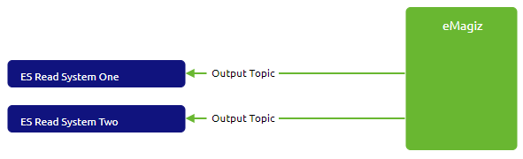
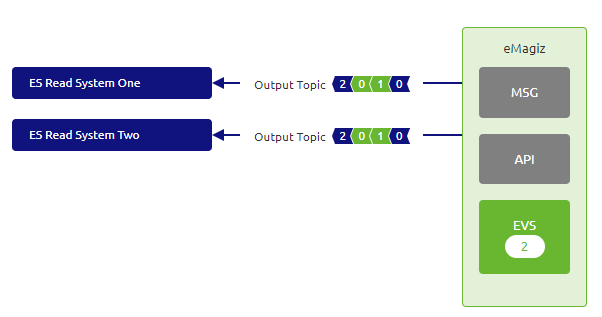
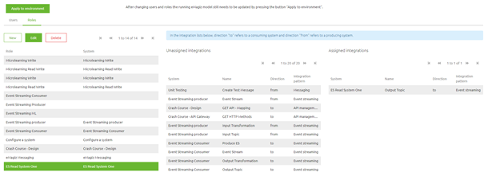
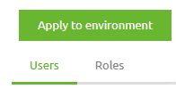
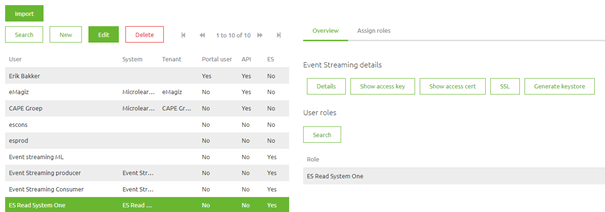
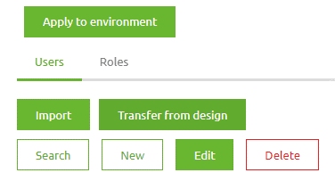

    

        <main class="micro-learning">
        <ul class="doc-nav">
            <li class="doc-nav__item"><a href="../../docs/microlearning/crashcourse-event-streaming-index" class="doc-nav__link">Home</a></li>
            <li class="doc-nav__item"><a href="#intro" class="doc-nav__link">Intro</a></li>
            <li class="doc-nav__item"><a href="#theory" class="doc-nav__link">Theory</a></li>
            <li class="doc-nav__item"><a href="#practice" class="doc-nav__link">Practice</a></li>
            <li class="doc-nav__item"><a href="#solution" class="doc-nav__link">Solution</a></li>
        </ul>

##### Intro

# User Management - Event Streaming

In this microlearning, we will focus on the registration of users within the context of Event Streaming. Furthermore, we focus on how to give these users the correct rights on a topic-level basis.

Should you have any questions, please get in touch with academy@emagiz.com.

- Last update: February 10th, 2022
- Required reading time: 6 minutes

## 1. Prerequisites
- Basic knowledge of the eMagiz platform
- Understanding of Event Streaming concept
- An active Event Streaming license

## 2. Key concepts
This microlearning centers around how you can register users via the eMagiz platform and hand out the correct rights for these users so they can access the topic (s) they need to access.
With users, we mean A system outside of eMagiz that is interested in producing or consuming data from a topic available via the eMagiz topic cluster.

Knowing how to register users and give them the correct rights makes it possible to control which parties have access to which data via a controlled and managed environment.

Registering users in eMagiz and handing out rights is straightforward. Below we will detail how you can configure the user and its accompanying rights.

##### Theory

## 3. Users and their rights

A crucial part of setting up your Event Streaming solution with the help of topics is defining which client(s) has what access to which topic.
In eMagiz, you have a straightforward way to define the specific rights per system connected to your Event Streaming solution. This is done in a two-part process.
The first part is done in Capture and Design, and the second part is done in Deploy.

Below we will discuss each of these parts in more detail.

### 3.1 Capture

In Capture, you can draw lines as usual. However, with Event Streaming, the line itself holds an additional context. For example, when drawing the line from the system to eMagiz, you define that the system has write access on a topic. For example, when drawing the line from eMagiz to the system, you determine that the system has read rights. For instance, if a system needs both write and read rights, you must draw two lines—one from the system to eMagiz and one from eMagiz to the system.

If you already have a system that also wants access to one of the topics within your Event Streaming solution, you don't have to create a new system but can draw a line from the existing system towards eMagiz or vice versa.

A possible solution of two separate systems reading data from the same topic can be represented.

### 3.2 Design

Based on the lines drawn in Capture, eMagiz will automatically update the number of consumers and producers on a particular topic. This information is handy to see the total number of consumers and producers on a topic. In contrast to the user management for API Gateway, you don't have to do any additional configuration in Design regarding user management for Event Streaming.

### 3.1 Deploy

Based on the lines drawn in Capture, the User Management section in Deploy for the Test environment is automatically updated. This means that when you open the User management tab, you will see all users and roles in the correct configuration based on the lines drawn in Capture. Note that when you exclude a particular topic in Design Architecture (more information in the following [microlearning](crashcourse-eventstreaming-create-your-topic.md)), you won't see those topics in the list under roles.

After you have verified the settings and are satisfied with how the rights per role and user are configured, you can update these settings 
per environment by pressing the Apply to environment button.
By pressing this button, you indicate that the choices you made in Design can be actualized in Deploy for that particular environment. Note that the topic on which you want to hand out rights needs to exist before you can grant access rights to it. More on how to deploy a topic can be found in this [microlearning](crashcourse-eventstreaming-create-your-topic.md).

After you have pressed the Apply to environment button, you can retrieve the relevant authentication information per user by selecting a user and selecting the options Details (for the password) and generate Keystore to get the accompanying Keystore.

### 3.2 Push to environment

The Test environment is updated automatically based on the lines drawn in Test. To actualize your settings in the Acceptance and Production environment, you need to use the Transfer from Design functionality, first on the roles tab and subsequently on the user tab.

##### Practice

## 4. Assignment

Define two roles that have reading rights on two topics.
This assignment can be completed with the help of the topic you have created/used in the previous assignment on your (Academy) project.

## 5. Key takeaways

- User Management is defined based on the configuration in Capture and Design
- To actualize the access rights on the topic, you need to press Apply to Environment
- Access rights will not be updated if a topic is not known on an environment or excluded from an environment
- To actualize the access rights on Acceptance and Production, you need to use the Transfer from Design functionality. First on roles and subsequently on users tab.

##### Solution

## 6. Suggested Additional Readings

If you are interested in this topic and want more information, please read the help text provided by eMagiz when executing these actions.

## 7. Silent demonstration video

This video demonstrates how you could have handled the assignment and gives you some context on what you have just learned.

<iframe width="1280" height="720" src="../../vid/microlearning/crashcourse-eventstreaming-user-management.mp4" frameborder="0" allow="accelerometer; autoplay; clipboard-write; encrypted-media; gyroscope; picture-in-picture" allowfullscreen></iframe>

</main>

