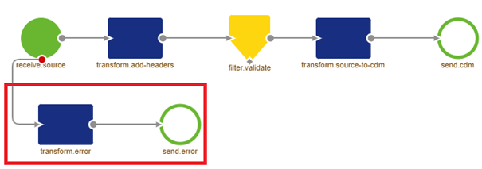
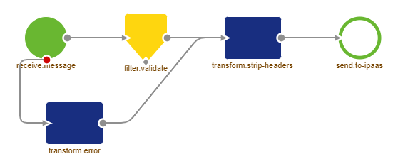

    

        <main class="micro-learning">
        <ul class="doc-nav">
            <li class="doc-nav__item"><a href="../../docs/microlearning/crashcourse-messaging-index" class="doc-nav__link">Home</a></li>
            <li class="doc-nav__item"><a href="#intro" class="doc-nav__link">Intro</a></li>
            <li class="doc-nav__item"><a href="#theory" class="doc-nav__link">Theory</a></li>
            <li class="doc-nav__item"><a href="#practice" class="doc-nav__link">Practice</a></li>
            <li class="doc-nav__item"><a href="#solution" class="doc-nav__link">Solution</a></li>
        </ul>

##### Intro

# Asynchronous Error Handling

In this microlearning, we will explain the basics of asynchronous error handling that plays a vital role in ensuring that messages that do not meet the criteria are correctly displayed in the Manage phase.

Should you have any questions, please get in touch with academy@emagiz.com.

- Last update: August 10th, 2021
- Required reading time: 5 minutes

## 1. Prerequisites
- Basic knowledge of the eMagiz platform

## 2. Key concepts
This microlearning centers around asynchronous error handling for messaging flows in eMagiz.
By asynchronous error handling, we mean The process that receives and processes error messages to show to the user in Manage.

The asynchronous error handling has three relevant parts:
- All asynchronous queues come with a standard error handling on flow level
- The centralized error flow receives and processes these messages
- Each error message is sent via the internal eMagiz architecture to display it in Manage

##### Theory

## 3. Asynchronous Error Handling

Asynchronous error handling plays a vital role in ensuring that messages that do not meet the criteria are correctly displayed in the Manage phase. 

The asynchronous error handling has three relevant parts:
- All asynchronous queues come with a standard error handling on flow level
- The centralized error flow receives and processes these messages
- Each error message is sent via the internal eMagiz architecture to display it in Manage

### 3.1 Error Handling Queues on Flow level
In asynchronous messaging, each flow that starts with a component that reads data from a queue comes with the standard error handling functionality in eMagiz. This error handling is the part of the flow that is always showed below the functional process. This part of the process ensures that each error is transformed generically and placed on a separate queue (the error queue) for further processing.

### 3.2 Error Flow
Now that all error messages are placed on a separate queue, it becomes time for the next step. The question might arise about what to do with those messages. In eMagiz, we have created a separate process that is fully standardized that processes all these messages in the error queue and places them on a different queue to be picked up by the internal architecture of eMagiz.

Note that when the error flow itself throws an error, the error subsequently gives back the error to the error flow. This error will then cause an infinite loop of error messages. That is why we advise not to alter this flow unless there are excellent reasons to do so. And even in that case, please be careful with what you change and how you will execute the change. After the message structure is validated and all headers are stripped (to reduce the payload), the message is placed on an internal emagiz error queue.

### 3.3 Internal eMagiz Error queue
From here on out, a centralized instance consumes these messages. This instance processes all metadata and error messages coming in from all the projects created within eMagiz. This process ensures to properly store the data in the right place within our architecture. After it is stored, a user can view the information via the Manage phase. In the Manage phase, you will see a Dashboard that shows (on a flow level) all error messages that occurred within a specific time frame. If you want to learn more about this dashboard, please check out this [microlearning](crashcourse-platform-manage-determining-origin-of-error-message.md)

These three parts ensure that when you handle your messages asynchronously and the message is placed on the queue, the message will either be successfully delivered to the external system or will end up in Manage as an Error Message.

##### Practice

## 4. Assignment

As the error process is completely auto-generated by eMagiz for you, there is no reason to build anything this time. Please check out the error handling within one of your projects to see if you can follow the logical flow of data in case of an error?

## 5. Key takeaways

- All asynchronous queues come with a standard error handling on flow level
- The centralized error flow receives and processes these messages
- Each error message is sent via the internal eMagiz architecture to display it in Manage

##### Solution

## 6. Suggested Additional Readings

If you are interested in this topic and want more information, please read the help text provided by eMagiz.

## 7. Silent demonstration video

As this is a more theoretical microlearning, we have no video for this.

</main>

