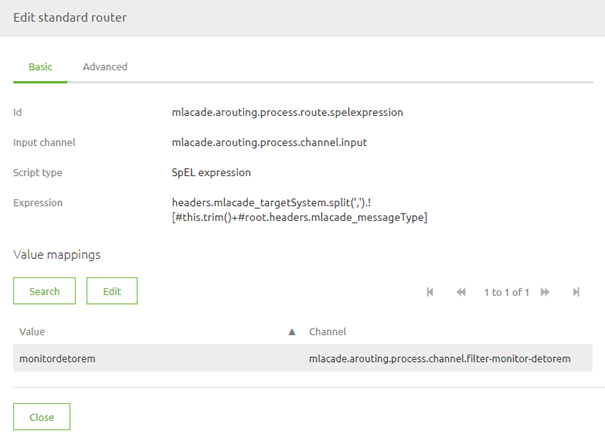
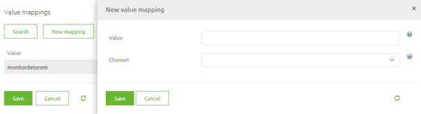
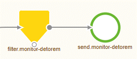
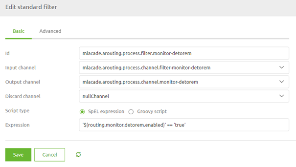
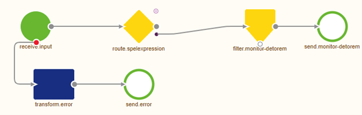

# Asynchronous Routing

In this microlearning, we will explain the basics of asynchronous routing that plays a vital role in the distribution of messages within the five-layer model of messaging.

Should you have any questions, please contact academy@emagiz.com.

- Last update: February 24th, 2021
- Required reading time: 3 minutes

## 1. Prerequisites
- Basic knowledge of the eMagiz platform

## 2. Key concepts
This microlearning centers around asynchronous routing for messaging flows in eMagiz.
By asynchronous routing we mean: The process that routes messages that it receives to the correct outbound queue based on some metadata.

The asynchronous routing has three relevant parts:
- All asynchronous onramps send their data to the routing
- Based on a decision made within the routing the message is routed to one or more offramp queues
- Each offramp queue will receive data based on the decision unless you add another filter before the messages are sent to the offramp queue

## 3. Asynchronous routing

Asynchronous routing plays a crucial role in the distribution of messages it receives to one or more offramps. 

The asynchronous routing has three relevant parts:
- All asynchronous onramps send their data to the routing
- Based on a decision made within the routing the message is routed to one or more offramp queues
- Each offramp queue will receive data based on the decision unless you add another filter before the messages are sent to the offramp queue

### 3.1 Make a decision
In asynchronous routing, you can build your decision model on which the routing needs to make the decision.

The best practice for setting up your asynchronous routing process is to use one SpEL expression that determines to which offramp queues a messages needs to be routed.
The SpEL expression looks as follows:

headers.{technicalnameofproject}_targetSystem.split(',').![#this.trim()+#root.headers.{technicalnameofproject}_messageType]

This SpEL expression does the following things:
1. It looks for the header called {technicalnameofproject}_targetSystem and will split each entry based on the separator (a comma)
2. It will trim the result of this split and combine it the value in the header called {technicalnameofproject}_messageType
3. For every unique combination it will search to a pre-configured list to see to which channel the message should be sent

In the standard router component this will look as follows:

In this simple case, we only have one channel as a result because all routings start simple. 
The moment you add new offramps to your project you need to add the new entry(s) to this list.
Doing so is easy when you are in Start Editing Mode. Simply open the router component and select the button New Mapping

In here you fill in the correct unique combination of a target system and the message type and select the channel you want to route the message to.
When you are satisfied you can press Save and the new entry will be registered in eMagiz.

Don't forget to make a new version and deploy it to actualize your changes.

### 3.2 Control output

As the asynchronous plays a role in routing messages between all asynchronous flows in a 
the messaging solution you can imagine that making changes does not need to happen lightly.
The other aspect is that when multiple projects are being built at the same time the asynchronous routing 
will house a multitude of changes that need to go to Acceptance or Production at the same time.

One control mechanism we consider a best practice to guard yourself against those risks is to add a filter 
before data is placed on the offramp queue. 
By doing this consistently you can control when a specific offramp can receive data on any environment. 
In other words, when a certain system is not ready yet to receive data on Acceptance or Production but is ready on Test 
you can control this behavior with this solution.

Below you see how this will look on flow level.

When we zoom in on the filter component we see a simple SpEL expression that checks the value of a certain property.
When the value of the property is true the message can pass. If the value of the property is any other value the message will be halted.
The best practice would be to work with false to get clarity on what the intended use of the property value is.

### 3.4 Step by step guide

Furthermore, as a best practice, we give you a short guide that you can add to your asynchronous routing as annotations 
to ensure that you always know what you need to do to make this a reality.

Steps to follow when adding an integration to the routing Part I:

1. Add a header in the onramp named {technicalnameofproject}_targetSystem (if this is not done yet)
2. Fill this header with a value that should be defined as a property (naming convention = systemname.messagetype.targetsystems)
3. This property should be created in Test, Accp, and Prod and filled with all target systems for a certain message type (notation = systemname1,systemname2,systemname3)
4. In the routing a standard router should be used as the first building block after receiving the input.

Part II

5. In this standard router a SpelExpression has to be defined **once** that concatenates the following headers: {technicalnameofproject}_targetSystem and {technicalnameofproject}_messageType.
6. For every unique combination there is a value that should be specified alongside the channel on which to put the message (this should be a channel that ultimately leads to the correct offramp queue)
7. For every channel that leads to a JMS outbound channel adapter a filter needs to be added to make sure that each output option can be turned on or off easily. 
This to prevent that messages are sent to a system that does not expect them then
8 This filter should look like this: '${routing.monitor.detorem.enabled}' == 'true'. 
The naming convention of said property is routing.targetsystem.messagetype.enabled.

### 3.3 The result

The result of setting up your asynchronous routing in this manner 
is that you have one single point of entry, one single piece of decision logic, and a way to control the output per specific output channel.

## 4. Assignment

Build your asynchronous routing based on the best practice for one of the offramps that are available within your (Academy) project. 
This assignment can be completed with the help of your (Academy) project you have created/used in the previous assignment.

## 5. Key takeaways

- Use one component that decides to route messages to certain channels
- Control the output with a filter to prevent data to be sent to a queue too early
- Use the annotations to write down the step by step guide within your asynchronous routing

## 6. Suggested Additional Readings

If you are interested in this topic and want more information on it please read the help text provided by eMagiz.
## 7. Silent demonstration video

This video demonstrates how you could have handled the assignment and gives you some context on what you have just learned.

<iframe width="1280" height="720" src="../../vid/microlearning/crashcourse-asynchronous-routing.mp4" frameborder="0" allow="accelerometer; autoplay; clipboard-write; encrypted-media; gyroscope; picture-in-picture" allowfullscreen></iframe>