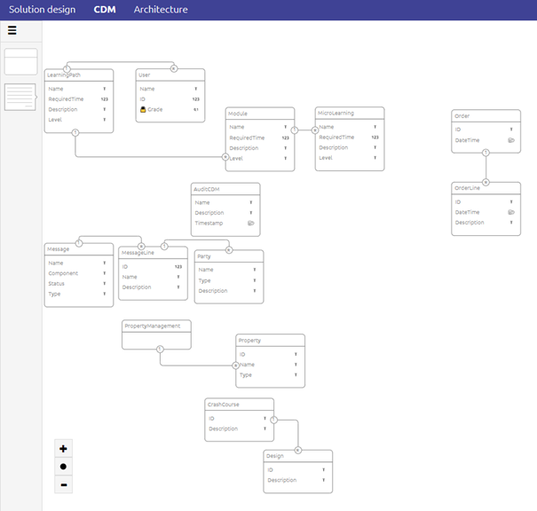

# Difference between CDM and CDM messages

To conclude our section on microlearnings that all have something to do with the CDM we wrap things up by learning what the difference is between CDM and CDM messages.

Should you have any questions, please contact academy@emagiz.com.

- Last update: February 24th, 2021
- Required reading time: 3 minutes

## 1. Prerequisites
- Basic knowledge of the eMagiz platform

## 2. Key concepts
This microlearning centers around understanding the difference between CDM and CDM messages.
By queue CDM we mean: The Canonical Data Model that plays a vital and central role while exchanging data between various systems via the messaging pattern

- The complete CDM consists of the collection of entities that are used or going to be used in the various CDM messages

## 3. Difference between CDM and CDM messages

Simply put the difference between the CDM and the CDM messages is as follows:

- The CDM holds all entities and attributes that are relevant within the context of your complete integration landscape.
- The CDM message is tailor-made for a specific piece of data (i.e. Order, Invoice, Employee) and only holds the entities and attributes relevant for that piece of data.

So that means that when you navigate to Design -> CDM you will see everything

Afterward when you zoom in on one of the available message types to create or view your CDM message the overview 
changes to show the structure of the message and to show which parts of the CDM are used for the CDM message.

## 4. Assignment

Open the CDM of your (Academy) project and subsequently open one of the CDM messages that are created within your (Academy) project and spot the differences. 
This assignment can be completed with the help of your (Academy) project you have created/used in the previous assignment.

## 5. Key takeaways

- The CDM holds all entities and attributes that are relevant within the context of your complete integration landscape.
- The CDM message is tailor-made for a specific piece of data (i.e. Order, Invoice, Employee) and only holds the entities and attributes relevant for that piece of data.

## 6. Suggested Additional Readings

If you are interested in this topic and want more information on it please read the help text provided by eMagiz when executing these actions.

## 7. Silent demonstration video

This video demonstrates how you could have handled the assignment and gives you some context on what you have just learned.

<iframe width="1280" height="720" src="../../vid/microlearning/crashcourse-messaging-difference-between-cdm-and-cdm-messages.mp4" frameborder="0" allow="accelerometer; autoplay; clipboard-write; encrypted-media; gyroscope; picture-in-picture" allowfullscreen></iframe>