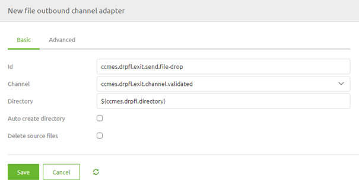
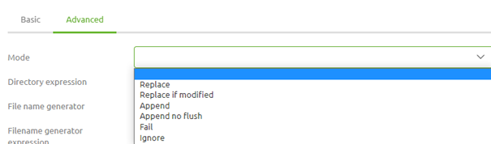
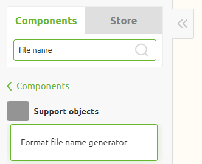
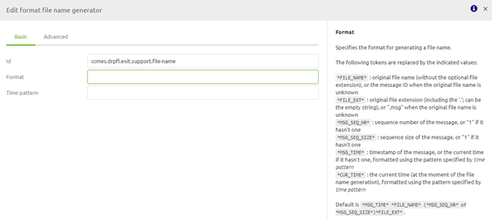
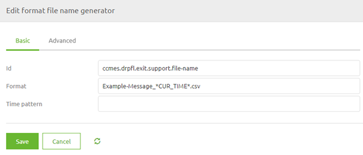
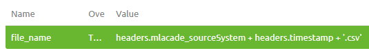

	

		<main class="micro-learning">
		<ul class="doc-nav">
			<li class="doc-nav__item"><a href="../../docs/microlearning/crashcourse-messaging-index" class="doc-nav__link">Home</a></li>
			<li class="doc-nav__item"><a href="#intro" class="doc-nav__link">Intro</a></li>
			<li class="doc-nav__item"><a href="#theory" class="doc-nav__link">Theory</a></li>
			<li class="doc-nav__item"><a href="#practice" class="doc-nav__link">Practice</a></li>
			<li class="doc-nav__item"><a href="#solution" class="doc-nav__link">Solution</a></li>
		</ul>

##### Intro

# Drop Files

In the last microlearning, we discussed how we can retrieve files **from** a local directory. 
In this microlearning we will learn the opposite, how to deliver files **to** a local directory

Should you have any questions, please contact academy@emagiz.com.

- Last update: February 25th, 2021
- Required reading time: 7 minutes

## 1. Prerequisites
- Basic knowledge of the eMagiz platform

## 2. Key concepts
This microlearning centers around dropping files to a local directory via eMagiz.
By dropping we mean: Writing the contents of the message to a local directory to be stored as a file
By local directory we mean: A directory that is directly accessible within the network where the eMagiz process is running

Key considerations when dropping files are:

- In which directory should we place the file
- Has eMagiz the appropriate rights to read from the directory where the messages are to be retrieved from
- If a file with the same name already exists what do we do
- How to name the file that you are writing to the directory

##### Theory

## 3. Drop Files

One of the easiest connectivity methods to implement within eMagiz is sending files to a local directory. 
With this method, eMagiz will write data to the local directory when data arrives on an exit queue for processing. 
There are four key considerations you should take into account when picking up files:

- In which directory should we place the file
- Has eMagiz the appropriate rights to read from the directory where the messages are to be retrieved from
- If a file with the same name already exists what do we do
- How to name the file that you are writing to the directory

### 3.1 Determine the directory

The key aspect of delivering a message is knowing where to deliver a message to. The same applies to delivering messages as files on a local directory.
The external party with whom you are connecting should be able to provide you with the directory where the data should be delivered to.

The best practice is to work with a property as the directory can change between environments. 
To ensure that a wrong directory is created by eMagiz the best practice is to **not** let eMagiz auto-create the directory. 
The basic configuration of the file outbound channel adapter should therefore look as follows:

### 3.2 Appropriate Rights

To send files to a local directory eMagiz needs to have the appropriate rights to access the directory in question. 
If the directory in which the files are located is part of a structure of other directories you need to ensure that eMagiz 
has sufficient rights on all directories above the directory to which you are writing data.

If this is not the case you will not be able to send data to a local directory via eMagiz.

### 3.3 What to do when a file already exists

In eMagiz, you can configure what eMagiz should do in case the file you are trying to write to the directory already exists.
The default pattern is to replace the original file with the new file ensuring that the newest information is available.

However, if there are reasons not to replace the original file with the new file considering one of the options below:

- Append. With this option, you append the new data to the original file
- Fail. eMagiz will throw an error when the file already exists
- Ignore. eMagiz will silently drop the message when the file already exists

To choose a specific mode you have to navigate to the Advanced tab and access the Mode drop-down menu.

### 3.4 Name the file

If you do not name the file eMagiz will use the message ID with the suffix .msg. In general, you do not want that so you should specify how the file should be named.

There are two methods to do so. The first method is more static and the second one is more dynamic.

#### 3.4.1 Format File Name Generator

The first option is the format file name generator. This is a support object in eMagiz

This component has several tokens available that can be replaced with values. However, in some cases, some of these tokens are not filled in at all.

Therefore we see that this component is mainly used to combine some static value with one of these tokens. An example of such a construction is shown below.

This way you control that the message has a certain extension and starts always with the same value. The only dynamic part in this example is the time that is added to the file name

#### 3.4.2 File Name Header

Another option that gives you more flexibility is to define the file name header. 
By adding a standard header enricher component to your exit you can define your file name as follows:

Do note that the naming of the header matters. Only when you name your header file_name this solution will work. Otherwise, eMagiz will revert to the default so pay attention!

As you can see from the example we will now dynamically create the file name based on two input variables for which the values can change.
Whichever method you choose to create the file name does not matter as long as you have thought about it. 
Most important thing is that you choose an option to keep control over what is happening.

##### Practice

## 4. Assignment

Build an exit that drops files on a local directory. 
This assignment can be completed with the help of your (Academy) project you have created/used in the previous assignment.

## 5. Key takeaways

- Key considerations when dropping files are:
	- In which directory should we place the file
	- Has eMagiz the appropriate rights to read from the directory where the messages are to be retrieved from
	- If a file with the same name already exists what do we do
	- How to name the file that you are writing to the directory

##### Solution
	
## 6. Suggested Additional Readings

If you are interested in this topic and want more information on it please read the help text provided by eMagiz.
## 7. Silent demonstration video

This video demonstrates how you could have handled the assignment and gives you some context on what you have just learned.

<iframe width="1280" height="720" src="../../vid/microlearning/crashcourse-messaging-drop-files.mp4" frameborder="0" allow="accelerometer; autoplay; clipboard-write; encrypted-media; gyroscope; picture-in-picture" allowfullscreen></iframe>

</main>

