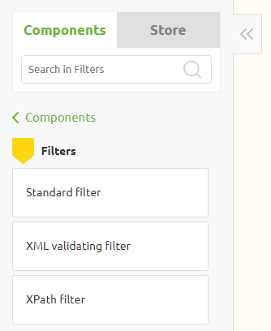
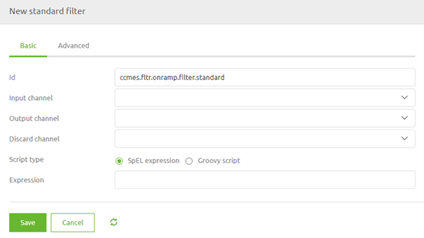
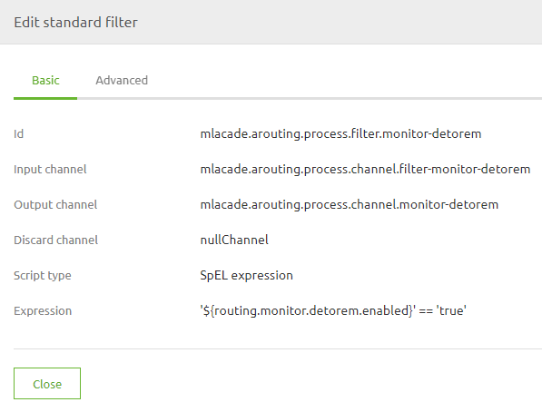
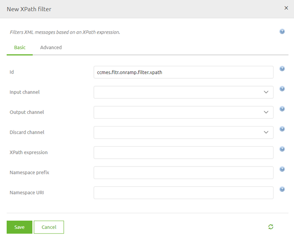
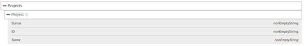
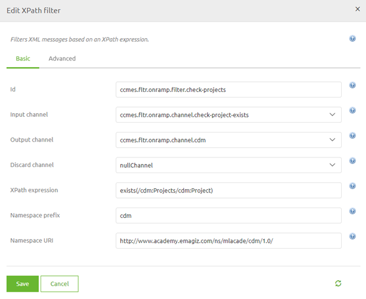

# Filter

In the crash course on the Platform level, we already discussed filtering in the transformation and highlighted the validating filter as that component is a standard in any flow that transforms data.
In this microlearning, we will take a closer look at the filter options in eMagiz while building a flow.

Should you have any questions, please contact academy@emagiz.com.

- Last update: February 24th, 2021
- Required reading time: 5 minutes

## 1. Prerequisites
- Basic knowledge of the eMagiz platform

## 2. Key concepts
This microlearning centers around filter options in eMagiz flows.
By filter we mean: The ability to determine on a **per-event** basis whether the event (i.e. message) is allowed to continue or not

On flow level eMagiz distinguishes three filter options:

- XML Validating Filter
- Standard Filter
- XPath Filter

## 3. Filter

In cases where you need to determine if a message (a piece of data) can continue or not you should use one of the filter options that eMagiz provides you.
eMagiz comes with three filter options:

- XML Validating Filter
- Standard Filter
- XPath Filter

The first option is already discussed in the Crash Course - Platform so we won't look into that option any further in this microlearning.

Below we will analyze the remaining two options to see how you can use these options to determine whether a message may continue or not

### 3.1 Standard Filter

The standard filter is the filter that is the most flexible and because it is the most flexible also the most complex to implement if you do not know what you are doing.

With the standard filter, you have two options to determine your filter. You either use a SpEL expression. 
A widely used example of such an implementation is the filter in the routing to control when data is allowed to travel to the offramp.

Or you use a Groovy script. A Groovy script is a piece of programming code that is executed for each incoming message, that can in turn use any third-party Java library.
This gives you a lot of flexibility but you are dependent on third-party Java libraries that are not maintained by eMagiz. 
Therefore if they change chances are that your solution might not work anymore. In this phase of your learning, it is strongly recommended **not** use this option.

In essence, this filter evaluates the SpEL expression or Groovy Script to see what the result is. If the result is true the message may continue. If not it will be dropped.

### 3.2 XPath Filter

The XPath filter can only be used to filter XML messages. As this filter is more narrow in scope it is also easier.
Think back to what we learned in the crash course - platform with regards to XPath. The same logic applies in this case.
 
With the help of this filter, you can filter messages based on the evaluation of an XPath expression

In this example, we want to validate that at least one Project is available in our CDM message

To do so we need to fill in the correct XPath and place the component at the correct place within the flow.

Once again, don't forget about the namespace

## 4. Assignment

Add an XPath filter to your flow that checks whether your message after transforming still has at least one entry in a list. 
This assignment can be completed with the help of your (Academy) project you have created/used in the previous assignment.

## 5. Key takeaways

- eMagiz comes with three filter options:
	- XML Validating Filter
	- Standard Filter
	- XPath Filter
- Each option comes with a specific function

## 6. Suggested Additional Readings

If you are interested in this topic and want more information on it please read the help text provided by eMagiz when executing these actions and read the following links:

- https://docs.spring.io/spring-framework/docs/4.3.8.RELEASE/spring-framework-reference/html/expressions.html
- http://docs.groovy-lang.org/docs/groovy-2.4.15/html/documentation/

## 7. Silent demonstration video

This video demonstrates how you could have handled the assignment and gives you some context on what you have just learned.

<iframe width="1280" height="720" src="../../vid/microlearning/crashcourse-messaging-filter.mp4" frameborder="0" allow="accelerometer; autoplay; clipboard-write; encrypted-media; gyroscope; picture-in-picture" allowfullscreen></iframe>