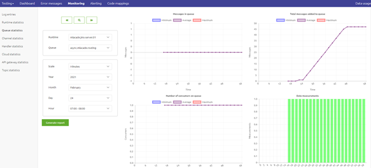
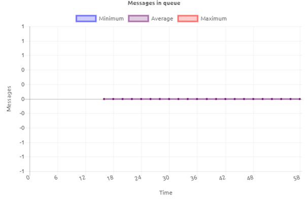
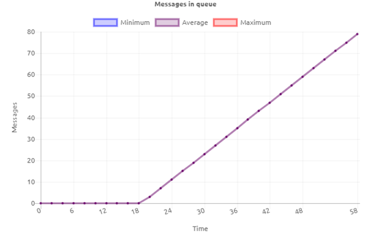
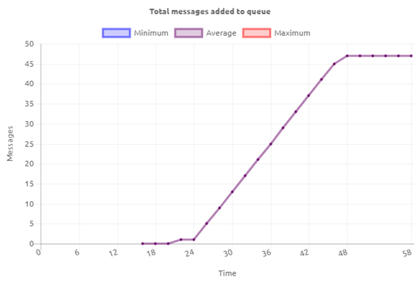
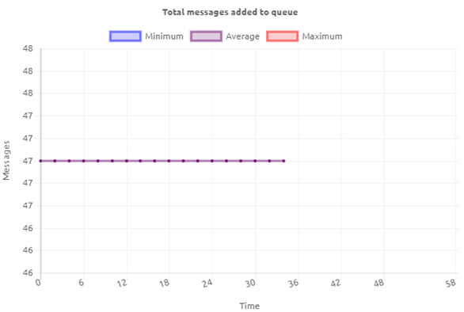
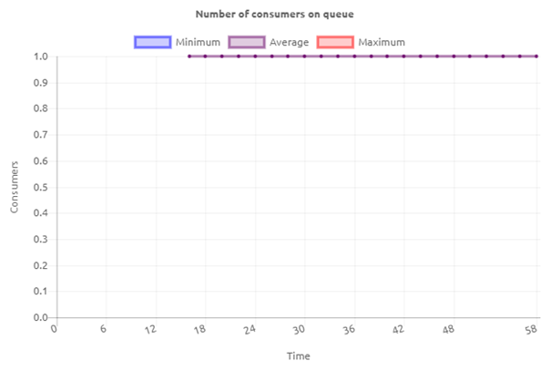
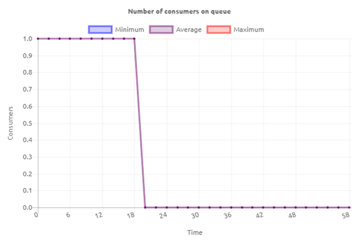
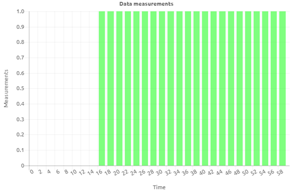

# Interpreting queue statistics

In this microlearning, we will focus on how you can read the information available on queue level for all integrations that use the messaging pattern.

Should you have any questions, please contact academy@emagiz.com.

- Last update: February 24th, 2021
- Required reading time: 8 minutes

## 1. Prerequisites
- Basic knowledge of the eMagiz platform

## 2. Key concepts
This microlearning centers around how you can read the information in the queue statistics and what you can learn from it.
By queue statistics we mean: Information on queue level that helps you to interpret the data that is passing on that queue

There are four parts to the queue statistics:
- Total messages in queue
- Total messages added to queue
- Number of consumers
- Data measurements

## 3. Interpreting queue statistics

In many cases, you want to validate your assumptions by checking the queue statistics. The queue statistics section in eMagiz is divided into four parts:

- Total messages in queue
- Total messages added to queue
- Number of consumers
- Data measurements

For example, when you want to verify how many messages have arrived on a certain queue within a certain time window you can use the queue statistics overview for this.

Below we will delve into each of these four parts and explain a bit more about them. 
That way you can use the queue statistics to interpret what happened within your messaging flows at any given moment. 
To assist you in tracking anomalies in your project you can use eMagiz alerting. To learn more on that please take a look at the microlearning on that subject.

### 3.1 Total messages in queue

The first metric we are going to look at is the total messages in queue. 
As the name implies this metric tells us how many messages currently reside on the queue and have **yet to be** processed.

Having a flat-line, such as in the picture above can mean two things:
- The queue can keep up with the supply (i.e. the number of messages added to the queue is **lower** than the number of messages that are processed on the queue)
- There is no supply (i.e. the number of messages added to the queue equals zero)

As you can see from the above interpretation one metric by itself will never paint the whole picture. 
Let's continue by looking at a scenario in which the total messages in queue are gradually increasing.

Seeing this behavior can also mean two things:
- The queue is **not** able to keep up with the supply (i.e. the number of messages added to the queue is **higher** than the number of messages that are processed on the queue)
- Nobody is processing the data on the queue (i.e. no consumer wants to consume the data from the queue and process it)

The first of these two potential reasons is most likely temporary in nature. 
In case you get a sudden burst of data that is supplied to the queue will need some time to process all data. 
In such a scenario you will see the metric increase at first and afterward decrease to zero (flat-line) again.

The second of these two potential reasons could be more structural. 
This can happen because the consumer is broken or not active. This will lead to a steady increase in data that won't return to zero without a user action correcting the behavior.

### 3.2 Total messages added to queue

The second metric we are going to look at is the total messages added to queue.
As the name implies this metric tells us how many messages were supplied to the queue within a given timeframe.

In the example shown above, you can see that between minute 24 and minute 46 we have a steady flow of data that is supplied to this queue. 
Based on the actual implementation of your flows the pattern of how data is supplied to your queue can differ. 
The main expectation is that data is supplied to the queue at some point in time. In some cases, you will expect data almost all the time. 
In some cases only between 9 and 17 on weekdays. And in other cases, you only expect data in the evening when nobody will be hindered by it.

If this metric shows that data is supplied to the queue and the total messages in queue metric show a flat-line on zero messages everything works as expected.
When this metric shows that data is supplied to the queue and the total messages in the queue metric show the same **exact** increase you can conclude that no data is being consumed from the queue.
In case the metric shows that data is supplied to the queue and the total messages in queue metric shows a **less steep** increase you can conclude that the queue is **not** able to keep up with demand.

Just as with the total messages in queue the number of total messages added to queue maybe not changed over a period leading to a flat-line graph.
In itself this means nothing. However, if you would have expected messages to be supplied to that queue within that time frame 
you need to analyze the complete chain of flows more thoroughly to see what is causing the unexpected behavior.

### 3.3 Number of consumers

The third metric we are going to look at is the number of consumers.
This metric tells us how many consumers are activated to consume data from that specific queue. 

In most asynchronous (messaging and event streaming) flows the expected number is 1 or 2 consumers. In API Gateway exit gates the number can vary between 1 and 5 depending on the supply on the queue.
Knowing the expected number of consumers is crucial for a good interpretation of what the reported number of consumers tells you.

Let's assume for the sake of this microlearning that the expected number of consumers on my queue is 1.

With that in mind, the number of consumers that is reported can either be 1 (i.e what we expect), 0 (i.e. too low), or 2 and higher (i.e. too much).

If the reported number of consumers equals the expected number of consumers data will be processed as expected. 
This means that one message per consumer is processed at any given moment assuming that a message is available to be processed.

However, if the number of consumers is too low or too high you need to analyze the situation.

As shown above, you can see that the number of consumers drops from 1 to 0 at a certain point in time. This could be caused by:

- A user stopped the queue ensuring no data would be processed anymore
- The runtime on which the queue is running is stopped (either by the user or by an automatic process)
- The complete eMagiz project is not running at the moment (either due to a user action or by an automatic process)

Whatever the reason maybe you should investigate what the cause is to keep your environment running stably.

Apart from the consumer count being too low, it can also happen that the consumer count is too high. This could be caused by:

- Incorrect configuration of the flow by a user that leads to an unexpected number of consumers
- Linking both a Test, Acceptance, and Production system to the same eMagiz environment
- Fringe situations that appear once in a while

### 3.4 Data measurements

The fourth and last metric tells us whether metrics (i.e. data measurements) are coming in.

With the help of this metric, we can establish if the queue in question is sending data measurements to the portal or not. 
As you can see from the example shown above the queue was not activated until somewhere after the 14th minute of the hour. 
This is entirely consistent with the behavior of the other graphs.

## 4. Assignment

Interpret the queue statistics of at least two flows within your (Academy) project. 
This assignment can be completed with the help of your (Academy) project you have created/used in the previous assignment.

## 5. Key takeaways

- There are four parts to the queue statistics:
	- Total messages in queue
	- Total messages added to queue
	- Number of consumers
	- Data measurements
- You can best interpret them together as that approach gives you the most context
- To assist in anomaly detection use the eMagiz alerting

## 6. Suggested Additional Readings

If you are interested in this topic and want more information on it please read the help text provided by eMagiz when executing these actions.

## 7. Silent demonstration video

This video demonstrates how you could have handled the assignment and gives you some context on what you have just learned.

<iframe width="1280" height="720" src="../../vid/microlearning/crashcourse-messaging-interpreting-queue-statistics.mp4" frameborder="0" allow="accelerometer; autoplay; clipboard-write; encrypted-media; gyroscope; picture-in-picture" allowfullscreen></iframe>