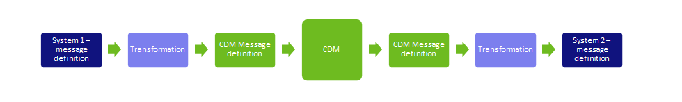
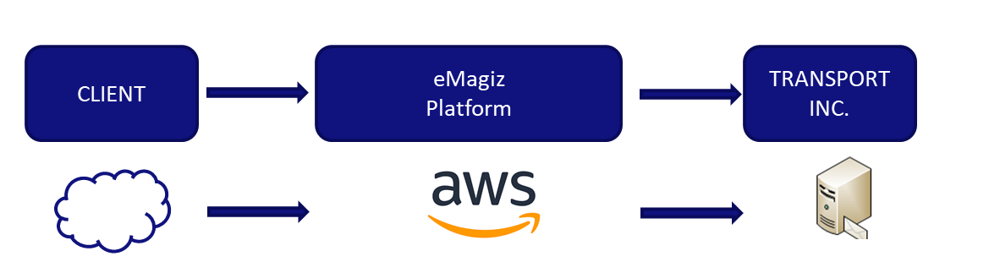

	

		<main class="micro-learning">
		<ul class="doc-nav">
			<li class="doc-nav__item"><a href="../../docs/microlearning/crashcourse-messaging-index" class="doc-nav__link">Home</a></li>
			<li class="doc-nav__item"><a href="#intro" class="doc-nav__link">Intro</a></li>
			<li class="doc-nav__item"><a href="#theory" class="doc-nav__link">Theory</a></li>
			<li class="doc-nav__item"><a href="#practice" class="doc-nav__link">Practice</a></li>
			<li class="doc-nav__item"><a href="#solution" class="doc-nav__link">Solution</a></li>
		</ul>

##### Intro

# Messaging - Introduction

In this microlearning, we will introduce the key concepts of the Messaging in the way that eMagiz provides this capability.

Should you have any questions, please contact academy@emagiz.com.

- Last update: February 25th, 2021
- Required reading time: 3 minutes

## 1. Prerequisites
- Basic knowledge of the eMagiz platform
- Completed the Crash course Platform

## 2. Key concepts
Organizations use many applications to support their business processes, and in regular landscape all of these applications are required to exchange data with each other to fulfill business processes. Some of the required data might be outside the organization. The messaging integration pattern allows to process messages that contain data in a secure, reliable manner. Whether that is processed synchronously or asynchronously – both are handled in the Messaging in eMagiz. Nearly all message formats and exchange protocols are supported. This last is one of the core advantages to overcome format and protocol limitatios of to be connected systems.

##### Theory

## 3. Key elements of Messaging

### 3.1 Five layers to rule them all
eMagiz has implemented a 5 layered model based on the integration architectural pattern VETRO which stands for Validate, Enrich, Transorm, Route and Operate. Each of these layers play a role in the pattern. Below the explanation of these 5 layers. Each of these layers will result in integration components referred to as flows in eMagiz, and each of these flows will run in a specific runtime position strategically across the integration landscape (see also section Cloud in this document).

1. Entry - in the entry flow you can configure the connectivity with the system that will send a message to eMagiz. It can be a push from the external system of a pull from eMagiz to the external system. Once the message is received, the message will be queued directly to the next step in the model
2. Onramp - In this part, the message will be transformed and validated so it be prepared for the next steps where that message will be send to the external system. Specific elements exist here to also enrich the message where needed with additional attributes
3. Routing - Using specific header information, the message can be routed to one of more offramps for further processing
4. Offramp - In this process the message that was passed on from the routing can be first validated if it meets the expected structure, and then transformed to the target system. Once processed, the message is put to the exit queue.
5. Exit - the exit will read the message from the queueu and then connect to the target system

Below a picture of the above layers including the formats of the intermediate transformations. Please see the CDM microlearnings for more information.

 

### 3.2 Support formats and protocols
The Messaging pattern of eMagiz can handle most common formats and protocols. Most typical ones that are used are SOAP/XML, Filebased connectivity and REST/JSON. However, format such as EDI are also handled by eMagiz. Special connectivity exists with Mendix applications where a specific connector is provide to ease the interaction at runtime as well as design time.

### 3.3 Cloud design pattern
eMagiz provides a specific runtime in which the different flow components of the 5 layered model can be deployed in. These runtime as standardized across, but can run anywhere in the integration architecture. As a typical scenario, messages mights be send to the client infrastructure from outside the organisation (suppliers, customers, etc) and send to an internal system that runs inside the client infrastructure. In this case, the entry flow would be deployed in a runtime somewhere in the eMagiz Cloud, and the exit would be deployed in a runtime that runs on a server inside the client infrastructure (close to the target system). the onramps, offramps and routing flows would run inside the eMagiz Cloud container. All these flows would then communicate via queues to transfer messages across. In this way the VETRO patterns is also used in the Cloud architecture of eMagiz.

 

##### Practice

## 4. Assignment

Review the video below to ensure all concepts are clear

## 5. Key takeaways

eMagiz provides a Messaging integration patterns that can be used to solve complex integrations where to be connected systems use complex formats and structures. Furthermore, messaging as a pattern is design in eMagiz in such a way that all integrations requirements can be met for implementing business solutions with eMagiz. 

##### Solution

## 6. Suggested Additional Readings

- https://www.emagiz.com/messaging-nl/

## 7. Silent demonstration video

This video provides an introduction of the Messaging concept

<iframe width="1907" height="1073" src="https://www.youtube.com/embed/Dy7hDzdE3tI" frameborder="0" allow="accelerometer; autoplay; clipboard-write; encrypted-media; gyroscope; picture-in-picture" allowfullscreen></iframe>

</main>

