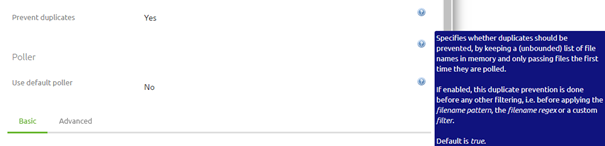
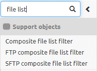
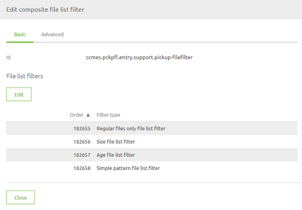
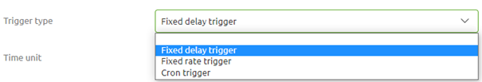
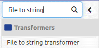
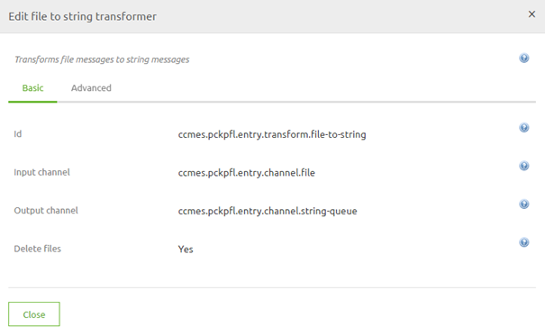
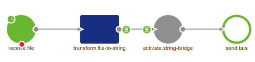

	

		<main class="micro-learning">
		<ul class="doc-nav">
			<li class="doc-nav__item"><a href="../../docs/microlearning/crashcourse-messaging-index" class="doc-nav__link">Home</a></li>
			<li class="doc-nav__item"><a href="#intro" class="doc-nav__link">Intro</a></li>
			<li class="doc-nav__item"><a href="#theory" class="doc-nav__link">Theory</a></li>
			<li class="doc-nav__item"><a href="#practice" class="doc-nav__link">Practice</a></li>
			<li class="doc-nav__item"><a href="#solution" class="doc-nav__link">Solution</a></li>
		</ul>

##### Intro

# Pick up Files

In this microlearning, we will explain the basics of retrieving files from a local directory (i.e. a directory that is directly accessible within the network where the eMagiz process is running)

Should you have any questions, please contact academy@emagiz.com.

- Last update: February 25th, 2021
- Required reading time: 8 minutes

## 1. Prerequisites
- Basic knowledge of the eMagiz platform

## 2. Key concepts
This microlearning centers around retrieving files from a local directory via eMagiz.
By retrieving we mean: Checking with a certain interval if new files are ready to be pulled from the directory by emagiz
By local directory we mean: A directory that is directly accessible within the network where the eMagiz process is running

Key considerations when picking up files are:

- What are the determining criteria to define when a file is "ready" to be picked up (age, pattern, size, etc.)
- With what frequency is eMagiz going to check for new files
- Has eMagiz the appropriate rights to read from the directory where the messages are to be retrieved from
- What is the format (i.e. XML, JSON, EDI, TXT, CSV, etc.) of the files that eMagiz needs to retrieve

##### Theory

## 3. Pick up Files

One of the easiest connectivity methods to implement within eMagiz is the retrieval of files from a local directory. 
With this method, eMagiz will periodically look whether (new) files are ready for consumption. There are four key considerations you should take into account when picking up files:

- What are the determining criteria to define when a file is "ready" to be picked up (age, pattern, size, etc.)
- With what frequency is eMagiz going to check for new files
- Has eMagiz the appropriate rights to read from the directory where the messages are to be retrieved from
- What is the format (i.e. XML, JSON, EDI, TXT, CSV, etc.) of the files that eMagiz needs to retrieve

### 3.1 Determining Criteria

By default, eMagiz has a filter that will only accept each file once. This option is called prevent duplicates

As the eMagiz help text clearly states this option will ensure that eMagiz will keep a list in memory and files are only to be passed once.
This check is done before any other filtering is done. So be aware when mixing these settings.

For example, if you combine this setting with an age list filter (i.e. specifying how old a message must be before picking it up) but you pick up messages 
at a higher frequency compared to the setting of your age list filter you run the risk of never picking the message up as the message 
will be blocked by the age list filter the first time and the second time by the prevent duplicates setting

Another downside of only using the prevent duplicates option is that when you do not delete messages properly and you do restart the flow eMagiz will start picking up those messages again.

So, as you can see determining the proper set of criteria can be quite challenging. 
Luckily there is a store component available in the public eMagiz Store that is build based on a set of best practices including the best practice when it comes to filtering.

To filter which messages need to be retrieved from a local directory we use a composite file list filter.

In this filter, we use the following four criteria to filter our messages:

- Regular files only
- Size list filter (minimum 1 bytes, maximum 1048575)
- Age file list filter (minimum 10000)
- Simple pattern file list filter (${file.pickup.pattern})

The result of this configuration should be:

The next step would be to link this support object to the file inbound channel adapter (the starting point of our flow). To do so open the component and navigate to the Advanced tab.
Here you need to select the correct filter to reference your support object.

### 3.2 Frequency

Now that we have established the criteria that govern which messages can and which messages cannot pass the next thing 
we need to consider is with what frequency we are going to let eMagiz check for new files.

There are three options from which you can choose:

- Fixed Delay
- Fixed-Rate
- Cron Trigger

Both the Fixed Delay and the Fixed Rate are static. This means that when you want to change the frequency with which you look you will have to make a new version of the flow.

The cron trigger can be filled in with the help of a property and can therefore be changed over time without having to change the flow itself. 

The best practice is to use the cron trigger in cases where you already expect that the frequency will change over time. If a static value is sufficient the Fixed Delay would be your best option.
The main benefit of the fixed delay above the fixed rate is that it waits before the previous process was finished. 
That way you ensure that eMagiz will have to process a huge amount of data in a small amount of time.

### 3.3 Appropriate Rights

To retrieve files from a local directory eMagiz needs to have the appropriate rights to access the directory in question. 
If the directory in which the files are located is part of a structure of other directories you need to ensure that eMagiz 
has sufficient rights on all directories above the directory from which you want to retrieve files.

If this is not the case you will not be able to retrieve the files from a local directory via eMagiz.

### 3.4 Message Format

Files come in many different forms, shapes, and sizes. Due to the wide variety of options, you will need to ensure that the data is processed correctly. 
How to process each message format (i.e. XML, JSON, EDI, CSV, etc.) correctly is explained in other microlearnings where we zoom in on each of the message formats.

For learning about picking up files we need to know that in other for eMagiz to 
process the content of the file in the onramp and further downstream the contents of the file need to be transformed to string.

There is a component in eMagiz called the file to string transformer. You should place this directly after receiving the file from the external source

Configuration wise you need to select the option Delete files to ensure that the files are deleted

The result of linking the components together will lead to the following solution

With all this in mind, you have successfully learned how to set up your first connectivity via a messaging flow in eMagiz!

##### Practice

## 4. Assignment

Build an entry that retrieves files from an external source and ensures that the data is delivered on the onramp queue. 
This assignment can be completed with the help of your (Academy) project you have created/used in the previous assignment.

## 5. Key takeaways

- Key considerations when picking up files are:
	- What are the determining criteria to define when a file is "ready" to be picked up (age, pattern, size, etc.)
	- With what frequency is eMagiz going to check for new files
	- Has eMagiz the appropriate rights to read from the directory where the messages are to be retrieved from
	- What is the format (i.e. XML, JSON, EDI, TXT, CSV, etc.) of the files that eMagiz needs to retrieve

##### Solution
	
## 6. Suggested Additional Readings

If you are interested in this topic and want more information on it please read the help text provided by eMagiz.
## 7. Silent demonstration video

This video demonstrates how you could have handled the assignment and gives you some context on what you have just learned.

<iframe width="1280" height="720" src="../../vid/microlearning/crashcourse-messaging-pick-up-files.mp4" frameborder="0" allow="accelerometer; autoplay; clipboard-write; encrypted-media; gyroscope; picture-in-picture" allowfullscreen></iframe>

</main>

