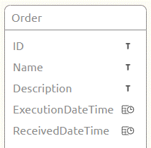
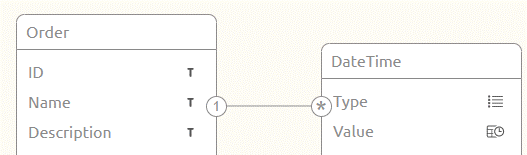
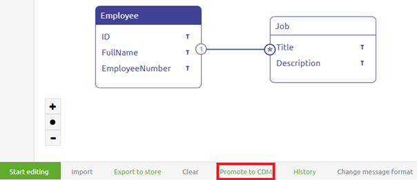
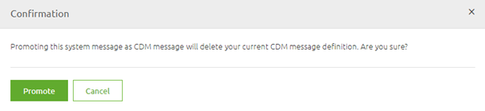
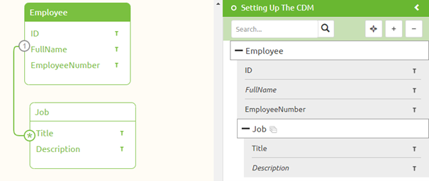

	

		<main class="micro-learning">
		<ul class="doc-nav">
			<li class="doc-nav__item"><a href="../../docs/microlearning/crashcourse-messaging-index" class="doc-nav__link">Home</a></li>
			<li class="doc-nav__item"><a href="#intro" class="doc-nav__link">Intro</a></li>
			<li class="doc-nav__item"><a href="#theory" class="doc-nav__link">Theory</a></li>
			<li class="doc-nav__item"><a href="#practice" class="doc-nav__link">Practice</a></li>
			<li class="doc-nav__item"><a href="#solution" class="doc-nav__link">Solution</a></li>
		</ul>

##### Intro

# Setting Up the CDM

In the last microlearning, we learned what the CDM is and how you should use it when building messaging integrations.
In this microlearning how you should go about whilst setting up the CDM.

Should you have any questions, please contact academy@emagiz.com.

- Last update: February 26th, 2021
- Required reading time: 7 minutes

## 1. Prerequisites
- Basic knowledge of the eMagiz platform

## 2. Key concepts
This microlearning centers around setting up the CDM via eMagiz.
By setting up we mean: Creating the CDM for the first time and maintaining it when changes occur

Key considerations when setting up the CDM are:

- When you throw something away that is already used in Create you also lose that
- Be careful with promoting to CDM. This can lead to replication of entities (i.e. Order and Order_1)
- Choose one naming convention and one language
- Discuss which characteristics (i.e. attributes) belong to which entities

##### Theory

## 3. Setting Up the CDM

In the last microlearning, we learned what the CDM is and what it represents within the context of eMagiz. 
In this microlearning, we will take a closer look at the CDM in terms of how you can create the CDM and maintain the CDM when your integration landscape grows.

There are several key considerations we should take into account when setting up and managing the CDM:

- When you throw something away that is already used in Create you also lose that
- Be careful with promoting to CDM. This can lead to replication of entities (i.e. Order and Order_1)
- Choose one naming convention and one language
- Discuss which characteristics (i.e. attributes) belong to which entities

### 3.1 Delete behavior

Before we start discussing how you should create the first contours of the CDM and how you can manage the CDM 
properly we would like to first address the fact that when you delete something in the CDM it can impact a lot of integrations within your landscape.

So before deleting anything from the CDM always consult with at least one colleague before proceeding.

### 3.2 Promoting to CDM

An easy way to start building your CDM is to use the Promote to CDM functionality. 
However, this functionality has two downsides you need to be aware of before thinking of using this functionality:

- If you already have a CDM message for the message type for which you press Promote to CDM it will overwrite that CDM Message (which could lead to loss of data across your integration landscape)
- If a certain entity already exists in the CDM the Promote to CDM **won't** override it but will create a new entity with a _1 behind it. So Order will become Order_1

Having said that, when the CDM is still empty and you have a dominant system within your integration landscape that feeds most data this is a useful method to quickly start building your CDM.

### 3.3 One naming convention

A third consideration before adding entities and attributes to the canvas is the naming convention that will be used. 
This naming convention consists of two aspects:

- The language (choose one language and don't mix languages)
- The notation of the names of entities and attributes. Do you start each word with a capital for example (i.e. PaymentCompensation)? Or do you start each new word with capital with exception of the first word (i.e. paymentCompensation)

### 3.4 What belongs to what

The fourth consideration you should take into account when setting up and maintaining your CDM is how you are going to assign certain attributes to certain entities.
For example, if you have an Order with the following attributes there are two distinct ways of creating this in your CDM:

- ID
- Name
- Description
- ExecutionDateTime
- ReceivedDateTime

The first option would be to add all these characteristics to the Order entity which will result in the following solution in your CDM.

A second option would be to create a separate entity for DateTime which has a Type and a Value.

Both options have their advantages and disadvantages. The point of the matter is that you should make consistent choices with regards to which option you choose for your CDM.

### 3.5 Building the CDM

Now that we have discussed the key considerations let us turn our attention to actually learning how to build the CDM. There are two distinct methods of adding information to the CDM:

- Drag and drop entities to the canvas and manually add attributes (as we learned in the crash course platform)
- Use the promote CDM button on the message level

In this microlearning, we will not explain the dragging and dropping of entities and adding attributes again. 
Instead, we will explain a new piece of functionality we have not explained yet called the Promote to CDM.

If you navigate to Design and access the context menu to get to the system message you will see a canvas in which the system message is filled in or not.
If it is filled in you can promote the structure that is represented in the system message to the CDM

You can do so after you have left Start Editing Mode. By selecting this button any existing creation on the CDM message level will be wiped clean. 
To remind you of that eMagiz shows you the following pop-up

When you are confident that this is the right move you can press the Promote button. 
This will promote the system message to the CDM message and in turn, will add the entities and attributes to the CDM.
This behavior is shown below

##### Practice

## 4. Assignment

Add the content of a system message to the CDM via the drag and drop functionality eMagiz offers on the CDM level. 
This assignment can be completed with the help of your (Academy) project you have created/used in the previous assignment.

## 5. Key takeaways

- Key considerations when setting up the CDM are:
	- When you throw something away that is already used in Create you also lose that
	- Be careful with promoting to CDM. This can lead to replication of entities (i.e. Order and Order_1)
	- Choose one naming convention and one language
	- Discuss which characteristics (i.e. attributes) belong to which entities
- Always take these considerations in mind when maintaining your CDM

##### Solution
	
## 6. Suggested Additional Readings

If you are interested in this topic and want more information on it please read the help text provided by eMagiz.

## 7. Silent demonstration video

This video demonstrates how you could have handled the assignment and gives you some context on what you have just learned.

<iframe width="1280" height="720" src="../../vid/microlearning/crashcourse-messaging-setting-up-the-cdm.mp4" frameborder="0" allow="accelerometer; autoplay; clipboard-write; encrypted-media; gyroscope; picture-in-picture" allowfullscreen></iframe>

</main>

