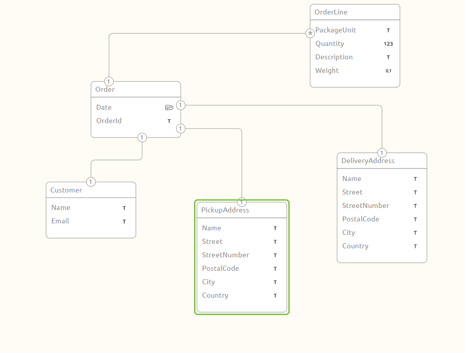

	

		<main class="micro-learning">
		<ul class="doc-nav">
			<li class="doc-nav__item"><a href="../../docs/microlearning/crashcourse-messaging-index" class="doc-nav__link">Home</a></li>
			<li class="doc-nav__item"><a href="#intro" class="doc-nav__link">Intro</a></li>
			<li class="doc-nav__item"><a href="#theory" class="doc-nav__link">Theory</a></li>
			<li class="doc-nav__item"><a href="#practice" class="doc-nav__link">Practice</a></li>
			<li class="doc-nav__item"><a href="#solution" class="doc-nav__link">Solution</a></li>
		</ul>

##### Intro

# Understanding the eMagiz CDM

In this microlearning, we will introduce the key concepts of the CDM or Canonical Data Model of eMagiz.

Should you have any questions, please contact academy@emagiz.com.

- Last update: February 25th, 2021
- Required reading time: 3 minutes

## 1. Prerequisites
- Basic knowledge of the eMagiz platform
- Completed the Crash course Platform

## 2. Key concepts
Canonical data models are a type of data model that aims to present data entities and relationships in the simplest possible form in order to integrate processes across various systems and databases. More often than not, the data exchanged across various systems rely on different languages, syntax, and protocols.

 
canonical-data-model

##### Theory

## 3. The CDM in eMagiz

In eMagiz you can model a CDM in the Design phase. Authorized users can make edits, and set up a generic data model that describes the entities that are used in the integration landscape. Each entity will have its unique name, and attributes can be added to define the required data types. The intent is to describe the data model so that there is an absolute definition of the model that can be interpreted by all users in the system. It can also act as a reference for compliancy to the company's logical data model. Using associations the relations between entities can be described as well as the cardinatily.

Once the CDM is defined, other users can then reuse this model to define CDM messages that are used in the 5-layered model as described in the Messaging introduction. These CDM messages define the parts of the data model that is actually used in the integrations realized, and may contain one of more entities and their associations. So that all data elements are defined in the same manner, types and lenght.

 

##### Practice

## 4. Assignment

Review the video below to ensure all concepts are clear. Take a look at the blog mentioned below.

## 5. Key takeaways

Core functions of the CDM:
- Centralize messaging between systems
- Describe the content of the messages in entity like model
- Understand what is exchanged exactly – attribute types
- Insight into proper, re-usable transformation

##### Solution

## 6. Suggested Additional Readings

- https://www.emagiz.com/blogs/cdm-canonical-data-model/

## 7. Silent demonstration video

This video provides an introduction of the Messaging concept

<iframe width="1907" height="1073" src="https://www.youtube.com/embed/G9zEARKQCIc" frameborder="0" allow="accelerometer; autoplay; clipboard-write; encrypted-media; gyroscope; picture-in-picture" allowfullscreen></iframe>

</main>

