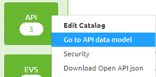
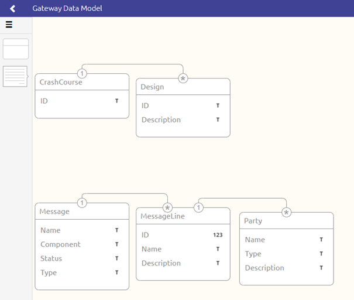
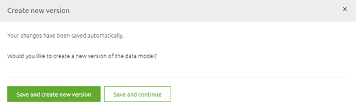
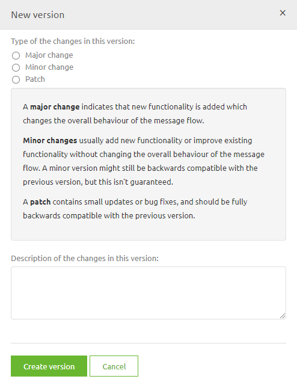
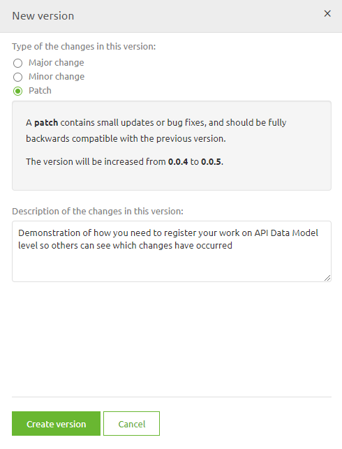
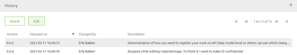

# API Data Model

In this microlearning we will focus on learning about the API Data model.
As with every integration pattern eMagiz gives you the option to create your own data model. 
This data model can be based on standards (i.e. OTM5), can be custom made or a combination of both. 

For API the data model represents the structure of messages that you want to publish to the outside (other parties or other internal systems) world. 

Should you have any questions, please contact academy@emagiz.com.

- Last update: February 11th 2021
- Required reading time: 4 minutes

## 1. Prerequisites
- Basic knowledge of the eMagiz platform

## 2. Key concepts
This microlearning centers around the API Data Model.
With API we mean: A collection of definitions based on which a client can communicate with applications
With data model we mean: A collection of elements (entities and attributes) that represent how you view those elements and how you want to converse about those elements

The data model consists of the following:
- Entities with their characteristics
- Relationships between entities

And has as a goal to create a landscape wide overview of the collection of elements that are integrated via the eMagiz platform.

## 3. API Data Model

As with every integration pattern eMagiz gives you the option to create your own data model. 
This data model can be based on standards (i.e. OTM5), can be custom made or a combination of both. 

For API the data model represents the structure of messages that you want to publish to the outside (other parties or other internal systems) world.

You can access the API data model in the Design phase of eMagiz. To do so you have to navigate to Design and open the context menu on the API block in the center of your Design Overview

When you select this option eMagiz will take you to the Gateway (API) Data Model. 
When you enter this overview for the first time you will see an empty canvas. 

On this canvas you can either drag and drop items (just as we discussed in our Crash Course Platform - Creating a Message Definition)
or you can opt to Import from an XSD file. In either case you need to enter "Start Editing" mode first.

Obviously you can also import part of the data model and extend on it further with the help of manual editing or importing a second part of the data model later on as the model grows.

So for example your data model could look like this after you have imported two separate XSD files into the API Gateway Data Model

### 3.1 Saving your changes

After you are done with editing on this data model you can press "Stop Editing" and you will be presented with the following pop-up

At this point you have to make a choice. If you are satisfied with your work you press Save and create new version. 
If you are unsure of your work or simply need to stop because there is no more time left go for the option Save and continue.

#### 3.1.1 Save and create new version

When you go for the option Save and create new version you will see the following pop-up

Choose whether this was a major, minor or patch upgrade and give a description to the version that tells you and others what you have changed. Something like this

Press the button Create version and eMagiz will save your changes.

#### 3.1.2 Save and continue
When you are not sure that the version you are currently working on is ready for Deploy you can select the other option called Save and continue. 
When choosing this option eMagiz will automatically create a temporary version of your flow in its current state. 
You can view who made what (temporary) version when you navigate to the History option on API Gateway Data Model level.

This history of the changes on API Gateway Data Model are not only useful for auditing purposes but it also helps you identify who you should ask about the latest changes.
As you can see the default description of a autosaved version is Autosaved version. You can give such a version a more descriptive name by selecting it and pressing Edit.

That action will lead you to the following pop-up. In this pop-up you can change the description of the autosaved version to something that makes clear what you did.

Simply press Save when you are done and the description will be changed

## 4. Assignment

Import two definitions (XSD's) into your API Gateway Data Model and change one the attributes to indicate that it is confidential
This assignment can be completed with the help of a associated Mendix project linked to the (Academy) project that you have created/used in the previous assignment.

## 5. Key takeaways

- The API data model can be based on standards (i.e. OTM5), can be custom made or a combination of both. 
- The data model consists of the following:
	- Entities with their characteristics
	- Relationships between entities
- Multiple ways of creating and editing the data model
	- You can import from outside sources
	- You can build it from scratch
	- You can use any combination in any order of the above mentioned options
- Changes on API Gateway Data Model are kept in History and it is up to the user to make it clear what has changed

## 6. Suggested Additional Readings

If you are interested in this topic and want more information on it please read the help text provided by eMagiz.

## 7. Silent demonstration video

This video demonstrates how you could have handled the assignment and gives you some context on what you have just learned. Disclaimer, you only see the eMagiz part but if you follow the above steps you are good to go!

<iframe width="1280" height="720" src="../../vid/microlearning/microlearning-api-data-model.mp4" frameborder="0" allow="accelerometer; autoplay; clipboard-write; encrypted-media; gyroscope; picture-in-picture" allowfullscreen></iframe>