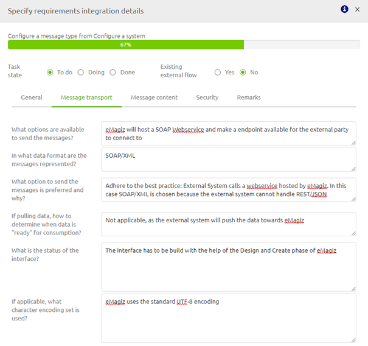
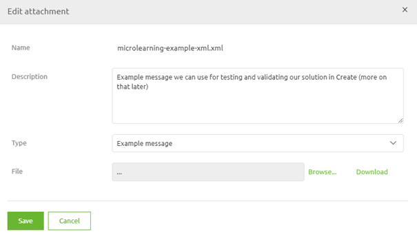
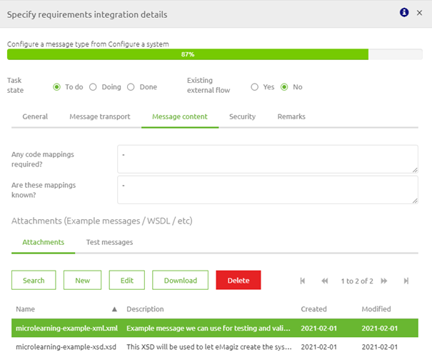
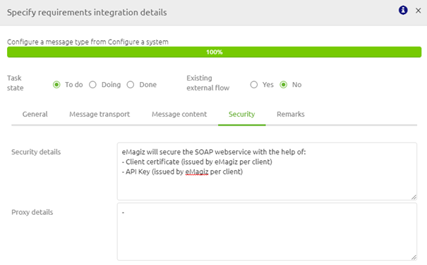

	

		<main class="master">
		<!-- 

<select class="dropdown__dropdown">
<option value="from-business-to-it-with-emagiz">From Business to IT with eMagiz</option>
    <option value="getting-the-technical-requirements" onclick="window.location.href='../../docs/microlearning/index-crashcourse-messaging';">Getting the technical requirements</option>
    <option value="moving-onto-the-next-step">Moving onto the next step</option>    
</select>

 -->

<ul class="doc-nav">
    <li class="doc-nav__item"><a href="/docs/microlearning/crashcourse-platform-index" class="doc-nav__link">Home</a></li>
    <li class="doc-nav__item"><a href="#intro" class="doc-nav__link">Intro</a></li>
    <li class="doc-nav__item"><a href="#3-configure-a-integration" class="doc-nav__link">Theory</a></li>
    <li class="doc-nav__item"><a href="#4-assignment" class="doc-nav__link">Practice</a></li>
    <li class="doc-nav__item"><a href="#7-silent-demonstration-video" class="doc-nav__link">Solution</a></li>
</ul>

# Configure a integration

In this microlearning, we will focus on learning how to configure an integration. 
Configuring the integration itself is the third and final step in designing an integration within eMagiz

Should you have any questions, please contact academy@emagiz.com.

- Last update: February 23th 2021
- Required reading time: 8 minutes

# INTRO

## 1. Prerequisites
- Basic knowledge of the eMagiz platform

## 2. Key concepts
This microlearning centers around configuring an integration.
With configuration we mean: Adding, Editing, and/or Deleting an integration
With integration we mean: A method to exchange data between an external party and eMagiz based on agreed-upon rules and definitions

To configure an integration you need the following:
- Connection information (how are you going to exchange information)
- Content information (what are you going to exchange)
- Security information (how are you going to secure the data exchange)

## 3. Configure an integration

As specified before with configure we mean adding, editing, and/or deleting an integration. Below we will detail per action what you should do.

### 3.1 Adding a integration

To add an integration you simply drag a line from or to a system on the canvas

 

After you have connected the system to eMagiz (located in the center) you will immediately be presented with the following pop-up. In this pop-up you have a choice to make:

- Re-use a message type (in case another system already supplies Orders and you want to send these Orders to another system for example)
- Add a new message type

In case you want to add a new message type, please study the microlearning **Configure a message type**.

In this microlearning, we will assume that the message type you want to use for this particular integration is already available within your eMagiz project.
Therefore we will select the message type Configure a message type from the drop-down menu

### 3.2 Editing a integration

Editing an integration means filling in the detailed information belonging to the integration and subsequently change the information.

Filling in the detailed information in Capture helps you to better Design, Create, Deploy and Manage your integration.
This detailed information is available when you double click on the line you have just drawn (or select the Edit integration option via the context menu).

After you have selected the integration a pop-up will be shown. This pop-up is divided into five segments:

- General
- Message Transport
- Message Content
- Security
- Remarks

#### 3.2.1 General
This segment answers several general questions surrounding this integration. 
If you have correctly added the message type you will notice that these questions are already filled at the moment you open them. 

The moment you want to change an answer given earlier on these questions this is the place to do so.

#### 3.2.2 Message Transport
The second segment has all to do with the transport of the message (i.e. how will the data be sent to eMagiz or from eMagiz to an external system).

In this segment you will answer questions on:
- how the messages will be send (i.e. REST web service, file drop, etc.)
- In what format the messages are exchanged (i.e. JSON, XML, EDI, CSV, etc.)
- whether the data is pushed (i.e the receiving systems waits idly until a message is sent to it) or pulled (i.e the receiving systems is actively checking for new messages)
- The preferred option to exchange data (i.e. REST web service, SOAP web service, etc.)
- The status of the interface (i.e. what already exists on both sides for this)

If you have filled in all this information you have learned a lot about how you need to Design and Create your integration.

#### 3.2.3 Message Content
The third segment is focused on the content of the message. 
Remind yourself, in the previous segment we determined the format of the message, now we can zoom in to determine the actual content of the messages that will be exchanged.

In this question you can add various documents retrieved from the external party that define how messages will be exchanged:
- Example messages (i.e. examples of how a message could look like, very useful when unit testing your flow)
- Definitions (i.e XSD or WSDL, that define the exact structure, order, and data types of the message)
- Specification Document (i.e. detailing the method of authentication, order of actions needed to successfully post a message, etc.)

You can do so by adding attachments to this specific implementation of the message type.

All attachments linked to this specific implementation of the message type are shown in a grid on this third segment.

#### 3.2.4 Security

The fourth segment has everything to do with security. In this segment, you can fill in all information related to the security of the connection between eMagiz and the external party.
In the example we are working out the external party will send data to eMagiz via a SOAP Webservice. 

Therefore the Security details should reflect the way eMagiz will secure this connection to make sure that the integrity of the data is not comprised. 
The best practice for **SOAP** Webservices is an API Key + Client certification for client authentication.

 
#### 3.2.5 Remarks
The fifth and last segment is called Remarks. In this segment, you can add everything you want. 
For example, you could add your notes of meetings with the business that will help your fellow developer to actually build the solution in Create.
 

The moment you are satisfied with the information registered in Capture on integration level you can switch the status of the integration to done.

### 3.3 Deleting a integration

Deleting an integration can be done with the help of the context menu on integration level. If you right-click on the line you have just finished you will see an option Delete Integration.
Selecting that option will delete your integration.

Be aware that you can only delete an integration if the integration is not part of the Create phase (anymore).

## 4. Assignment

The assignment is simple this time. Simply add, edit and subsequently delete an integration called Configure a message type. 
After you have successfully deleted the integration re-add the integration as you will need it in the following assignment(s).
This assignment can be completed with the help of an associated Mendix project linked to the (Academy) project that you have created/used in the previous assignment.

## 5. Key takeaways

- A integration refers to a specific implementation between a specific external party and eMagiz based on a message type (data object)
- Several integrations can re-use the same message type
- Filling in the detailed information in Capture helps you to better Design, Create, Deploy and Manage your integration.
- Deleting an integration can only be done **after** the integration has been untransferred from Create (or never existed in Create in the first place)

## 6. Suggested Additional Readings

If you are interested in this topic and want more information on it please read the help text provided by eMagiz.

## 7. Silent demonstration video

This video demonstrates how you could have handled the assignment and gives you some context on what you have just learned. Disclaimer, you only see the eMagiz part but if you follow the above steps you are good to go!

<iframe width="1280" height="720" src="../../vid/microlearning/microlearning-configure-a-integration.mp4" frameborder="0" allow="accelerometer; autoplay; clipboard-write; encrypted-media; gyroscope; picture-in-picture" allowfullscreen></iframe>
</main>

