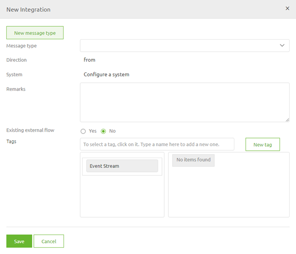
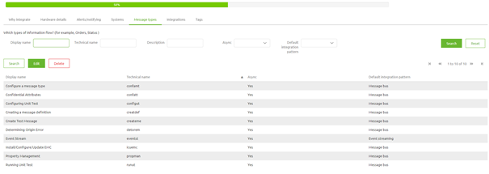

# Configure a message type

In this microlearning we will focus on learning how to configure a message type. 
Configuring a message type is the second step in designing a integration within eMagiz

Should you have any questions, please contact academy@emagiz.com.

- Last update: February 1th 2021
- Required reading time: 6 minutes

## 1. Prerequisites
- Basic knowledge of the eMagiz platform

## 2. Key concepts
This microlearning centers around configuring a message type.
With configuration we mean: Adding, Editing and/or Deleting of a message type
With message type we mean: A reference to a specific data object (Order, Status, Employee, Invoice, etc.) of the data that needs to be exchanged. 
This specific data object can be exchanged between several parties, meaning a message type can be in multiple integrations within your landscape

To configure a message type you need the following:
- The name of the message type
- Basic information about the message type

## 3. Configure a message type

As specified before with configure we mean adding, editing and/or deleting a message type. Below we will detail per action what you should do.

### 3.1 Adding a message type

To add a message type you simply drag a line from or to a system on the canvas

 

After you have connected the system to eMagiz (located in the center) you will immediately be presented with the following pop-up. In this pop-up you have a choice to make:

- Re-use a message type (in case another system already supplies Orders and you want to send these Orders to another system for example)
- Add new message type

In this case we will choose the option New message type. Selecting this option will lead to a second pop-up

In this pop-up you need to fill in the correct details regarding your message type. The critical ones are:

- Display name
- Technical name
- Default integration pattern (coupled with Asynchronous)
- Amount/frequency of messages
- Timing/spread of messages
- Size of messages
- How critical are these messages
- Is the order of the messages relevant

While the first two are critical because you need a unique name within your eMagiz project to prevent errors the remainder of the information elements are interesting for a different reason.

These information elements are a critical first step in determining what is the most suitable way of transporting the data, 
can help you determine early on whether extra monitoring measurements are needed and can help you make better decisions in terms of memory needed to process the data that will be exchanged.

Not filling this information in, or filling it in at random hurts you in the long term when we look at changeability and maintainability of your eMagiz project 
and could be the reason you are surprised by problems in a Production environment that could have been prevented.

See below for a example of how to fill this information in a clear manner

If you are satisfied with your work you can press Save. This action will lead you back to the first pop-up with a distinctive difference, the message type is filled in.

If everything is okay you can press Save and as a result eMagiz will update the Capture overview

#### 3.2.2 Editing a message type

To edit this general set of information on message type level navigate to **Capture -> Settings -> Message Types**. In this overview you see all message types related to your eMagiz project.
In here you can search for the message type you want to Edit, select it and press Edit.

In here you can change the information you have first filled in when you wanted to create a new message type. 
As a message type can de re-used over multiple integrations (lines in Capture) be carefull what you change here as it will automatically update the information on integration level.

Furthermore we strongly advice not to change the technical name of a message type the moment you have already transferred one (or more) integration(s) that make use of this message type to Create.

### 3.3 Deleting a message type

Deleting a message type can be done after you have deleted all integrations that make use of the message type. 
Therefore in order to delete a message type you first need to delete all integrations (lines) in Capture that make use of your message type

Be aware that you can only delete a integration if the integration is not part of the Create phase (anymore).

After you have done this you can navigate to **Capture -> Settings -> Message Types**. In this overview you see all message types related to your eMagiz project.
In here you can search for the message type you want to Delete, select it and press Delete. 

If you have deleted all integrations correctly the message type will be removed.

## 4. Assignment

The assignment is simple this time. Simply add, edit and subsequently delete a message type called Configure a message type. 
After you have successfully deleted the message type re-add the message type as you will need it in the following assignment(s).
This assignment can be completed with the help of a associated Mendix project linked to the (Academy) project that you have created/used in the previous assignment.

## 5. Key takeaways

- A message type refers to a specific data object that you want to exchange between parties
- Several integrations can re-use the message type
- Editing information on message type level also edits information on integration level
- Deleting a message type can only be done **after** all integrations have been deleted.

## 6. Suggested Additional Readings

If you are interested in this topic and want more information on it please read the help text provided by eMagiz.

## 7. Silent demonstration video

This video demonstrates how you could have handled the assignment and gives you some context on what you have just learned. Disclaimer, you only see the eMagiz part but if you follow the above steps you are good to go!

<iframe width="1280" height="720" src="../../vid/microlearning/microlearning-configure-a-message-type.mp4" frameborder="0" allow="accelerometer; autoplay; clipboard-write; encrypted-media; gyroscope; picture-in-picture" allowfullscreen></iframe>