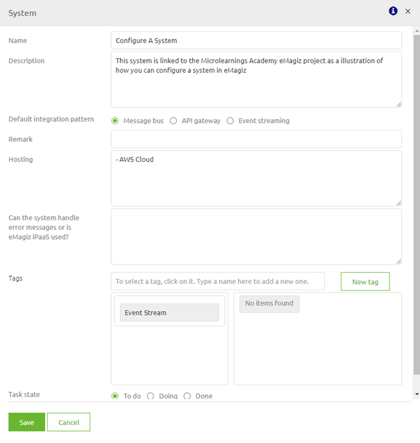
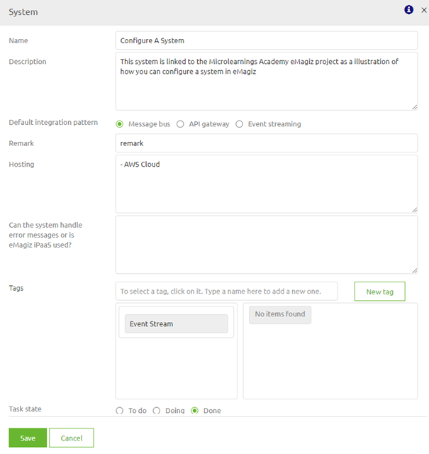

# Configure a system

In this microlearning, we will focus on learning how to configure a system. 
Configuring a system is the first step in designing an integration within eMagiz

Should you have any questions, please contact academy@emagiz.com.

- Last update: January 29th, 2021
- Required reading time: 2 minutes

## 1. Prerequisites
- Basic knowledge of the eMagiz platform

## 2. Key concepts
This microlearning centers around configuring a system.
With configuration we mean: Adding, Editing, and/or Deleting a system
With system we mean: A application that will exchange data between itself and others (via eMagiz)

To configure a system you need the following:
- The name of the system
- Basic information about the system

## 3. Configure a system

As specified before with configure we mean adding, editing, and/or deleting a system. Below we will detail per action what you should do.

### 3.1 Adding a system

To add a system simply drop the system (regular or multi-tenant) on the canvas

 

 

After you have released the system in the correct place you will immediately be presented with the following pop-up. In this pop-up fill in the following elements:

- Name
- Description
- Default Integration Pattern
- Hosting

When you fill in these elements you have registered the relevant meta-information for yourself and others to relate to the system in question

If you are satisfied with your work you can update the status and press Save.

### 3.2 Editing a system

To edit a system you simply double click on the system (or edit it via the context menu). After you have done so you can edit the system via the same pop-up as when you create a new system.

For example, you could change the Status to Done or add a Remark. Editing a system can be done without impact at any given moment as you only edit descriptive fields.

### 3.3 Deleting a system

Adding a system is the starting point of your integration and both editing and deleting a system can happen at any given moment.
Although editing a system has no impact regardless of the state of the system in subsequent phases of the ILM the same does not apply for deleting a system.

When a system has been transferred to Create you cannot delete the system anymore in Capture without removing it first from Create. 
This is done to prevent situations that could be disastrous (i.e removing something that is still running on Production).

The specifics of those situations will be discussed in a separate microlearning. For now, we will keep it simple and focus on deleting a system while it is still in Capture and Design.

To delete a system in such a scenario you can simply open the context menu and press Delete system and press OK on the confirmation pop-up.

## 4. Assignment

The assignment is simple this time. Simply add, edit and subsequently delete a system called Microlearning. 
After you have successfully deleted add a new system that you can use in the following assignment(s).
This assignment can be completed with the help of an associated Mendix project linked to the (Academy) project that you have created/used in the previous assignment.

## 5. Key takeaways

- Adding a system is the starting point of building an integration via eMagiz
- Editing system information can be done at any given time without impact on other ILM phases
- Deleting a system can only be done (without special steps in preparation) when the system has **not** yet been transferred to Create or has been untransferred from Create.

## 6. Suggested Additional Readings

If you are interested in this topic and want more information on it please read the help text provided by eMagiz.

## 7. Silent demonstration video

This video demonstrates how you could have handled the assignment and gives you some context on what you have just learned. Disclaimer, you only see the eMagiz part but if you follow the above steps you are good to go!

<iframe width="1280" height="720" src="../../vid/microlearning/microlearning-configure-a-system.mp4" frameborder="0" allow="accelerometer; autoplay; clipboard-write; encrypted-media; gyroscope; picture-in-picture" allowfullscreen></iframe>