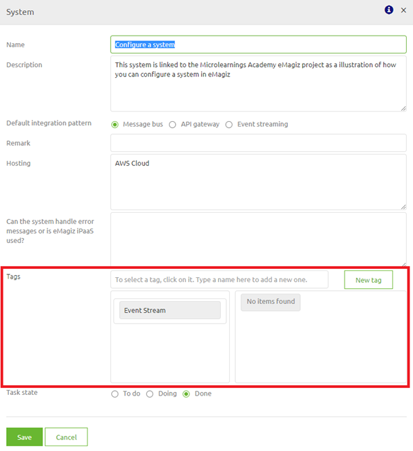
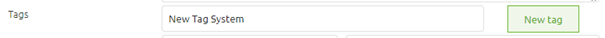
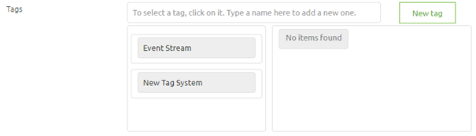
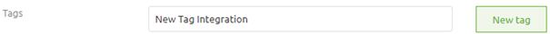
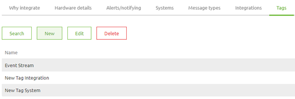

	

		<main class="master">
		<!-- 

			<select class="dropdown__dropdown">
			<option value="from-business-to-it-with-emagiz">From Business to IT with eMagiz</option>
				<option value="getting-the-technical-requirements" onclick="window.location.href='../../docs/microlearning/index-crashcourse-messaging';">Getting the technical requirements</option>
				<option value="moving-onto-the-next-step">Moving onto the next step</option>    
			</select>
			

			
			

		
 -->
		</main>
	

# Configure a tag

In this microlearning we will focus on learning how to configure a tag. 
Configuring the tag itself is relatively simple. Using tagging to create different views is the art.

Should you have any questions, please contact academy@emagiz.com.

- Last update: February 1th 2021
- Required reading time: 5 minutes

## 1. Prerequisites
- Basic knowledge of the eMagiz platform

## 2. Key concepts
This microlearning centers around configuring a tag.
With configuration we mean: Adding, Editing and/or Deleting of a tag
With tag we mean: A label under which you can group a set of systems and/or integrations

## 3. Configure a tag

As specified before with configure we mean adding, editing and/or deleting a tag. Below we will detail per action what you should do.

### 3.1 Adding a tag

Adding a tag can be done in three distinctive ways

#### 3.1.1 Adding a tag on system level
The moment you double click on a system (or edit the system via the context menu)  the detail information of that system will appear. 
Furthermore a segment related to Tags will be shown in the pop-up.

In here you can create a new tag by typing in the name next to the tags label. After you are done with writing out the name select the button New tag

By adding a tag this way you also directly link it to the system you are currently editing

If you want to deselect a certain tag on system level you can select the x icon to the right of the tag to make sure this system is not tagged anymore.

#### 3.1.2 Adding a tag on integration level
The moment you double click on a integration (or edit the integration via the context menu) the detail information of that integration will appear. 
Furthermore a segment related to Tags will be shown in the pop-up.

In here you can create a new tag by typing in the name next to the tags label. After you are done with writing out the name select the button New tag

By adding a tag this way you also directly link it to the integration you are currently editing

If you want to deselect a certain tag on integration level you can select the x icon to the right of the tag to make sure this integration is not tagged anymore.

#### 3.1.3 Adding a tag on capture level
Apart from adding a tag on system and/or integration level you can also add a tag via Capture -> Settings -> Tags.
On this overview page you can press the New button to add a New tag. 

Adding a tag in this way makes sure the tag is linked to your project but not yet applied on any system and/or integration

However you do have the possibility to link systems and integrations to this newly created tag in the same pop-up

Best practice when it comes to adding tags is to add them via the system or integration option as that is the contextual level for which you want to utilize the tags.

### 3.2 Editing a tag
Editing a tag can mean two things:

- Edit the name of the tag
- Edit which systems and integrations the tag is assigned to

Both are discussed below in more detail

#### 3.2.1 Edit the name of the tag
To edit the name of a tag you navigate to Capture -> Settings -> Tags. Here you can search for the tag, select it and edit it.

In the pop-up that you will be presented with you can simply edit the name of the tag and press Close.

#### 3.2.1 Edit which systems and integrations the tag is assigned to
You can either add or remove system(s) and integration(s) via the pop-up we have just discussed 
or you can select the system or integration you want the tag to be added or removed from via the Capture overview page.

In the second case you look for the tag you want to add or remove and click on it to add or remove it.

### 3.3 Deleting a tag
To delete the name of a tag you navigate to Capture -> Settings -> Tags. Here you can search for the tag, select it and delete it.

After reading the confirmation popup press OK to remove the tag from your project.

## 4. Assignment

This time we have a three part assignment:
- Add three seperate tags to your eMagiz project. One on system level, one on integration level and one on capture level.
- Secondly edit the tag on integration level by also adding the accompanying system to this tag.  
- Finally delete the tag on capture level

This assignment can be completed with the help of a associated Mendix project linked to the (Academy) project that you have created/used in the previous assignment.

## 5. Key takeaways

- You can link a tag to a integration or a system
- Editing and deleting tags can be done via an overview under Capture -> Settings
- Best practice is to use the system and/or integration as starting point for adding and removing tags

## 6. Suggested Additional Readings

If you are interested in this topic and want more information on it please read the help text provided by eMagiz.

## 7. Silent demonstration video

This video demonstrates how you could have handled the assignment and gives you some context on what you have just learned. Disclaimer, you only see the eMagiz part but if you follow the above steps you are good to go!

<iframe width="1280" height="720" src="../../vid/microlearning/microlearning-configure-a-tag.mp4" frameborder="0" allow="accelerometer; autoplay; clipboard-write; encrypted-media; gyroscope; picture-in-picture" allowfullscreen></iframe>