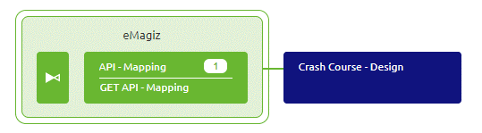

# Adding flows to Create
The moment you are satisfied with your work in Design you can add the flow to Create in order for the flow to be build.

Should you have any questions, please contact academy@emagiz.com.

- Last update: February 4th 2021
- Required reading time: 4 minutes

## 1. Prerequisites
- Basic knowledge of the eMagiz platform

## 2. Key concepts
This micro learning focuses on adding flows to create.

With adding flows we mean: Making a flow available in the Create phase of eMagiz so it can be build / generated.

## 3. Adding flows to Create

Adding flows to Create is a relatively simple action to perform. Simply navigate to Create and in the Create overview there is a button located on the bottom left called Add integrations.

Selecting this option leads you to a overview where you can add (and remove) flows to and from Create.

In this overview all integrations that have already been transferred to Create are indicated as a blue cube with a checkmark in the middle

All integrations that have **not** been transferred to Create yet (or have been removed from Create but not yet from Design) are identifiable as a white cube with a green border

When you want to add a flow to Create simply click on the cube linked to the integration you want to add and eMagiz will change it to a green cube with a + icon and will tell you what you want to add.

If you are satisfied with the choices you have made you can press Save selection and eMagiz will add the flows to Create. 
To verify that your integration has been added you can navigate to the Create overview belonging to your integration pattern to verify the result

 
## 4. Assignment

Navigate to Create and add a flow to Create. After you have done so verify the result in the Create overview. 
This assignment can be completed within the (Academy) project that you have created/used in the previous assignment.

## 5. Key takeaways

- Adding (and removing) flows can be done via a visual overview showing you the current status
- eMagiz will tell you what you want to add (or remove) so you can check before you action
- Removing means removing (so no turning back)

## 6. Suggested Additional Readings

If you are interested in this topic and want more information on it please read the help text provided by eMagiz.

## 7. Silent demonstration video

This video demonstrates a working solution and how you can validate whether you have successfully completed the assignment.

<iframe width="1280" height="720" src="../../vid/microlearning/microlearning-adding-flows-to-create.mp4" frameborder="0" allow="accelerometer; autoplay; clipboard-write; encrypted-media; gyroscope; picture-in-picture" allowfullscreen></iframe>