

    

        <main class="micro-learning">
        <ul class="doc-nav">
            <li class="doc-nav__item"><a href="../../docs/microlearning/crashcourse-platform-index" class="doc-nav__link">Home</a></li>
            <li class="doc-nav__item"><a href="#intro" class="doc-nav__link">Intro</a></li>
            <li class="doc-nav__item"><a href="#theory" class="doc-nav__link">Theory</a></li>
            <li class="doc-nav__item"><a href="#practice" class="doc-nav__link">Practice</a></li>
            <li class="doc-nav__item"><a href="#solution" class="doc-nav__link">Solution</a></li>
        </ul>

##### Intro

# Configuring a Flow Test

In this microlearning, we will focus on configuring a flow test.

Should you have any questions, please contact academy@emagiz.com.

- Last update: July 7th, 2021
- Required reading time: 7 minutes

## 1. Prerequisites
- Basic knowledge of the eMagiz platform
- Understanding of the Flow testing concept

## 2. Key concepts
This microlearning centers around configuring a flow test.
With flow testing, we mean: Testing each separate component (unit) within the context of a flow based on a supplied input (and an expected outcome).

Configuring a flow test can be done via the Configure Tests canvas in the Create phase on the flow level.
In this canvas, there is a button called Add Test Case. By pressing this button you can start with the configuration of your flow test.

The moment you already have flow tests available within the context of your flow you can edit or delete them.

##### Theory

## 3. Configuring a Flow Test

Configuration of a flow test is necessary for two scenarios. On the one hand, you want to add a new flow test to test a scenario for which you have not yet a flow test available. 
On the other hand, you want to be able to edit an existing flow test to alter the input, output, or naming of the existing flow test.

Apart from adding or editing a configuration, it is also possible to delete a configured flow test when it has become obsolete. In the remainder of this microlearning, we will discuss these three options.

### 3.1 Add a Test Case

To add a flow test you navigate to the Create phase of eMagiz. Within the Create phase of eMagiz, you open the flow you want to flow test.
After you have opened the flow you should press the button on the bottom bar called Configure tests. This will lead you to the following canvas:

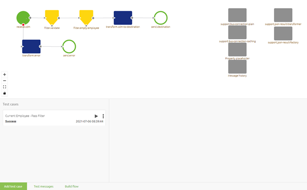

In this canvas, you will see the flow as you have currently built it in the top half and all other test cases on the bottom half. On the bottom pane, there is a button located called Add test case. 
By pressing this button you start the configuration of a new flow test within the context of the flow on which you are currently working.

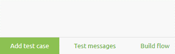

After you have pressed this button a new entry in your list of test cases will appear. When your list is still empty this will be your first entry, congrats!

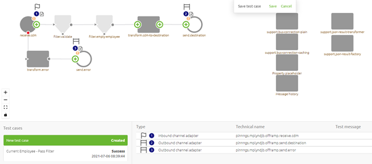

Meanwhile, the canvas is also changed to indicate that you can configure your flow test. To properly configure a unit test you should follow these steps:

- Select the input for the unit test that fits the scenario you want to test. 
    - This can be done by navigating with your mouse to the input component of the flow and clicking on the plus icon. Here you will be presented with a list of options from which you can choose the correct input message. (The same process works for the output components)
- If available and relevant for your scenario select the test message that embodies the expected outcome of the scenario you want to test (or specify that there is no expected message on a certain outbound component). Note that this is an optional step. However, to achieve Success as result you need to define an expected message or define that there is no expected message. If you specify nothing but something happens (regardless of what) you will receive a Failure status.

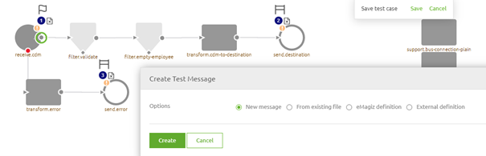

As you can see eMagiz provides you with four distinctive options to link a test message to your test case:

- Create a message from scratch
- Create a message based on an example message
- Create message based on eMagiz definition
- Create a message based on an external definition

See [Creating Test Messages for Test Cases](crashcourse-platform-create-creating-test-messages.md) for detailed information on what each option means and how you can use it.

After you have linked your test message to your test case you will see that the canvas is updated to reflect this change. Note that the warning icon is disappeared and that the Test message is linked to the inbound component.

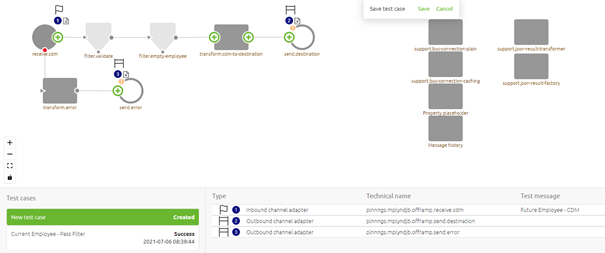

As stated before you could Save your test case at this point in time. However, if you already know what the expected message will be per outbound component you can define it in a similar manner. In some scenarios however you might not even expect a message at the end of your flow. For those cases, we have added the option called No expected message. Once again you click on the plus icon and instead of selecting a certain option to create a test message you select the option no expected message.

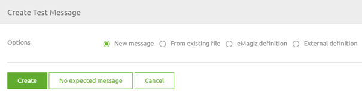

When selecting this option you tell eMagiz that you do not expect any message to reach that outbound component. A good example is the error handling on the flow level. Here you don’t expect a message to pass by. It is recommended to do this for the error outbound adapter. After doing so the canvas will change again to reflect the choices made by you.

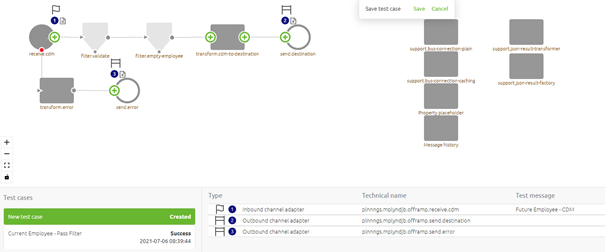

This concludes the configuration of our first test case so we can press Save on Save test case. As a result, the canvas will exit the edit mode and reflect the configuration we have made.

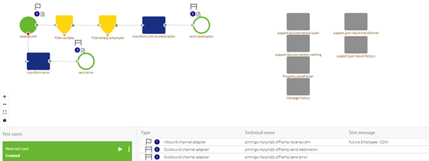

As we want to be able to distinguish between test cases we need to define a name for this test case. To do so open the context menu and select the option Details. Here you can change the name of your test case.

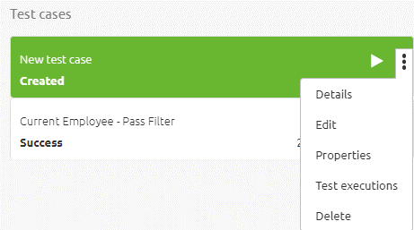

This action makes it possible for you to enter a name. As mentioned before keep the name as descriptive as possible. For an example see below. When you are satisfied press Save.

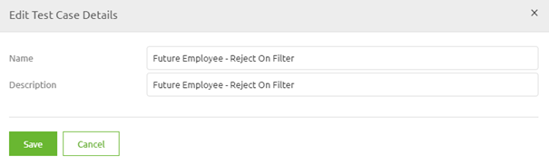

Last but not least in the configuration we need to define our property values. To do so select the option properties from the same context menu. Here you can edit each property by clicking on the value input and entering the correct value.

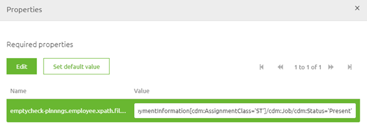

### 3.2 Edit a Test Case

Apart from Adding a test case, you can also edit a flow test. This could be handy if you need to add new messages to your test case later on. Note that the editing (and/or removing) of test messages is done in a different manner. If you want more information on that please check out [Editing Test Messages for Test Cases](crashcourse-platform-create-editing-test-messages.md) and [Deleting Test Messages for Test Cases](crashcourse-platform-create-deleting-test-messages.md). 

To enter the edit mode of your test case again there are two alternatives after selecting the test case itself. You can either enter the context menu on the test case level or you can enter the context menu on the flow canvas level. Since you need to select a specific test case to edit it makes sense to Edit from the context menu on the test case level. In here you have an option called Edit. Pressing this leads you to the edit mode of the test case (similar to what we saw before).

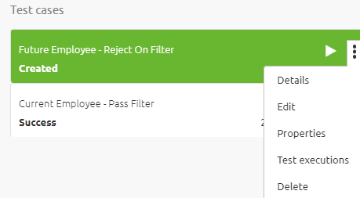

### 3.3 Delete a Test Case

Sometimes your test cases become obsolete or there are duplicate test cases created. In those cases, you want to have the option to delete a test case. Whatever the reason maybe you can remove a unit test from the list of unit tests that are linked to the flow.

To do so simply select the test case in question and access the context menu. In this context menu, you have the option to Delete your test case.

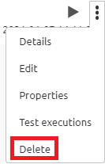

##### Practice

## 4. Assignment

Configure two flow tests. One flow test should have as input a complete representation of the system message in Design. 
The second flow test should have as input a minimal representation of the system message in Design and as output the expected CDM message. This assignment can be completed within a flow within your (Academy) project that you have created in the previous assignment.

## 5. Key takeaways

- Configuring a flow test can mean three things:
    - Add a test case
    - Edit a test case
    - Delete a test case
- Always give each flow test a descriptive name so it becomes clear what you are trying to test
- Selecting an input message is mandatory
- Selecting an output message is optional
- You can define that you expect no message in any output component

##### Solution

## 6. Suggested Additional Readings

If you are interested in this topic and want more information on it please read the help text provided by eMagiz when executing these actions. 

## 7. Silent demonstration video

<iframe width="1280" height="720" src="../../vid/microlearning/crashcourse-platform-create-configuring-flow-test.mp4" frameborder="0" allow="accelerometer; autoplay; clipboard-write; encrypted-media; gyroscope; picture-in-picture" allowfullscreen></iframe>

</main>

