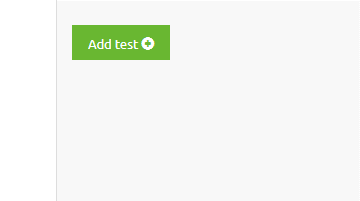
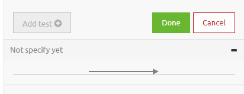
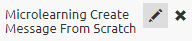
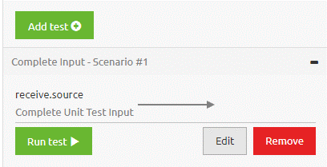

	

		<main class="micro-learning">
		<ul class="doc-nav">
			<li class="doc-nav__item"><a href="../../docs/microlearning/crashcourse-platform-index" class="doc-nav__link">Home</a></li>
			<li class="doc-nav__item"><a href="#intro" class="doc-nav__link">Intro</a></li>
			<li class="doc-nav__item"><a href="#theory" class="doc-nav__link">Theory</a></li>
			<li class="doc-nav__item"><a href="#practice" class="doc-nav__link">Practice</a></li>
			<li class="doc-nav__item"><a href="#solution" class="doc-nav__link">Solution</a></li>
		</ul>

##### Intro

# Configuring a Unit Test

In this microlearning we will focus on configuring a unit test.

Should you have any questions, please contact academy@emagiz.com.

- Last update: January 7th 2021
- Required reading time: 7 minutes

## 1. Prerequisites
- Basic knowledge of the eMagiz platform
- Understanding of Unit testing concept
- On- or offramp (without splitter or router) that needs to be tested

## 2. Key concepts
This micro learning centers around configuring a unit test.
With unit testing we mean: Testing each separate component (unit) within the context of a flow based on a supplied input (and an expected outcome).

Configuring a unit test can be done via the right hand panel menu while being in the Configure Tests screen of your Create flow.
In this right panel there is a button called Add Test. By pressing this button you have the ability to configure your unit test.

The moment you already have unit tests available within the context of your flow you can edit these by selecting the edit icon on that specific unit test.

##### Theory

## 3. Configuring a Unit Test

Configuration of a unit test can happen on two occassions. On the one hand you want to add a new unit test to test a scenario for which you have not yet a unit test available. 
On the other hand you want to be able to edit a existing unit test to alter the input, output or naming of the existing unit test.

### 3.1 Add a Unit Test

To add a unit test you navigate to the Create phase of eMagiz. Within the Create phase of eMagiz you open the flow you want to unit test.
After you have opened the flow you should press the button on the bottom bar called Configure tests 

In this overview you will see the flow as you have build it and in the right hand panel there is a button located called Add test. 
By pressing this button you add a new unit test to the context of the flow on which you are currently working on.

After you have pressed this button a new entry in your list of unit tests will appear. Obviously when your list is still empty this will be your first entry, congrats!

As you can see from the picture above you are now in a mode ready to configure your unit test.

To properly configure a unit test you should follow these steps:

- Select the input for the unit test that fits the scenario you want to test. 
	- This can be done by navigating with your mouse to the input component of the flow and clicking on the document icon. Here you will be presented with a list of options from which you can choose the correct input message. (The same process works for the output components)
- If available and relevant for your scenario select the test message that embodies the expected outcome of the scenario you want to test. Be aware this is an optional step.
- When you are content with your selection press Done.

As you can see from the picture above the view has changed again. To finish the configuration please add a descriptive name to the unit test. This way you and others that work with you can keep them apart.

To enter a name of the unit test you simply hover over the just created unit test on the point just before the - icon and click on the edit icon (pencil)

This action makes it possible for you to enter a name. As mentioned before keep the name as descriptive as possible. For an example see below.

The moment you hover over a certain message you will see two icons appear. One, the pencil, indicates the possiblity to edit the message.

When you are satisfied with your choice you can click on the edit icon. The result will be a popup showing you the message you can edit.
If you are satisfied with your name simply select the checkmark icon. In case you have doubts or want to cancel press the X icon.

By following these steps you have succesfully added a unit test to your flow.

### 3.2 Edit a Unit Test

Apart from Adding a Unit test you can also edit a unit test if you for example would like to change the input, output and/or name of the unit test.

To edit the name of the unit test you simply hover over the just created unit test on the point just before the - icon and click on the edit icon (pencil)

This action makes it possible for you to enter a name. As mentioned before keep the name as descriptive as possible. For an example see below.

The moment you hover over a certain message you will see two icons appear. One, the pencil, indicates the possiblity to edit the message.

When you are satisfied with your choice you can click on the edit icon. The result will be a popup showing you the message you can edit.
If you are satisfied with your name simply select the checkmark icon. In case you have doubts or want to cancel press the X icon.

To edit the input and/or output message that will be used in your unit test you press the Edit button

After you have pressed this button you can select another input (and/or output) message just as we have learned in the Add a unit test segment.

The moment you are satisfied with your changes you press Done and your changes have been saved.

### 3.3 Removing a Unit Test

Sometimes you even want to get rid of certain unit test. Maybe they have become obsolete due to changes within the flow, or maybe multiple test were created with the same intent.
Whatever the reason may be you can remove a unit test from the list of unit tests that is linked to the flow.

To do so simply press the Remove button for the unit test that you want to remove. After you pressed this button the unit test is gone from the list.

##### Practice

## 4. Assignment

Configure two unit tests. One unit test should have as input a complete representation of the system message in Design. 
The second unit test should have as input a minimal representation of the system message in Design and as output the expected CDM message. This assignment can be completed within a onramp or offramp flow within your (Academy) project that you have created in the previous assignment.

## 5. Key takeaways

- Configuring a unit test can mean three things:
	- Add a unit test
	- Edit a unit test
	- Remove a unit test
- Always give each unit test a descriptive name so it becomes clear what you are trying to test
- Selecting an input message is mandatory
- Selecting an output message is optional

##### Solution

## 6. Suggested Additional Readings

If you are interested in this topic and want more information on it please read the helptext provided by eMagiz when executing these actions and read the user guide on unit testing which you can find in the documentation portal.

## 7. Silent demonstration video

This video demonstrates how you could have handled the assignment and gives you some context on what you have just learned.

<iframe width="1280" height="720" src="../../vid/microlearning/crashcourse-platform-create-configuring-a-unit-test.mp4" frameborder="0" allow="accelerometer; autoplay; clipboard-write; encrypted-media; gyroscope; picture-in-picture" allowfullscreen></iframe>

</main>

