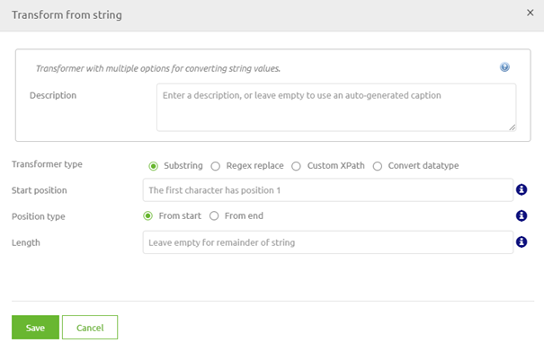
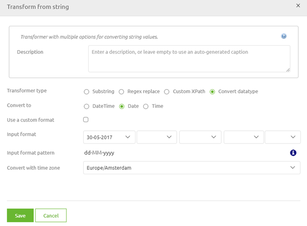

# Data type transformations
The data type (i.e. string, dateTime, boolean, integer or decimal) of attributes can differ between the input definition and the target definition.
To ensure that you end up with a valid target message you will need a data type transformation to reach that goal.

In this microlearning we will educate you on the possibility of data transformations in eMagiz.

Should you have any questions, please contact academy@emagiz.com.

- Last update: February 5th 2021
- Required reading time: 2 minutes

## 1. Prerequisites
- Basic knowledge of the eMagiz platform

## 2. Key concepts
This micro learning focuses on data type transformations.

With data type transformations we mean: Ensuring that the output is valid according to the data type of the attribute in the target message

## 3. Data type transformations
There are several data type transformations that could be done with eMagiz. In this microlearning we will focus on the one that you will use the most.
Transforming from a string to a date(Time). To illustrate this point I made a new mapping in Design, this time one for a API Gateway flow.

As we talk about a transformation we need to select the transformation icon (the blue rectangle, remember). This will lead us to the following pop-up

In this pop-up we have the option convert datatype. As the name suggest, this is the option we want to use this time

Now the only thing we need to know is how (in which notation) the backend operation of our API Gateway will return the Datum. 

In this case the dates they return are formatted as dd-MM-yyyy. So let's alter the input format in eMagiz to represent that.

Save your solution and you will notice that the warning is gone from eMagiz as you have successfully transformed the content of Datum to a valid date.

So, remember to check for the option convert datatype when you have a mismatch in the datatype between input and output.

## 4. Assignment

Use the convert datatype option to transform a input string in the format dd/MM/yyyy to a valid date in one of the transformations in your project. 
If you do not have one available you can add another integration via Capture, Design and Create to access the transformation.
This assignment can be completed within the (Academy) project that you have created/used in the previous assignment.

## 5. Key takeaways

- Data type transformation is to ensure that the output is valid according to the underlying rules of that data type
- eMagiz gives you the option to convert the datatype in most cases via the visual tooling
- Without knowing the input format it will be impossible to make a successfull data type transformation

## 6. Suggested Additional Readings

If you are interested in this topic and want more information on it please read the help text provided by eMagiz.

## 7. Silent demonstration video

This video demonstrates a working solution and how you can validate whether you have successfully completed the assignment.

<iframe width="1280" height="720" src="../../vid/microlearning/microlearning-data-type-transformations.mp4" frameborder="0" allow="accelerometer; autoplay; clipboard-write; encrypted-media; gyroscope; picture-in-picture" allowfullscreen></iframe>