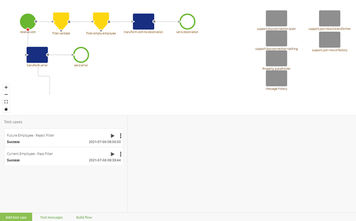
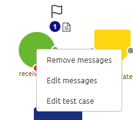
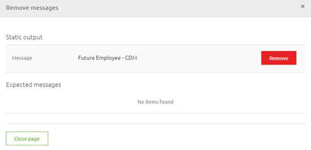
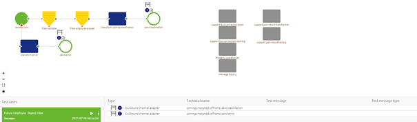
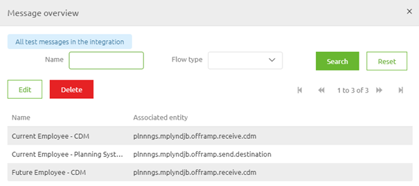
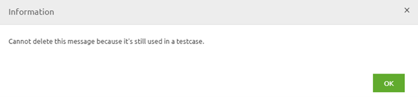

    

        <main class="micro-learning">
        <ul class="doc-nav">
            <li class="doc-nav__item"><a href="../../docs/microlearning/crashcourse-platform-index" class="doc-nav__link">Home</a></li>
            <li class="doc-nav__item"><a href="#intro" class="doc-nav__link">Intro</a></li>
            <li class="doc-nav__item"><a href="#theory" class="doc-nav__link">Theory</a></li>
            <li class="doc-nav__item"><a href="#practice" class="doc-nav__link">Practice</a></li>
            <li class="doc-nav__item"><a href="#solution" class="doc-nav__link">Solution</a></li>
        </ul>

##### Intro

# Deleting Test Messages for Test Cases

In this microlearning, we will focus on deleting test messages which you can use while configuring and executing flow tests.

Should you have any questions, please contact academy@emagiz.com.

Last update: July 7th, 2021
Required reading time: 2 minutes

## 1. Prerequisites
- Basic knowledge of the eMagiz platform
- Understanding of the Flow testing concept

## 2. Key concepts
This microlearning centers around deleting test messages for flow testing.
With flow testing, we mean: Testing each separate component (unit) within the context of a flow based on a supplied input (and an expected outcome).

Deleting a test message can be done in two steps.
- Select a specific test case for which you want to delete the message(s) and access the context menu on the flow to Delete messages.
- Use the Test messages button to see all linked test messages to a certain flow which you can delete one by one

##### Theory

## 3. Deleting Test Messages for Test Cases

To delete a test message you navigate to the Create phase of eMagiz. Within the Create phase of eMagiz, you open the flow where you want to delete a test message from.
After you have opened the flow you should press the button on the bottom bar called Configure tests. This will lead you to the following canvas:

Within this canvas there are two steps needed to delete your test messages:
- Select a specific test case for which you want to delete the message(s) and access the context menu on the flow to Delete messages.
- Use the Test messages button to see all linked test messages to a certain flow which you can delete one by one

### 3.1 Remove from test case via Canvas

Let us first zoom in on the first step. To do so first select the test case for which you want to delete your test messages. You can do so by clicking on the Test case in question in the left bottom pane. When you do so successfully the test case will be highlighted in green and the canvas will change. 

While in this mode you can hover over any input (identifiable via a flag icon) or output component (identifiable via a finish icon) and access the context menu (via a right-click) on the canvas.

When you click on Remove messages a pop-up will show the linked message(s). Per message, you have the option to remove the message from a certain flow test by clicking on the remove button.

Note that as a result, the canvas will update to reflect the action you took. In this case, we have no input message anymore so the flow test will not work anymore. 

Also, note that although the message is now removed from a specific flow test it is still available to use as a blueprint for any other flow test (or the same one in the future). To completely delete test messages from eMagiz we need the second approach. So let us discuss that approach.

### 3.2 Deleting via Test messages

After the step we just discussed to remove test messages from the test case you can completely remove the test message itself when you are done with it. To do this press the button called Test messages. Pressing the button called Test messages (located on the bottom bar) presents you with a list of all test messages that are linked to this flow.

In this pop-up, you can select a specific test message and click delete to delete it. Before you can delete eMagiz will ask for your confirmation via a confirmation pop-up. Note that gone means gone from eMagiz without a way to retrieve again. So think twice before deleting test messages. Note that when you try to delete a test message that is still linked to a test case you will be prevented to do so by eMagiz. eMagiz will also tell you that the test message in question cannot be deleted via an information pop-up.

To summarize, to remove a test message from a specific test case you use the canvas option. To delete the test message from eMagiz so it cannot be used anymore can be done via the Test messages screen.

##### Practice

## 4. Assignment

Delete one of the test messages for a flow within your (Academy) project.

## 5. Key takeaways

- Within this canvas there are two steps needed to delete your test messages:
    - Select a specific test case for which you want to delete the message(s) and access the context menu on the flow to Delete messages.
    - Use the Test messages button to see all linked test messages to a certain flow which you can delete one by one.
- Be aware that gone is gone and there is no undo button after you have deleted something.

##### Solution

## 6. Suggested Additional Readings

If you are interested in this topic and want more information on it please read the help text provided by eMagiz when executing these actions. 

## 7. Silent demonstration video

<iframe width="1280" height="720" src="../../vid/microlearning/crashcourse-platform-create-deleting-test-messages.mp4" frameborder="0" allow="accelerometer; autoplay; clipboard-write; encrypted-media; gyroscope; picture-in-picture" allowfullscreen></iframe>

</main>

