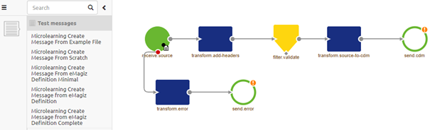
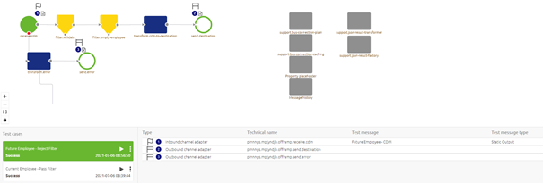
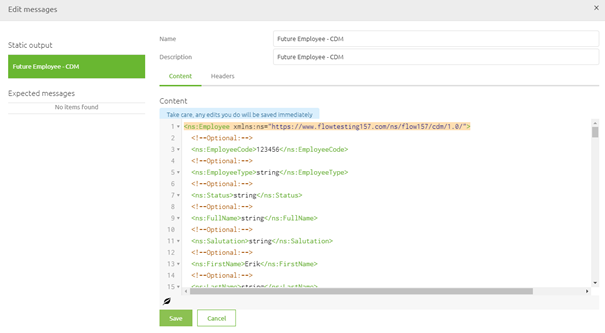

    

        <main class="micro-learning">
        <ul class="doc-nav">
            <li class="doc-nav__item"><a href="../../docs/microlearning/crashcourse-platform-index" class="doc-nav__link">Home</a></li>
            <li class="doc-nav__item"><a href="#intro" class="doc-nav__link">Intro</a></li>
            <li class="doc-nav__item"><a href="#theory" class="doc-nav__link">Theory</a></li>
            <li class="doc-nav__item"><a href="#practice" class="doc-nav__link">Practice</a></li>
            <li class="doc-nav__item"><a href="#solution" class="doc-nav__link">Solution</a></li>
        </ul>

##### Intro

# Editing Test Messages for Test Cases

In this microlearning, we will focus on editing test messages which you can use while configuring and executing flow tests.

Should you have any questions, please contact academy@emagiz.com.

Last update: July 7th, 2021
Required reading time: 2 minutes

## 1. Prerequisites
- Basic knowledge of the eMagiz platform
- Understanding of the Flow testing concept

## 2. Key concepts
This microlearning centers around editing test messages for flow testing.
With flow testing, we mean: Testing each separate component (unit) within the context of a flow based on a supplied input (and an expected outcome).

Editing a test message can be done in two ways.
- Select a specific test case for which you want to edit the message(s) and access the context menu on the flow to Edit messages.
- Use the Test messages button to see all linked test messages to a certain flow which you can edit one by one

##### Theory

## 3. Editing Test Messages for Test Cases

To edit a test message you navigate to the Create phase of eMagiz. Within the Create phase of eMagiz, you open the flow you want to flow test.
After you have opened the flow you should press the button on the bottom bar called Configure tests. This will lead you to the following canvas:

Within this canvas there are two ways to edit your test messages:
- Select a specific test case for which you want to edit the message(s) and access the context menu on the flow to Edit messages.
- Use the Test messages button to see all linked test messages to a certain flow which you can edit one by one

### 3.1 Editing via Canvas

Let us first zoom in on the first option. To do so first select the test case for which you want to edit your test messages. You can do so by clicking on the Test case in question in the left bottom pane. When you do so successfully the test case will be highlighted in green and the canvas will change. 

While in this mode you can hover over any input (identifiable via a flag icon) or output component (identifiable via a finish icon) and access the context menu (via a right click) on the canvas.

When you click on Edit messages a pop-up will show the linked message(s) in terms of content and headers. In this pop-up, you can edit the content and the headers. Note that changes made here are automatically applied so think before you act. When you are satisfied you can press Save to exit the pop-up.

### 3.2 Editing via Test messages

Apart from the option we just discussed there is an alternative approach to editing messages. With this approach you don't need to select a specific test case for which you want to edit messages. Pressing the button called Test messages (located on the bottom bar) presents you with a list of all test messages that are linked to this flow.

In this pop-up you can select a specific test messages and click edit to edit it. Note that the edit screen is identical to the one we discussed above with the other alternative. Therefore the same rules apply here also.

##### Practice

## 4. Assignment

Edit one of the test messages for a flow within your (Academy) project that you have created in the previous assignment.

## 5. Key takeaways

- Within this canvas there are two ways to edit your test messages:
	- Select a specific test case for which you want to edit the message(s) and access the context menu on the flow to Edit messages.
	- Use the Test messages button to see all linked test messages to a certain flow which you can edit one by one

##### Solution

## 6. Suggested Additional Readings

If you are interested in this topic and want more information on it please read the help text provided by eMagiz when executing these actions. 

## 7. Silent demonstration video

This part is currently under construction to reflect the latest changes.

</main>

