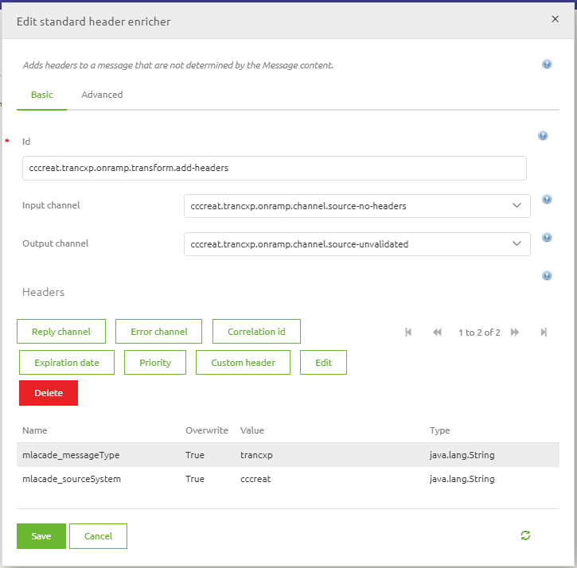

	

		<main class="micro-learning">
		<ul class="doc-nav">
			<li class="doc-nav__item"><a href="../../docs/microlearning/crashcourse-platform-index" class="doc-nav__link">Home</a></li>
			<li class="doc-nav__item"><a href="#intro" class="doc-nav__link">Intro</a></li>
			<li class="doc-nav__item"><a href="#theory" class="doc-nav__link">Theory</a></li>
			<li class="doc-nav__item"><a href="#practice" class="doc-nav__link">Practice</a></li>
			<li class="doc-nav__item"><a href="#solution" class="doc-nav__link">Solution</a></li>
		</ul>

##### Intro

# Flow Editor - Basics
A central part of building your integration in eMagiz is the flow editor. Here you can see what is happening in the flow to make the intended process work as you would expect.
To make your life easier eMagiz will generate a starting point for you based on your configuration choices in Design so you don't start with a completely blank canvas.

Having said that not all flows are completely pre-built yet and do require changes made by you.
In this microlearning, we will focus on getting to know the various types of components that are at your disposal while creating/editing a flow and illustrate what those types are based on some examples.

Should you have any questions, please contact academy@emagiz.com.

- Last update: February 8th, 2021
- Required reading time: 9 minutes

## 1. Prerequisites
- Basic knowledge of the eMagiz platform

## 2. Key concepts
This microlearning focuses on the flow editor.

With flow editor we mean: The canvas in Create that allows you to edit the functionality of a flow

##### Theory

## 3. Flow Editor - Basics
A central part of building your integration in eMagiz is the flow editor. Here you can see what is happening in the flow to make the intended process work as you would expect.
To make your life easier eMagiz will generate a starting point for you based on your configuration choices in Design so you don't start with a completely blank canvas.

Some of the flows that are pre-built for 85-95% of the cases include:
- Onramps and offramps (Messaging)
- Entry and exit gate (API Gateway)
- Event Processors (Event Streaming)

Having said that not all flows are completely pre-built yet and do require changes made by you. 
Therefore we would like to walk you through the various type of components that you can use to edit your flow:

- Inbound (Input)
- Outbound (Output)
- Transformation (Change)
- Splitter (Change)
- Filter (Decision)
- Router (Decision)
- Support (Help)

To connect each of these components you use channels that connect one component to another component. 

### 3.1 Inbound
All inbound components represent the input of your flow (i.e. the starting point). Inbound components can be identified through the green color of the components

Via these components, the flow either **receives** or **retrieves** data from an external source. The inbound components most frequently used are:

- JMS Message-Driven Channel Adapter
- HTTP Inbound Gateway
- Web service Inbound Gateway
- File inbound channel adapter
- Kafka message-driven channel adapter

We will not discuss each of them in detail here but all of them receive or retrieve data from an external source. 
The JMS Message-Driven Channel Adapter for example **receives** messages placed on a certain queue. The HTTP Inbound Gateway **receives** messages every time someone calls your endpoint. 
The file inbound channel adapter **retrieves** messages from a specific location.

### 3.2 Outbound
All outbound components represent the output of the flow (i.e. the endpoint). Outbound components can be identified through the white color with a green border.

Via these components, the flow either **sends** or **retrieves** data to/from an external source. The outbound components most frequently used are:

- JMS outbound channel adapter
- HTTP Outbound Gateway
- Web service Outbound Gateway
- File outbound channel adapter
- Kafka outbound channel adapter

As you can see, the list is pretty similar, and when you make the correct design decisions most of these are already placed on the canvas and you only need to fill in the details at most.
The JMS outbound channel adapter for example **sends** messages to a certain queue. 
The HTTP outbound gateway **sends** or **retrieves** (based on the operation) messages from an external source by calling an endpoint.
The Kafka outbound channel adapter **sends** data to a topic.

### 3.3 Transformation
All standard transformations as created as part of the message mapping in Design are automatically transferred and correctly linked to the flow in Create. So that is easy. 
In all other cases, you will have to add a transformation component to the flow. These components are identified as blue rectangles in eMagiz

The two most often use cases of a transformation component are:

- XSLT Transformer (Using the message mapping in Design)
- Standard Header enricher

We will talk more about the former later in this course. 
The latter gives you the option to add pieces of metadata to the data that you are processing (i.e. where does it come from, what is it about, where should it go to).
To do so you can add a Custom header with name and value to the standard enricher component that will be stored on the message level.

Some other transformation components that are used are:

- Flat file to XML transformer
- XPath header enricher
- Standard Transformer

### 3.4 Splitter
In eMagiz, you can split messages based on the input message. 
If an input message contains a list you can make separate messages based on each entry in the list with the help of a splitter. These components are identified as blue trapeziums in eMagiz.

We will discuss the splitter components in more detail in a later microlearning.

### 3.5 Filter
In eMagiz, you can filter messages based on certain criteria a message should adhere to. If an input message does not fit the criteria it will be filtered out. 
The failure of matching the criteria can lead to silently dropping messages or could lead to an error (the decision is yours). These components are identified as yellow pentagons in eMagiz.

There are three filter components available of which the XML validating filter is used most often:

- XML validating filter
- Standard filter
- XPath filter

The best practice is to validate your message **before** and **after** any change done by a component that is capable of altering the message (i.e. transformation and splitter). 
This can be done with the help of an XML validating filter. This filter validates your input message against your message definition. If the message is valid it can pass. If not it will be refused.

In a standard filter or XPath filter, you could filter on the information in the body of the message or metadata information stored in a header related to the message. More on those in a later course.

### 3.6 Router
In eMagiz, you can route messages based on criteria. The content to verify if the criteria are met can be either stored in headers or in the body itself.
These components are identified as yellow diamonds in eMagiz.

There are several router components in eMagiz. The most used ones are:

- Header value router
- Recipient list router

As most of the use cases for incorporating a router component on flow level without eMagiz generating it for you lie within messaging we won't go into detail in the exact mechanics of each of these router options.

### 3.7 Support
In eMagiz, support objects can be linked to a functional component to aid the working of that component. These components are identifiable through the grey color of the components

We will discuss the support components in more detail in a later microlearning.

### 3.8 Channel
To connect all these components (except for the support objects) we need channels. A channel makes sure that the output of component A is sent to component B for further processing.

Each channel should be given a descriptive name so you and others you work with know what the channel is used for.

### 3.9 Annotation
eMagiz also offers you the option to add an annotation and link it to one or more components. 
This way you can make it explicit for yourself and others what is exactly happening in those components and why you have opted for a certain option.

### 3.10 The Combination
Combining this all together results in a flow with at least an input and output component helped by several support objects. An example of how a working flow looks like is:

##### Practice

## 4. Assignment

Open a flow that is pre-generated by eMagiz or built by someone else. Define for each functional component (excluding the support objects) what its function is within the flow.
This assignment can be completed within the (Academy) project that you have created/used in the previous assignment.

## 5. Key takeaways

- By making the correct Design decisions eMagiz will generate most of your flow for you based on defined best practices.
	- If no best practice has yet emerged only the known components are generated
- A flow needs to have at least an input and output component paired with the default support objects
- Every component has a specific function and there are a lot of them

##### Solution

## 6. Suggested Additional Readings

If you are interested in this topic and want more information on it please read the help text provided by eMagiz or browse through the reference guide to see which components eMagiz offers.

## 7. Silent demonstration video

This video demonstrates a working solution and how you can validate whether you have successfully completed the assignment.

<iframe width="1280" height="720" src="../../vid/microlearning/crashcourse-platform-create-flow-editor-basics.mp4" frameborder="0" allow="accelerometer; autoplay; clipboard-write; encrypted-media; gyroscope; picture-in-picture" allowfullscreen></iframe>

</main>

