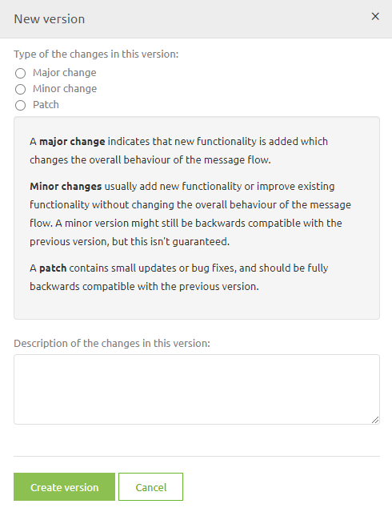
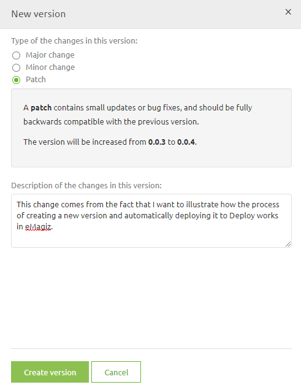
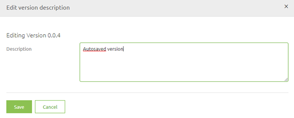
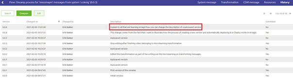
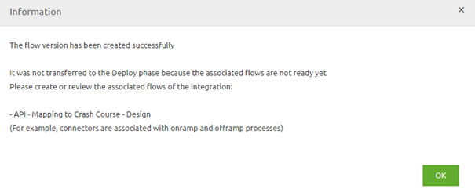

	

		<main class="micro-learning">
		<ul class="doc-nav">
			<li class="doc-nav__item"><a href="../../docs/microlearning/crashcourse-platform-index" class="doc-nav__link">Home</a></li>
			<li class="doc-nav__item"><a href="#intro" class="doc-nav__link">Intro</a></li>
			<li class="doc-nav__item"><a href="#theory" class="doc-nav__link">Theory</a></li>
			<li class="doc-nav__item"><a href="#practice" class="doc-nav__link">Practice</a></li>
			<li class="doc-nav__item"><a href="#solution" class="doc-nav__link">Solution</a></li>
		</ul>

##### Intro

# Promote flows to deploy
A crucial part of proper release management is a clear distinction between what is (perceived to be) finished and what is still under development. 
To help you in making that decision, eMagiz gives you the possibility to temporarily save your work, and when you (think you) are finished creating a definitive version that will be promoted to Deploy

In this microlearning, we will zoom in on this process to educate you on how you can and should use this functionality.

Should you have any questions, please contact academy@emagiz.com.

- Last update: February 5th, 2021
- Required reading time: 5 minutes

## 1. Prerequisites
- Basic knowledge of the eMagiz platform

## 2. Key concepts
This microlearning focuses on promoting flows to deploy.

With promoting to deploy we mean: Saving a definitive version of a flow that is (perceived to be) finished by the developer for the flow to become available under Releases

##### Theory

## 3. Promote flows to deploy
A crucial part of proper release management is a clear distinction between what is (perceived to be) finished and what is still under development. 
To help you in making that decision, eMagiz gives you the possibility to temporarily save your work, and when you (think you) are finished creating a definitive version that will be promoted to Deploy

When you are in the Start Editing Mode you will have to press Stop Editing at some point in time. When you press Stop Editing in the flow you will be presented with the following pop-up

At this point, you have to make a choice. If you are satisfied with your work you press Save and create a new version. 
If you are unsure of your work or simply need to stop because there is no more time left go for the option Save and continue

### 3.1 Save and create a new version
When you go for the option Save and create a new version you will see the following pop-up

Choose whether this was a major, minor, or patch upgrade and give a description of the version that tells you and others what you have changed. Something like this

Press the button Create version and eMagiz will automatically promote this flow version to Deploy where you can use it as part of your Release (more on releases later in this course).

### 3.2 Save and continue
When you are not sure that the version you are currently working on is ready for Deploy you can select the other option called Save and continue. 
When choosing this option eMagiz will automatically create a temporary version of your flow in its current state. 
You can view who made what (temporary) version when you navigate to the History tab of your flow.

This history of the changes in the flow is not only useful for auditing purposes but also helps you identify who you should ask about the latest changes.
As you can see the default description of an autosaved version is Autosaved version. You can give such a version a more descriptive name by selecting it and pressing Edit.

That action will lead you to the following pop-up. In this pop-up, you can change the description of the autosaved version to something that makes clear what you did.

Simply press Save when you are done and the description will be changed

Furthermore, to make it clear to yourself and others the version of the flow will get an asterisk as a suffix the next time you open the flow

### 3.3 Initial promotion
In many cases, there is a link between several flows (i.e. entry and onramp, entry and exit gate, infra, and all other flows). These flows we call the associated flows. 
The moment you try to promote one of these flows without all others eMagiz will tell you that for an initial promotion you will look for these associated flows 
and create a new version for them as well for eMagiz to promote them all at once when you press Save and create a new version on the last one of the flows that are associated with each other.

To indicate to you that such an action is required eMagiz will present you the following pop-up:

##### Practice

## 4. Assignment

The assignment this time consists of several steps:
- Navigate to Create and open a flow
- Press Start Editing
- Immediately press Stop Editing and choose the option Save and Continue
- Give this autosaved version a description
- Press Start Editing again
- Immediately press Stop Editing and choose the option Save and Create a new version
- Choose the option patch and give a good description

This assignment can be completed within the (Academy) project that you have created/used in the previous assignment.

## 5. Key takeaways

- In Create you can choose between the options:
	- Save and create a new version (promoting the flow to Deploy)
	- Save and continue (creating a temporary version)
- You can change the description of an autosaved version
- To get a bundle of associated flows to deploy initially you will have to create a version for each flow within that bundle

##### Solution

## 6. Suggested Additional Readings

If you are interested in this topic and want more information on it please read the help text provided by eMagiz.

## 7. Silent demonstration video

This video demonstrates a working solution and how you can validate whether you have successfully completed the assignment.

<iframe width="1280" height="720" src="../../vid/microlearning/crashcourse-platform-create-promote-flows-to-deploy.mp4" frameborder="0" allow="accelerometer; autoplay; clipboard-write; encrypted-media; gyroscope; picture-in-picture" allowfullscreen></iframe>

</main>

