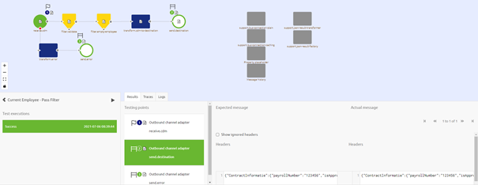
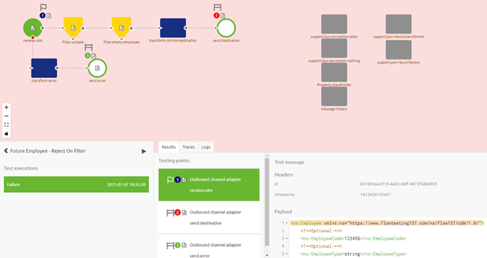
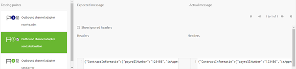
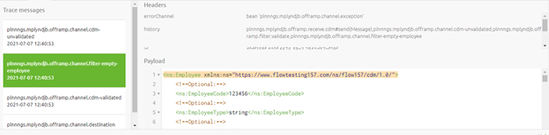
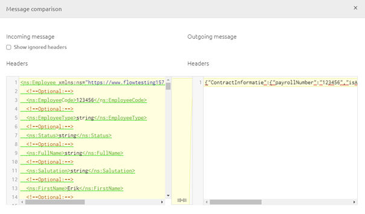
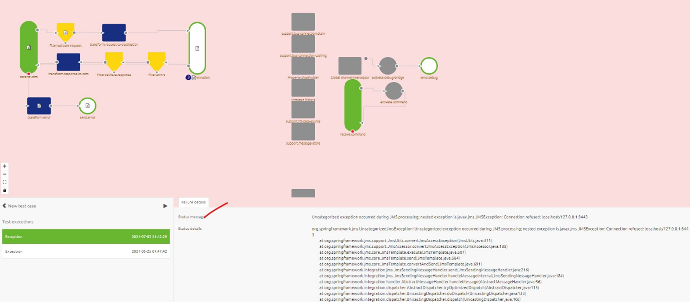

    

        <main class="micro-learning">
        <ul class="doc-nav">
            <li class="doc-nav__item"><a href="../../docs/microlearning/crashcourse-platform-index" class="doc-nav__link">Home</a></li>
            <li class="doc-nav__item"><a href="#intro" class="doc-nav__link">Intro</a></li>
            <li class="doc-nav__item"><a href="#theory" class="doc-nav__link">Theory</a></li>
            <li class="doc-nav__item"><a href="#practice" class="doc-nav__link">Practice</a></li>
            <li class="doc-nav__item"><a href="#solution" class="doc-nav__link">Solution</a></li>
        </ul>

##### Intro

# Running a Flow Test

In this microlearning, we will focus on running a flow test.

Should you have any questions, please contact academy@emagiz.com.

- Last update: July 7th, 2021
- Required reading time: 5 minutes

## 1. Prerequisites
- Basic knowledge of the eMagiz platform
- Understanding of the Flow testing concept

## 2. Key concepts
This microlearning centers around running a flow test.
With flow testing, we mean: Testing each separate component (unit) within the context of a flow based on a supplied input (and an expected outcome).

Now that we have successfully set up our test case it is time to run our test case. To run your test case simply press the play button. At this point, eMagiz will gather all that you have configured to deploy it in our flow testing environment. Subsequently, eMagiz will report back the status to you the user in four distinctive ways:
- Status
    - Via background color (Blue = Success, Red = Failure)
    - Via status change from Initializing -> Success, (Failure, or Exception)
- Results
    - See the results per inbound and outbound component including comparison functionality
- Traces
    - Gives you the ability to zoom in on a component level to see how a message (including headers) looked at any given component (input and output)
- Logs / Failure Details
    - Gives you the logging of what happened when eMagiz tried to run your test case against your flow on a technical level
    - Handy when you run into exceptions.
As you can imagine this takes a little while to gather so be patient and be amazed at the results. The result could depict something as follows.

##### Theory

## 3. Running a Flow Test

Now that we have successfully set up our test case it is time to run our test case. To run your test case simply press the play button. At this point, eMagiz will gather all that you have configured to deploy it in our flow testing environment. Subsequently, eMagiz will report back the status to you the user in four distinctive ways:
- Status
    - Via background color (Blue = Success, Red = Failure)
    - Via status change from Initializing -> Success, (Failure, or Exception)
- Results
    - See the results per inbound and outbound component including comparison functionality
- Traces
    - Gives you the ability to zoom in on a component level to see how a message (including headers) looked at any given component (input and output)
- Logs / Failure Details
    - Gives you the logging of what happened when eMagiz tried to run your test case against your flow on a technical level
    - Handy when you run into exceptions.
As you can imagine this takes a little while to gather so be patient and be amazed at the results. The result could depict something as follows.

Congratulations! The color of the backscreen in combination with detailed information on the bottom half of your screen indicates the result of the test. How you should interpret this result is detailed in the next section.

### 3.1 Validate result of unit test
After you run the test eMagiz gives you, the user, feedback in four ways:
1.  Status
2.  Results
3.  Traces
4.  Logs / Failure Details
Let’s look into these two ways with a little bit more detail

#### 3.1.1 Status
As specified before the status coupled with the color of the background is a quick indicator to the user telling the user if the executed test was successful or not. If the background turns red it means the test was not successful. If the background color turns blue it means success. Note that each test execution also has a status. We have four statuses that we discern:
- Initializing
- Exception
- Success
- Failure

The test execution always starts in the Initializing phase and will be changed to either Exception (the test case won't run), Success (the expected result matches the actual result), or Failure (the expected result does not match the actual result). Note that when you do not define an expected outcome the result of the test will always be a Failure and therefore the background color will be red. For an example see below

After you have specified the expected outcome of the flow the screen will turn blue if the actual result equals (in every detail) the expected outcome. 
If the actual message does not match the expected outcome the background will turn red. See below for a successful result!

We will discuss the Exception option later on in this microlearning.

#### 3.1.2 Results
Next to the status eMagiz will also report back the results in the Results tab. Here you can click through each input and output component you have in your flow to see whether or not the actual and expected message match. For example, when you expect no message and there is indeed no message that has arrived it will turn green. When you do expect a message and the actual message (content + headers) match the expected message it will turn green. In other scenarios it will turn red, indicating a mismatch. See below for how such a comparison looks like.

#### 3.1.3 Traces
eMagiz will also give you feedback on how the message looks on both component as well as channel level. When you switch to the traces tab you can select the various channels within your flow to see how your message looked when passing that channel.

Furthermore, you can double click on each component on the flow level to see the input and output message (if available) per component. This way you can zoom in to see on a component level whether or not that specific component did what you would have expected it to do.

#### 3.1.4 Logs / Failure Details
These first three parts of analyzing can take place when the test case ran successfully. However, it could also happen that the test case is not able to be executed. In these cases, you can use the failure details tab or the logs tab to identify why the test case in question is unable to be executed properly. Based on the information presented you can take appropriate action on flow level or test case level before running the flow again.

##### Practice

## 4. Assignment

Run the flow test with only an input. Validate the result and make changes to the flow test to get a Success result. 
This assignment can be completed within an onramp or offramp flow within your (Academy) project that you have created in the previous assignment.

## 5. Key takeaways

- You can run a flow test by pressing the play button
- Feedback is given on the result in the form of:
    - Status
    - Results
    - Traces
    - Logs / Failure Details

##### Solution

## 6. Suggested Additional Readings

If you are interested in this topic and want more information on it please read the help text provided by eMagiz when executing these actions.
## 7. Silent demonstration video

This part is currently under construction to reflect the latest changes.

</main>

