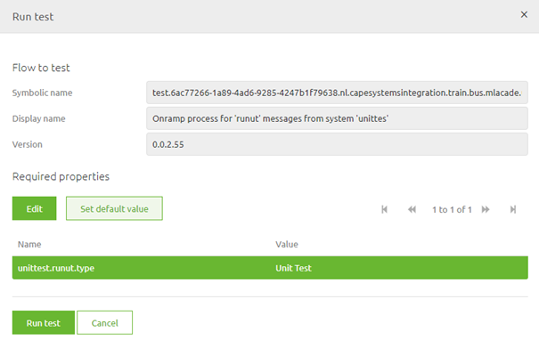

# Running a Unit Test

In this microlearning we will focus on running a unit test.

Should you have any questions, please contact academy@emagiz.com.

- Last update: January 7th 2021
- Required reading time: 5 minutes

## 1. Prerequisites
- Basic knowledge of the eMagiz platform
- Understanding of Unit testing concept
- On- or offramp (without splitter or router) that needs to be tested

## 2. Key concepts
This micro learning centers around running a unit test.
With unit testing we mean: Testing each separate component (unit) within the context of a flow based on a supplied input (and an expected outcome).

Running a unit test can be done via the right hand panel menu while being in the Configure Tests screen of your Create flow.
In this right panel there is a button available per configured unit test. This button is called Run Test. Pressing this button makes it possible to run a unit test.

After you have pressed the Run Test button and there are properties used in your flow you should fill these in otherwise your unit test will fail.

## 3. Running a Unit Test

You can simple run a unit test by pressing the Run test button. After this eMagiz will show you the following popup. 
In case properties are used in the flow you are about to test you need to add values for these properties.

Adding properties is relatively simple. You can Edit the value (meaning you only want to use this value for this particular unit test) 
or you can define a default value that will be used in all unit tests. 
In both cases you first select the data type (i.e. String) and subsequently fill in the value of the property. Be aware that currently the value of a property cannot exceed 200 characters.

After you have done so the result should look something along what is shown below.

Whether you have properties or not just press Run Test (Note: When you are the first of the day using the functionality the Unit Testing bus needs to wake up. Therefore it can take a while until you get a result)

When no popup indicating an error shows up the test has run successfully. 
Congratulations! The color of the backscreen indicates the result of the test. How you should interpret this result is detailed in the next section.

### 3.1 Validate result of unit test
After you ran the test eMagiz gives you, the user, feedback in two ways:
1.	The color of the background of the screen (red means failed, green means success)
2.	Showing the state of the message in each component it passes
Let’s look into these two ways with a little bit more detail

#### 3.1.1 Feedback through color of background
As specified before the color of the background is a quick indicator to the user telling the user if the executed test was successful or not. If the background turns red it means the test was not successful. 
Be aware, when you do not define an expected outcome the result of the test will always be a fail and therefore the color will also be red. For an example see below

After you have specified the expected outcome of the flow the screen will turn green if the actual result equals (in every detail) the expected outcome. 
If the actual message does not match the expected outcome the background will turn red. See below for a green result!

#### 3.1.2 State of message throughout the flow
eMagiz will also give you feedback on how the message looks like in every component of the flow it passed. 
This way you can validate if certain headers are set correctly and if certain transformations were successful. 
Below is an example of comparing the input and output of the transformation component shown in the flow. 
In here you can see in detail what the transformation has done. 
This way you can determine whether the change you have just made was indeed successful.

Congratulations, you have successfully learned how to implement a unit test within eMagiz and run it in order for you to develop more effectively and more robust.

## 4. Assignment

Run the unit test with only a input. Validate the result and make changes to the unit test in order to get a green result. 
This assignment can be completed within a onramp or offramp flow within your (Academy) project that you have created in the previous assignment.

## 5. Key takeaways

- You can run a unit test by pressing on the Run Test button
- Values for properties can be specific or uniform but need to be less than 200 characters
- Feedback is given on the result in the form of:
	- background color
	- state of message

## 6. Suggested Additional Readings

If you are interested in this topic and want more information on it please read the helptext provided by eMagiz when executing these actions and read the user guide on unit testing which you can find in the documentation portal.

## 7. Silent demonstration video

This video demonstrates how you could have handled the assignment and gives you some context on what you have just learned.

<iframe width="1280" height="720" src="../../vid/microlearning/microlearning-running-a-unit-test.mp4" frameborder="0" allow="accelerometer; autoplay; clipboard-write; encrypted-media; gyroscope; picture-in-picture" allowfullscreen></iframe>