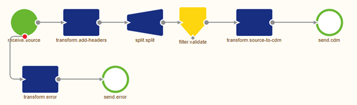
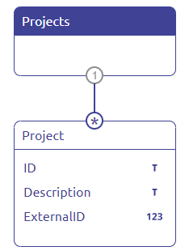
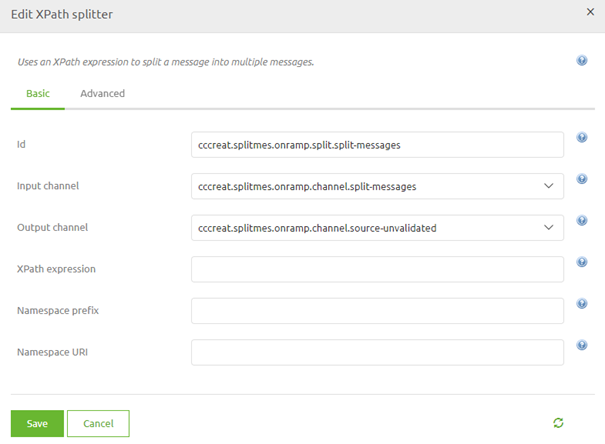
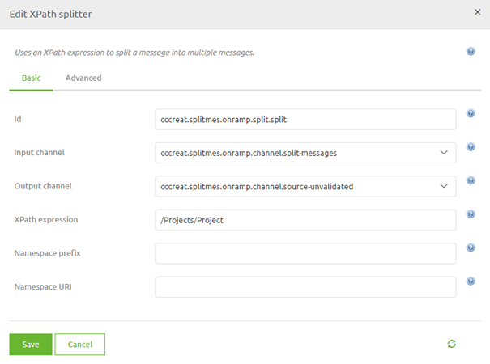

# Splitting messages
Sometimes you receive or need to retrieve a batch file of data containing a large number of iterations on the same object (i.e Project, Employee, Order, Invoice, etc.)
that you want or need to process individually from one another. To do so you can use the splitter functionality of eMagiz to split the incoming messages into multiple messages.

In this microlearning, we will educate you on how you can split messages with the help of eMagiz tooling.

Should you have any questions, please contact academy@emagiz.com.

- Last update: February 8th, 2021
- Required reading time: 7 minutes

## 1. Prerequisites
- Basic knowledge of the eMagiz platform

## 2. Key concepts
This microlearning focuses on splitting messages.

With splitting messages we mean: Cutting up the input messages in multiple output messages with the same format

## 3. Splitting messages
Sometimes you receive or need to retrieve a batch file of data containing a large number of iterations on the same object (i.e Project, Employee, Order, Invoice, etc.)
that you want or need to process individually from one another. To do so you can use the splitter functionality of eMagiz to split the incoming messages into multiple messages.

There are two split options available on flow level in eMagiz:
- Standard splitter
- Xpath splitter

In this microlearning, we will turn our attention to the Xpath splitter as that option is used in 99% of the cases we encounter when someone wants to split a message.
With the help of the Xpath splitter, you can split the message based on the result of an Xpath expression.

According to the help text of eMagiz: "The splitter uses the provided XPath expression to split the payload into many nodes. 
By default, this will result in each Node becoming the payload of a new message."

As you remember from our microlearnings on Xpath an XPath navigates through the input XML based on the expression given.
What the starting point of this navigation is differs based on the context. 
If you want to write an XPath while doing a transformation any input element can be the starting point of your XPath.
However, when you write an XPath outside of the transformation tooling the root node of your input message will always be the starting point for your XPath.
That is a crucial point in quickly getting the right XPath for the job

### 3.1 Basic

In this use case, we want to split our list of Projects into single Project messages that will validate against our system message.

To do so we need to place an XPath splitter before validating the system message. 
As a reminder, the best practice is that after every mutation on the message level you validate to check your work.

On flow level the solution therefore would look as follows:

Now it becomes time for the crucial part of this component. Determining the correct XPath to split my message to end up with a valid system message.
To be able to determine the correct XPath we need to know:
- The structure of the input message
- Whether the input messages has a namespace
- Always start at the root of the input message when writing an XPath outside of the transformation

Let us first determine what the structure of the input message is. In most cases, you can derive this from the documentation supplied by the external party. 
In this case the structure is provided by us:

Furthermore, we give you an example of how such an input message could look like:

<Projects>
	<Project>
		<ID>ID-1</ID>
		<Description>Example Microlearning</Description>
		<ExternalID>1</ExternalID>
	</Project>
	<Project>
		<ID>ID-2</ID>
		<ExternalID>3</ExternalID>
	</Project>
	<Project>
		<ID>ID-3</ID>
		<Description>Microlearning Example</Description>
		<ExternalID>3</ExternalID>
	</Project>
</Projects>

With the help of an example message or documentation dictating the structure of a message (i.e. an XSD), you can quickly see whether a message has a namespace.
In this example, no namespace is used. We conclude this based on two things:
- The absence of a namespace declaration within the example message
- No namespace prefixes throughout the example message

No, that we have all the information we need to determine the correct XPath let us take a look at the component to see what and how we need to fill in the XPath expression. 
Double click on the splitter component to access the following pop-up

As you can see the component needs to know the correct XPath expression and needs to know whether a namespace is used. 
As we don't have a namespace in this example it becomes less complicated to figure out the correct XPath.

Remember we start at the root and work our way down from there. So in this case we start at Projects. 
To get the correct Xpath notation (remember!) we need to start with a forward slash indicating the root level.

The beginning of the XPath should look like this: /Projects. But that is not all. 
If we would stop here the splitter would split on the Projects level, meaning we have not ended up with a valid system message. 
So we need to continue with our navigation into the next element in our input structure. This is the Project element.
This means that the Xpath will be: /Projects/Project. This is also the desired result of our XPath expression 
as this will split on Project level giving us three separate and valid system messages.

### 3.2 Variations
The above XPath expression is not the only expression that will yield a correct result. 
In case you don't want to start your XPath expression at the root level but somewhere in the middle of your input message you can use two forward backslashes (i.e. //) 
to determine that you want to start at a certain element in the input message. In this example, we also could have written the Xpath as //Project which yields the same result.
Especially in cases where there is a nested structure of multiple lists, it could be advantageous to start at one of those lists instead of starting at the root level to reduce the complexity of your XPath.

In cases where you don't know whether or not a namespace will be used in the input message or you don't want to specify namespace and namespace prefix, you can utilize the wildcard option in eMagiz.
This wildcard option states that all namespaces and namespace prefixes are valid when trying to resolve the XPath expression.

Incorporating such a wildcard within our initial XPath would look as follows:

## 4. Assignment

Make sure that you add a splitter to your flow that splits messages before they are validated. To end up with valid output messages make sure to use the correct XPath.
This assignment can be completed within the (Academy) project that you have created/used in the previous assignment.

## 5. Key takeaways

- eMagiz offers two types of splitters of which the XPath splitter is used in most cases
- To determine the XPath expression in your splitter correctly remember the following things:
	- The structure of the input message
	- Whether the input messages has a namespace
	- Always start at the root of the input message when writing an XPath outside of the transformation

## 6. Suggested Additional Readings

If you are interested in this topic and want more information on it please read the help text provided by eMagiz and read the info on the following links:
- https://www.w3schools.com/xml/xpath_intro.asp

## 7. Silent demonstration video

This video demonstrates a working solution and how you can validate whether you have successfully completed the assignment.

<iframe width="1280" height="720" src="../../vid/microlearning/microlearning-splitting-messages.mp4" frameborder="0" allow="accelerometer; autoplay; clipboard-write; encrypted-media; gyroscope; picture-in-picture" allowfullscreen></iframe>