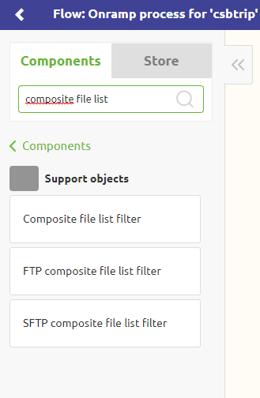
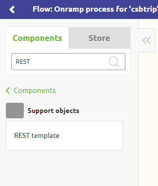

	

		<main class="micro-learning">
		<ul class="doc-nav">
			<li class="doc-nav__item"><a href="../../docs/microlearning/crashcourse-platform-index" class="doc-nav__link">Home</a></li>
			<li class="doc-nav__item"><a href="#intro" class="doc-nav__link">Intro</a></li>
			<li class="doc-nav__item"><a href="#theory" class="doc-nav__link">Theory</a></li>
			<li class="doc-nav__item"><a href="#practice" class="doc-nav__link">Practice</a></li>
			<li class="doc-nav__item"><a href="#solution" class="doc-nav__link">Solution</a></li>
		</ul>

##### Intro

# Support objects - Introduction
Apart from having components in the flow editor that make sure that the message is received, validated, transformed, and/or send you can also use so-called support objects while building your flow.
There are a lot of support objects in various categories. As this is an introduction we are not going to discuss all of them in detail.

In this microlearning, we will focus on what they conceptually mean and discuss a couple of them so you get a sense of what they can help you with.

Should you have any questions, please contact academy@emagiz.com.

- Last update: February 8th, 2021
- Required reading time: 6 minutes

## 1. Prerequisites
- Basic knowledge of the eMagiz platform

## 2. Key concepts
This microlearning focuses on support objects.

With support objects we mean: Component that help the functional components do the work they are supposed to do

##### Theory

## 3. Support objects - Introduction
Apart from having components in the flow editor that make sure that the message is received, validated, transformed, and/or send you can also use so-called support objects while building your flow.
There are a lot of support objects in various categories. As this is an introduction we are not going to discuss all of them in detail.

Support objects can be linked to a functional component to aid the working of that component. Some areas in which a support object could help:

- Connectivity (i.e. JDBC, FTP, SFTP)
- Authentication (i..e Basic, OAuth2.0, Metacom, Azure)
- Headers (i.e. XPath expression)
- Message Format Transformation (i.e. JSON result factory, JSON result transformer, JSON source factory)
- Security (i.e. Merlin crypto, WSS4J Security Interceptor, WS-addressing action callback)
- File handling (i.e. Composite file list filter, FTP composite file list lifter)

Aside from the areas mentioned above there are other less frequently used support objects for highly specific cases. 
In the remainder of this microlearning, we will zoom in on two of these support objects as illustrative examples of what all support objects conceptually do for you.

### 3.1 File handling
When retrieving (pulling) files from a certain directory you might want to determine some criteria based on which you will either retrieve (or not retrieve) the files located in that directory.
To register such a list you can add a support object called Composite file list filter.

Opening the support object will give you the following pop-up. In this pop-up, you have a myriad of options you can use for filtering files

The combination that is most used and is effective in most cases becomes a best practice within eMagiz when using this filter option on the retrieval of files.
This combination is:

- Regular files only filter
- Size list filter (minimum bytes is 1, maximum bytes is 1048575)
- Age file list filter (minimum age is 10000)
- Simple pattern file list filter (property reference)

By ordering the filters in this way you make optimal use of the functionality in eMagiz and ensure that every time you will check for new files all new and existing files will get another shot.

If you use other filter options or start mixing up the order of filter options a file could get stuck in limbo. 
What I mean by that is a file that has been checked by the filter once without being allowed to pass (even though it would have passed the second time around).

This behavior is the direct consequence of the fact that an internal list is kept on flow level (in cache) that has a reference to all files that have been checked before. 
Once you are on the list and you try to enter again eMagiz will deny you access.

An example of a filter option with memory is the Accept Once option. As the name suggests, this will only allow a file once. 
If this is the first thing you check for (before other checks) and the other checks fail the first time around eMagiz will never retrieve the file anymore, because the file is already on the list.

So be careful experimenting with this one without consulting another team member.

To make sure that your file inbound channel adapter takes the filter into account you have to link the support object to the file inbound channel adapter.

### 3.2 Authentication
In almost all cases some form of Authentication is needed when calling a REST web service. One type of authentication is basic authentication. 
This is the easiest form of authentication and the least complex one. To ensure that the authentication is sent correctly to the REST web service you can use a support object in eMagiz called a REST Template

Opening the support object will give you the following pop-up. In this pop-up, you have several options that could add authorization to your call to the HTTP endpoint.

For now, we will focus on the Basic access authorization. 
After you select this option you can fill in property references to the username and password you need to execute the basic authentication.

After you have saved this setting you will see that an Interceptor has been added to the REST Template

You can press Save here and the only thing remaining to make it work in combination with the HTTP outbound gateway is to link it to the HTTP outbound gateway

##### Practice

## 4. Assignment

Make sure that you add a REST Template support object with basic authentication to an exit and link it to the HTTP outbound gateway.
This assignment can be completed within the (Academy) project that you have created/used in the previous assignment.

## 5. Key takeaways

- Support objects help other functional components in executing their functional
- Support objects can help in various categories
- Each support object has a specific task and use case

##### Solution

## 6. Suggested Additional Readings

If you are interested in this topic and want more information on it please read the help text provided by eMagiz.

## 7. Silent demonstration video

This video demonstrates a working solution and how you can validate whether you have successfully completed the assignment.

<iframe width="1280" height="720" src="../../vid/microlearning/crashcourse-platform-create-support-objects-introduction.mp4" frameborder="0" allow="accelerometer; autoplay; clipboard-write; encrypted-media; gyroscope; picture-in-picture" allowfullscreen></iframe>

</main>

