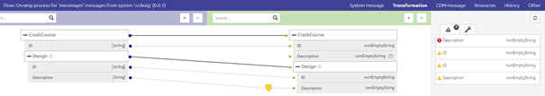
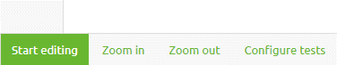
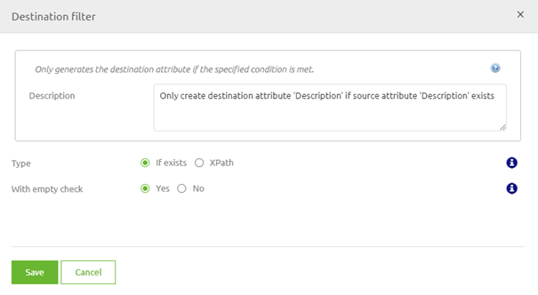
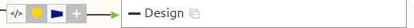
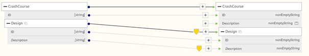
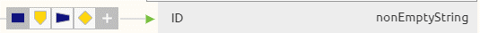
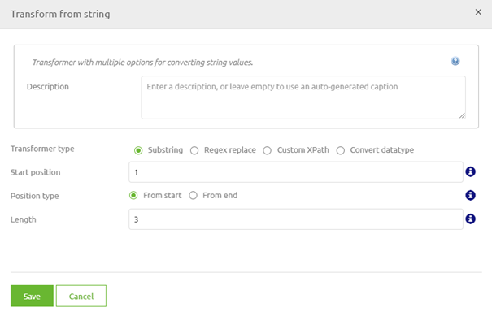
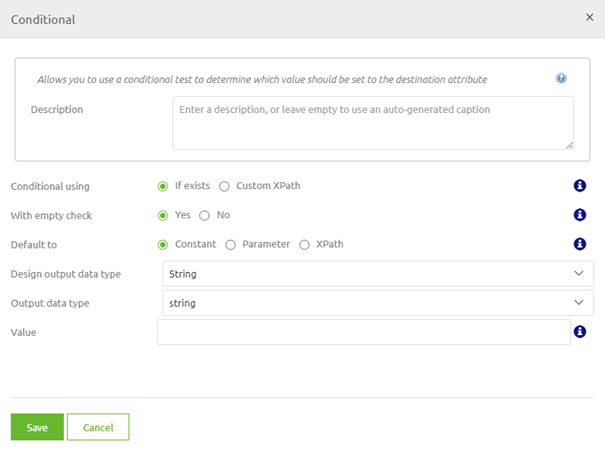
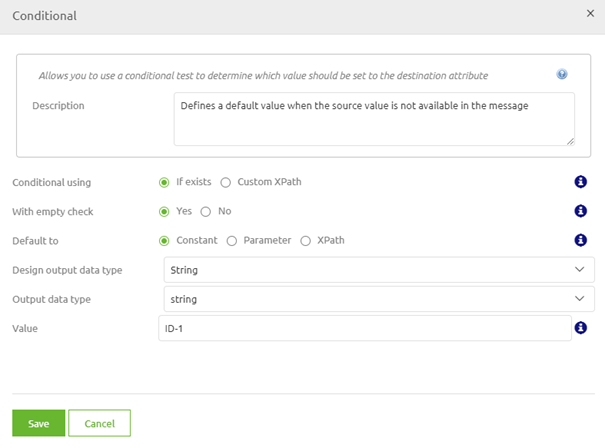

# Transformation - XML to XML
A central part of the eMagiz platform is the ability to transform data from one structure to another structure. 
As you can remember from our microlearning on message mappings this process starts in Design.

Obviously it would be great if drawing a line, saying that a is the input for b would always be enough. Sadly though that is not always the case (the easiest example is the set as mapped option).
For all cases where only drawing a line does not suffice you can alter the transformation between a and b with the help of the Create Transformation.

Within Create you can transform between multiple message formats. In this microlearning we will focus on the simplest one, XML to XML.

Should you have any questions, please contact academy@emagiz.com.

- Last update: February 4th 2021
- Required reading time: 7 minutes

## 1. Prerequisites
- Basic knowledge of the eMagiz platform

## 2. Key concepts
This micro learning focuses on the transformation in Create (XML to XML).

With transformation we mean: Transforming the data in such a manner that the source message will lead to a valid target message

## 3. Transformation - XML to XML
In the Create phase of eMagiz you can build upon the message mapping made in Design. 
When you open your flow by double clicking on it (or opening it via the context menu) you will see the following visual representation of the flow itself

More on what this overview represents later on in this module. For now let us turn our attention to the Transformation part of a flow. 

Note that the transformation option is only available for flows that are setup for processing (i.e. transforming) data:

- **Messaging**: Onramp and Offramp
- **API Gateway**: Exit gate
- **Event Streaming**: Event processor

When you select the Transformation option eMagiz will show you what you have drawn while executing your message mapping in Design.

The above picture should have a familiar feeling as it closely resembles what we have determined while doing our message mapping.
However you can also see some differences between the two. In Create you have several options at hand to correctly transform the data, while being in Start Editing Mode.
Below we will discuss each of these options briefly. Apart from the set of generic options a lot more can be done but we will leave that out of the discussion for now.

Before we delve into the specific options let us first enter Start Editing mode.

### 3.1 Filter
As you can see, eMagiz already added a yellow trapezium (a turned one atleast). This icon indicates a filter. 
As you can see the Description attribute is optional (written in Italic) therefore we only want to fill the Description 
attribute in the target message when the Description field in the source message exists (meaning the tag exists in the message) and is not empty

Apart from filtering on attributes you can also filter on entities. For example, in this case I could say that I only want a Design entity if the ID is ID-4.
This you can easily do by adding a filter on the target entity called Design. To do so press the + icon in front of this entity and select the yellow filter icon.

As a result you will be presented with the following pop-up. In here you can choose from the input attributes that fall under the entity from which you have drawn your line in the message mapping.

This solution works perfectly for us in this example case. Select the ID as input attribute, leave is equal true as it is and fill in ID-4. 
This makes sure that only Design entities in the input with a ID with content ID-4 will be transformed to the target message.

To visually tell you and others that a filter has been added the yellow trapezium will appear.

### 3.2 Transform
The second option at your disposal to ensure that you generate a valid target message is to transform. 
Transformation actions are visually represented as a blue rectangle.

For example, let us say that we only want to have the first three character of the input attribute ID on CrashCourse level. To do so we select the transform option and enter the following pop-up

In here we see several options that we can use. As the input is a string and we want the first three characters we can use the substring option. 
Note, that based on the data type of the input attribute other options will be presented to you by eMagiz.

In this case we fill in 1 as the start position and 3 for the length. This will ensure that eMagiz will only place the first three characters of the ID it receives in the target message.

To visually tell you and others that a transformation has been added the blue rectangle will appear.

### 3.3 Static Input
The third option at your disposal to ensure that you generate a valid target message is to enter a static input.
Static input actions are visually represented as a green circle and are only selectable for attributes without a source attribute.

As you might well remember we have added a note on this attribute telling us how we should fill this value. 
So let's take a look at the note to see what it said exactly. To read it hover over the note icon

Okay, now that we know again what we wanted to fill in lets take you through the steps of how you can make this happen.
First, select the option static input (green circle). This will lead you to the following pop-up

As the note states we always want to fill in the string value: Microlearning eMagiz Academy. In other words we need to fill in a constant with this value. That should look as follows.

To visually tell you and others that a static input has been added the green circle will appear.

### 3.4 Conditional
The fourth option at your disposal to ensure that you generate a valid target message is to enter a conditional.
Conditional actions are visually represented as a yellow diamond.

A conditional is very similar to a filter option. 
The only difference is that when a filter determines that you are not on the list you won't get in whereas the conditional will treat you as some pre-defined constant.

To get what I mean let us take a look at the pop-up for a conditional

As you can see a lot of similarities between the filter and the conditional. The only difference is that the conditional provides you with a escape opportunity.
So let us define that escape. In this case we want that whenever the ID does not exists (or is empty) the value ID-1 should appear. The result will look like this

To visually tell you and others that a conditional has been added the yellow diamond will appear.

For those of you paying attention it should be clear that the way I have configured the examples there is no way that the conditional will ever lead to a output of ID-1.
Having said that the above examples give a good indication of the various options you have at your disposal to transform messages without having to possess complex programming skills.

 
## 4. Assignment

Navigate to Create and open a flow in which a transformation could occur. After you have done so enter Start Editing Mode and open the transformation.
For this transformation add atleast one filter and one static input to your transformation. 
This assignment can be completed within the (Academy) project that you have created/used in the previous assignment.

## 5. Key takeaways

- eMagiz provides you with several out of the box options to correctly transform your data to end up with a valid target message
- All options have their own unique use case

## 6. Suggested Additional Readings

If you are interested in this topic and want more information on it please read the help text provided by eMagiz.

## 7. Silent demonstration video

This video demonstrates a working solution and how you can validate whether you have successfully completed the assignment.

<iframe width="1280" height="720" src="../../vid/microlearning/microlearning-transformation-xml-to-xml.mp4" frameborder="0" allow="accelerometer; autoplay; clipboard-write; encrypted-media; gyroscope; picture-in-picture" allowfullscreen></iframe>