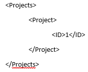
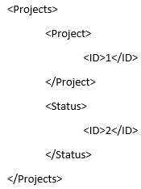
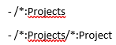
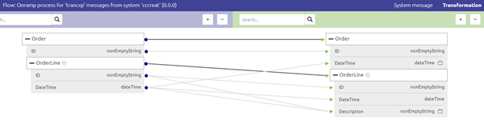

# Transformation - XPath Basic
Sometimes the transformation tooling does not provide you with the exact correct transformation option to get the desired result in your output. 
For those cases you can use a custom (hand written) XPath expression to achieve the desired result.

In this microlearning we will educate you on the basics of XPath and see how we can use it **within** the context of transforming messages. 
In other microlearnings we will discuss the use of XPath **outside** the context of transforming messages.

Should you have any questions, please contact academy@emagiz.com.

- Last update: February 9th 2021
- Required reading time: 9 minutes

## 1. Prerequisites
- Basic knowledge of the eMagiz platform

## 2. Key concepts
This micro learning focuses on XPath Basic in the context of transformations.

With XPath Basic we mean: Understanding on a fundemental level what XPath is, how it is used and how you can use it within the transformation tooling of eMagiz

## 3. Transformation - XPath Basic
Sometimes the transformation tooling does not provide you with the exact correct transformation option to get the desired result in your output. 
For those cases you can use a custom (hand written) XPath expression to achieve the desired result.

### 3.1 What is XPath
Before we delve into the use of XPath within the eMagiz tooling let us first discuss XPath itself. XPath stands for XML Path Language.
As the name suggest it can be used to write down a certain "path" to identify and navigate nodes in an XML message. 
By following this "path" you can access all elements and attributes within your **input** XML message.

XPath is a widely used standard with a lot of build-in functions and is a W3C recommendation

### 3.2 Reading and Writing XPath

The simplest XPath is /. This simply means access the root of the **input** message. So to access the root of your **input** message you write down one forwardslash (/). 
If you want to access a element below the root directly you can use two forward slashes (//) to start your XPath expression. 

For example, take a look at the following **input** message:

When I want to write a "path" to Projects I would only have to write down / and that is it. However when I want to write a "path" to Project I have two options. 
I can either start at the root (Absolute XPath) and navigate down from there which would give me /Projects/Project as a valid XPath expression. 
On the other hand I could also start directly at the Project element (Relative Xpath) which would give me //Project as a valid XPath expression.

To expand on that example we would now like to navigate to ID. The XPath can either start at root level (Projects) or at element level (Project or ID). 
So this means that in this simple example we have three alternatives to end up with the same result:
- /Projects/Project/ID
- //Project/ID
- //ID

At this point you probably wonder why anyone would start their journey on the XPath "path" from the root level. Well imagine the following **input** message:

As you can see from this example taking the third option of our previous example would end up getting two results (both the ID under Project and the ID under Status). 
Obviously there are also scenario one could think of that would benefit from starting **not** on the root level of the **input** message. So always consider the context when writing down your XPath.

### 3.3 Absolute vs Relative XPath
As dicussed in the previous segment there is a choice to be made between using a Absolute XPath (which starts at the root level) and the Relative XPath (which can start anywhere in the structure)

Below you find a summary of the main differences between both options.

**Absolute XPath**
- It is the direct way to find the element
- Disadvantage of the absolute XPath is that if there are any changes made in the path of the element then that XPath gets failed.
- Starts with the single forward slash(/) ,which means you can select the element from the root node.

**Relative XPath**
- Finds the element(s) in the whole message, not considering the structure.
- Starts with the double forward slash (//), which means it can search the element anywhere at message.

### 3.4 Namespaces
To complete things a little bit more we are now going to discuss namespaces. A namespace is a set of symbols that are used to organize objects of various kinds, so that these objects may be referred to by name.

An example of comparitive nature would be:
There are in the Netherlands two cities named Hengelo. Via namespaces can we split and recognize them. Namespace that can be used to split them is using the namespace Province (Gelderland and Overijssel). 
Gelderland:Hengelo & Overijssel:Hengelo

To handle namespaces while reading and writing XPath you have two options:
- Prefix
- Wildcard

#### 3.4.1 Prefix
By definining the prefix of the namespace (i.e. sys, cdm, ns) you can reference to this prefix while reading and writing your XPath. 
Let's return to our original example, only this time the **input** message has a namespace:

As you can see the notation has slightly changed. A prefix has occurred before each element and attribute called sys. To seperate the prefix from the name of the element or attribute a colon (:) is used.
The XPath also needs to change to get the desired result. We need to take the prefix into account. This wil result in the following valid XPath options:

- /sys:Projects
- /sys:Projects/sys:Project

#### 3.4.2 Wildcard
By using the wildcard notation, a asterisk (*), you specify that regardless of the chosen prefix by the party for delivering the **input** message you will accept it.
Using the prefix makes it clearer to others in which namespaces the XPath is written. 
Using the wildcard is easier as you don't have to check for every XPath you write what the prefix is and whether there is a namespace.
Therefore we see a lot of use of the wildcard when writing a custom XPath in eMagiz.

Using the wildcard will result in the following valid XPath options:

### 3.5 Custom XPath in Transformation
Now that we have a basic conceptual understanding of XPath let us turn our attention towards relating this information to eMagiz. 
Specifically how you can use it while transforming your messages with the help of the transformation functionality in Create.

As you saw in the previous microlearning a lot of options are already available out of the box and don't require you to write your own custom XPath. 
However sometimes it is necessary to write a custom XPath.

Let us look at a example in eMagiz:

In this example you see two notes on two attributes. One on the DateTime on Order Level and one on the Description on OrderLine level. The requirements are:

- The DateTime should be filled with the DateTime value related to the **first** OrderLine
- The Description should be the value for ID and the value for DateTime merged together with the help of a dash (-) icon.

To make this happen we need a custom XPath. Remember the discussion on Absolute vs Relative earlier in this microlearning? 
The way the transformation logic is build up helps you ensure that the correct values end up in the correct places. 
What I mean by that is that the line drawn towards a certain entity in the **output** determines the starting point from where to reason when writing a XPath. 
For example, when looking at the Order entity you see that the origin is the Order entity of the **input** message. 
So the basic XPath eMagiz would have generated to fill in the value for DateTime on Order level would be:

- OrderLine/DateTime

This is because the starting point of our "path" is the Order entity already. 
To ensure that we only place the DateTime value of the first OrderLine in the DateTime field on Order level in the **output** message we need to change the XPath.
To do so enter Start Editing Mode and navigate to the Transformation. In here select the option Transformation and then Custom XPath

In here we need to ensure that we only take the DateTime value from the **first** OrderLine. To do so we need to specify which of the OrderLines we want as input.
You can specify that by using the following notation:

- [1] = the first iteration of OrderLine
- [2] = the second iteration of OrderLine
- etc.

This would change our XPath to OrderLine[1]/DateTime. So let us fill that in and press Save.

Now let us turn our focus toward the second part of this example. Remember what we said earlier. 
The starting point of your "path" within a transformation is determined by the starting point of the line that is drawn to the entity you are currently working with.
In this case that is the OrderLine.

So the basic XPath eMagiz would have generated to fill in the value for DateTime on Order level would be:

- DateTime|ID

This is not quite what we want as it does not account for the dash icon that needs to seperate the two values. 
So, once again select the transformation option and opt for Custom XPath.

As specified before there are a lot of build-in functions available when using XPath. One of these functions is the string-join.
With a string-join you can join two input attributes together in a certain order and separate them with the help of a divider.

This would change our XPath to string-join((DateTime,ID),'-'). So let us fill that in and press Save.

When I tested this I got the following result. In a later microlearning we will teach you all about testing these things yourself.

## 4. Assignment

Open a flow that makes use of the transformation tooling and enter two custom XPath expression to achieve the following:
- A element on root level should be filled with a value related to the **first** iteration of a list in your input message
- The desired output for a field called Description should be the input values of two other elements merged via a hashtag sign
This assignment can be completed within the (Academy) project that you have created/used in the previous assignment.

## 5. Key takeaways

- XPath gives you the option to navigate through a XML document in a "path" like manner
- There are various ways of setting up your XPath (Absolute vs Relative)
- Consider the namespace
- Within the transformation the starting point of each XPath depends on where the line on entity level was drawn from

## 6. Suggested Additional Readings

If you are interested in this topic and want more information on it please read the help text provided by eMagiz and/or read more information on the following link:
- https://www.w3schools.com/xml/xpath_intro.asp

## 7. Silent demonstration video

This video demonstrates a working solution and how you can validate whether you have successfully completed the assignment.

<iframe width="1280" height="720" src="../../vid/microlearning/microlearning-transformation-xpath-basic.mp4" frameborder="0" allow="accelerometer; autoplay; clipboard-write; encrypted-media; gyroscope; picture-in-picture" allowfullscreen></iframe>