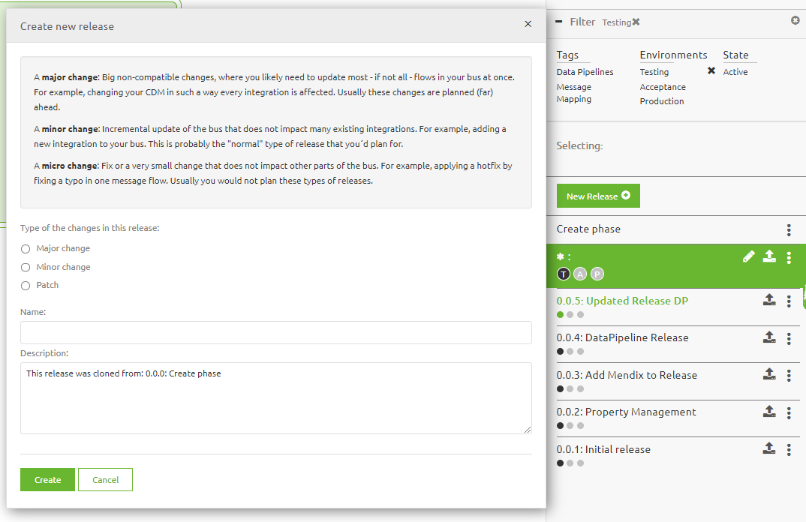
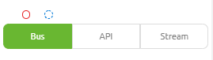
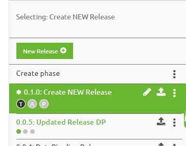

	

		<main class="micro-learning">
		<ul class="doc-nav">
			<li class="doc-nav__item"><a href="../../docs/microlearning/crashcourse-platform-index" class="doc-nav__link">Home</a></li>
			<li class="doc-nav__item"><a href="#intro" class="doc-nav__link">Intro</a></li>
			<li class="doc-nav__item"><a href="#theory" class="doc-nav__link">Theory</a></li>
			<li class="doc-nav__item"><a href="#practice" class="doc-nav__link">Practice</a></li>
			<li class="doc-nav__item"><a href="#solution" class="doc-nav__link">Solution</a></li>
		</ul>

##### Intro

# Creating a new Release

In this microlearning we will focus on the various options to create and edit releases as part of Release Management with eMagiz.

Should you have any questions, please contact academy@emagiz.com.

- Last update: February 7th 2021
- Required reading time: 4 minutes

## 1. Prerequisites
- Basic knowledge of the eMagiz platform
- Completed all microlearnings from Deploy till this specific microlearning
- Have a environment where you can add releases and that is operational to try out the deployment plan

## 2. Key concepts
eMagiz provides the capability to manage your deployments effectively so that all your updated flow components as created in the previous ILM phases of eMagiz. In the previous microlearning you have seen how the flows are deployed across the different eMagiz runtime - this microlearnings defines what exactly needs to be deployed. 

This micro learning centers around creating (and managing) a eMagiz Release.

##### Theory

## 3. Creating a new Releaes

Below the steps to create a new release and the options available.

### 3.1 Creating a Release in TEST
The first step is to create a new release using the New Release button. This allows to provide a name for the Release and the revisions type (Major, Minor or Patch). Depending on the purpose of the release, the right versioning can be selected. Provide sufficient comments to recognize the objective of the release.

Once the name is provided, please note the three small circles under the name. These denote on what environment this release is active (black or green color), and quickly looking for the green circle you will find the active release of a specific environment.

### 3.2 Adding flows to Release
Based on the version selected, and the committed flows from the Create phase, the release content is determined. You have various compare options between releases to understand what exactly has changed between releases to verify if the list of flows created is the good one. You can compare Releases (and to the Create phase) by holding the CRTL button and selecting two releases. The canvas will then highlight the differences in the following manner:

- Blue: the flow is changed functionally (new version created) or the flow is connected to the lastest buildnumber of emagiz
- Red: a flow in the first Release selected is no longer present compared the second release selected
- Green/white: this flow is added compared to the second release selected
  

A release may contain flow components from different patterns. In the bottom right the different patterns are displayed and the steps above can be repeated for every pattern. There are small circles right above the patterns to understand the changes made in these views. The are following the same color indication pattern as above 

### 3.3 Set Release as active
Once the release is created, there is an asterix before the name. This means that the release is not active yet. With the three-dots-option button right next to the name of the release, you have various options for that release. Select the option set as active to make this the release that the deployment plan will use to deploy the updated, new and changed flows with. 

##### Practice

## 4. Assignment

Go to your personal environment, and try to add a new release for your environment. Explore all the options that are available, and ensure to select, deselect flows from your environment.  

## 5. Key takeaways

- The Release defined what is to be deployed on a specific environment, as compared to the Deployment plan that determines what is to be deployed
- Use proper naming and clean your old releases regularly. Non-active releases only can be deleted

##### Solution

## 6. Suggested Additional Readings

If you are interested in this topic and want more information on it please read the helptext provided by eMagiz when executing these actions.

## 7. Silent demonstration video

This video demonstrates how you could have handled the assignment and gives you some context on what you have just learned.

<iframe width="1280" height="720" src="../../vid/microlearning/crashcourse-platform-deploy-create-new-release.mp4" frameborder="0" allow="accelerometer; autoplay; clipboard-write; encrypted-media; gyroscope; picture-in-picture" allowfullscreen></iframe>

</main>

