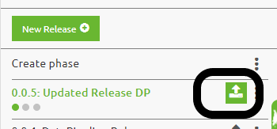
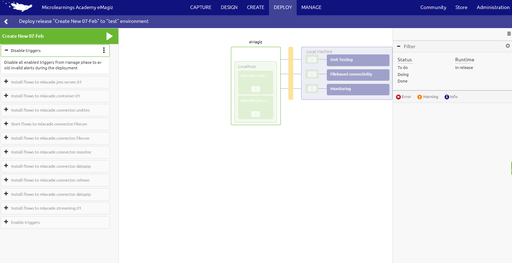
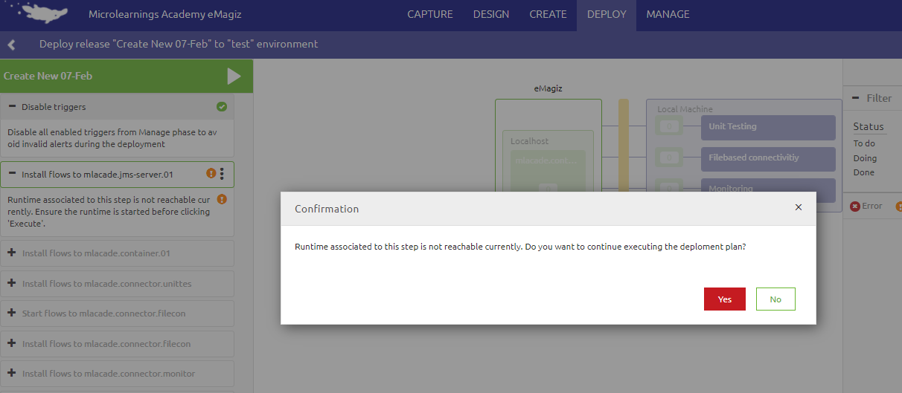

    

        <main class="micro-learning">
        <ul class="doc-nav">
            <li class="doc-nav__item"><a href="../../docs/microlearning/crashcourse-platform-index" class="doc-nav__link">Home</a></li>
            <li class="doc-nav__item"><a href="#intro" class="doc-nav__link">Intro</a></li>
            <li class="doc-nav__item"><a href="#theory" class="doc-nav__link">Theory</a></li>
            <li class="doc-nav__item"><a href="#practice" class="doc-nav__link">Practice</a></li>
            <li class="doc-nav__item"><a href="#solution" class="doc-nav__link">Solution</a></li>
        </ul>

##### Intro

# Deploy a release

This microlearning will focus on deploying your release to a specific environment.

Should you have any questions, please get in touch with academy@emagiz.com.

- Last update: March 17th, 2022
- Required reading time: 5 minutes

## 1. Prerequisites
- Basic knowledge of the eMagiz platform
- Understanding of Releases and how to set up a Deployment plan
- Edit rights for your environment in Deploy
- A change made in a flow version that is added to a release so you can try it yourself

## 2. Key concepts
This microlearning will focus on deploying your release to a specific environment. To deploy a release to an environment, we suggest using the deployment plan functionality. The deployment plan is a series of steps that must be executed on any TAP environment to make the release defined active inside the eMagiz runtimes. Involved in the sense that all changes made to the release compared to the running environment before executing the deployment plan are applied effectively.

##### Theory

## 3. Execute a Deployment plan

Provided there is a deployment plan; the execution is initialized from the Releases section. The button highlighted in the figure above is to start the deployment plan. The page below is displayed as an example of the page showing the deployment steps' progress. Pressing the green play button will begin the execution of the deployment plan.

### 3.1 Key considerations Gen 2
1. Only the changed, added, or deleted flow will be considered for deployment. No change means that the current flow remains untouched
2. The runtime that requires updates must be started / active before anything can be deployed. See the screenshot below to see what happens if the runtime is not running at the moment of execution
3. The middle section showing the integration landscape is highlighting in what system the deployment of a flow is happening
4. The right-hand panel shows the log messages from the runtimes where the deployment(s) of flows are taking place
5. A message will be displayed that the deployment is completed
6. The deployment plan will be default cleanup old versions of flow (unless specified otherwise in the settings of the deployment plan). 

### 3.1 Key considerations Gen 3
1. The deployment step of the machine will only be executed when changes are detected within the current release compared to the previous release.
2. The middle section showing the integration landscape highlights what part of the landscape is currently updated
3. The right-hand panel shows the log messages from the runtimes where the deployment(s) is taking place
4. A message will be displayed that the deployment is completed
5. There is an alternative way of deploying your runtimes for Gen3. This is via Deploy Architecture and selecting the option Deploy runtimes on machine level

##### Practice

## 4. Assignment
Try to deploy a plan using an active release and observe the results taking the above points into account.

## 5. Key takeaways

- The execution of a deployment plan is a smooth process to avoid manual deployments of flows
- Be aware of the specific considerations involved 
- Tune the deployment plan continuously to make it better all the time.

##### Solution

## 6. Suggested Additional Readings

If you are interested in this topic and want more information, please read the help text provided by eMagiz when executing these actions.

## 7. Silent demonstration video

This video demonstrates how you could have handled the assignment and gives you some context on what you have just learned.

<iframe width="1280" height="720" src="../../vid/microlearning/crashcourse-platform-deploy-execute-deployment-plan.mp4" frameborder="0" allow="accelerometer; autoplay; clipboard-write; encrypted-media; gyroscope; picture-in-picture" allowfullscreen></iframe>

</main>

