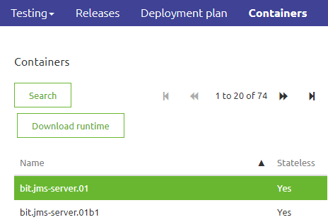
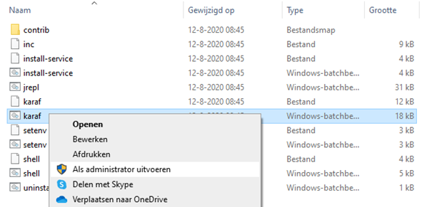
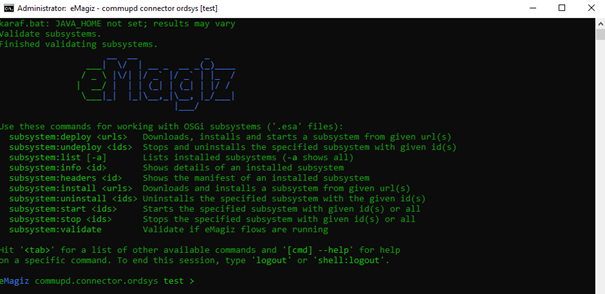

# Install eMagiz runtime on local server

In this microlearning we will focus on installing the eMagiz environment locall
Should you have any questions, please contact academy@emagiz.com.

- Last update: February 10th 2021
- Required reading time: 5 minutes

## 1. Prerequisites
To install a runtime, please be aware that eMagiz needs an environment that satisfies certain requirements. These requirements can be different depending on your architectural choices. Most common is the connector inside your network and a JMS and container running outside the network. In that case, if you are running only connectors on this environment, please keep the following requirements in mind:

1.	OS with support for Java 
2.	OS user with granted security rights to run startup services (Windows services) 
3.	The correct Java installation (Java 8 SE JRE for example, https://adoptopenjdk.net) with NO automatic updates. OpenJDK 8 is currently the recommended version for eMagiz installations.
4.	NTP synchronization – all eMagiz service instances should use the same time and settings. 
5.	Access to internet 
6.	Outbound JMS traffic - port 8443 (and 8444 in case of failover situation) - amqp.emagiz.com / cloudXXXX.emagizcloud.com 
	-	General monitoring data to eMagiz iPaaS 
	-	Specific JMS traffic to eMagiz JMS Server 
7.	Outbound HTTPS traffic – port 443 – Specific provisioning data- https://rts.emagiz.com/ws/ / https://repository.emagiz.com    
8.	Hardware requirements 
	-	Modern CPU  
	-	Enough Disk Space according to sizing calculations 
9.	Enough Memory according to sizing calculations
10. JAVA_HOME variable is properly set

## 2. Key concepts
eMagiz uses a runtime component as a container where flow components can be deployed in. There are infrastructure components that act as flows, and there are functional flow components. Furthermore, there are routing and error flows. By deploying these runtimes across various locations across the integration architecture, you can make these flows work as a chain to realize a complete integration. In the platform training, you need to use the JMS runtime and container runtime, and make this run on your local machine.

## 3. Steps involved to run eMagiz on local server 

### 3.1 Download runtime

1.	Download the eMagiz runtime of your connector, JMS or container via eMagiz Deploy phase in the Containers tab on the server where it needs to be installed. Please note the environment you want the runtime of. If you download the runtime of the wrong environment you will send to or receive of the wrong environment. For example you want to test a flow but by downloading the runtime from the incorrect enviroment you end up sending data to the Production environment. In the case below, we see that we are downloading a connector runtime ordsys for the Test environment.

### 3.2 Unzip the runtime

1.	Unzip your download package into a directory which is not too deep into the directory structure. 
A directory structure which is too deep will cause issues when extracting the runtime.
For example use: C://eMagiz/test
Do not use: C://Programs/eMagiz/test/connector/appeee/installation
2.	Go to the unpacked package and open the folder

### 3.3 Run the runtime

1.	In the Bin folder, you can validate if the service can make a connection via karaf.bat. 
To check the connection of the service, use right mouse button the execute the file as Administrator.
Please make sure that before you try this you verify that your JMS is running.

2.	A screen will pop up and will show you the following:
	
	-	Use the command ‘log:tail’ to see the full log. You will see the full stack trace. If the installation is successful, you should see something like this as a result:
		org.eclipse.gemini.blueprint.extender - 2.1.0.RELEASE |  Application context successfully refreshed (ApplicationContext(bundle=nl.capesystemsintegration.demo.bus.commupd.ordsys.connector-infra.spring, config=nl.capesystemsintegration.demo.bus.commupd.ordsys.connector-infra.spring_1.0.0.52.xml))

If you see an error or the popup closes itself immediately, please check the above steps and requirements. If the popup closes this is probably due to a mismatch between Java version and runtime version. Please look back at the section explaining how to set JAVA_HOME for more information. If all the above steps are correct and you are not able to identify the issue, please contact your implementation partner.

3.	If you see the expected logging, check in eMagiz if:
-	You are able to reach the runtime via the runtime dashboard.
-	You see runtime statistics in Manage.

## 4. Assignment

Execute these steps on the training environment. Ensure to have both runtimes active, and see of the flows can be seen active in the Runtime Dashboard

## 5. Key takeaways

- eMagiz has a runtime software component that allows to run flows inside. It is generic for all types of flows that exist in eMagiz
- Using the JMS and the Container runtimes created by the eMagiz Portal, you can test your work properly during the microlearning training sessions
- Above instructions are also valid for making the installation on a server where a runtime needs to be deployed locally.
 

## 6. Suggested Additional Readings

The user guide section has a complete user guide for installing on-premise connectors including memory settings. There is also a user guide for installation on Linux based servers.

## 7. Silent demonstration video

This video demonstrates how you could have handled the assignment and gives you some context on what you have just learned.

<iframe width="1280" height="720" src="../../vid/microlearning/crashcourse-platform-deploy-install-local-connector.mp4" frameborder="0" allow="accelerometer; autoplay; clipboard-write; encrypted-media; gyroscope; picture-in-picture" allowfullscreen></iframe>