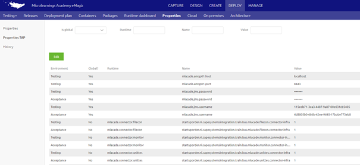
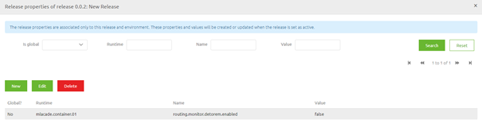

	

		<main class="micro-learning">
		<ul class="doc-nav">
			<li class="doc-nav__item"><a href="../../docs/microlearning/crashcourse-platform-index" class="doc-nav__link">Home</a></li>
			<li class="doc-nav__item"><a href="#intro" class="doc-nav__link">Intro</a></li>
			<li class="doc-nav__item"><a href="#theory" class="doc-nav__link">Theory</a></li>
			<li class="doc-nav__item"><a href="#practice" class="doc-nav__link">Practice</a></li>
			<li class="doc-nav__item"><a href="#solution" class="doc-nav__link">Solution</a></li>
		</ul>

##### Intro

# Property management

In this microlearning, we will focus on the various options to create and edit properties i.e. property management.

Should you have any questions, please contact academy@emagiz.com.

- Last update: January 21th 2021
- Required reading time: 6 minutes

## 1. Prerequisites
- Basic knowledge of the eMagiz platform
- Understanding of property concept
- At least one flow for which you need to create a property or edit a property

## 2. Key concepts
This microlearning centers around property management.
With property management we mean: The process of creating, editing, and deletion of properties based on changing circumstances (i.e. a new release).

There are three ways in which you can create, edit and/or delete these properties:

- Via the property overview in Deploy
- Via the properties TAP overview in Deploy
- Via the Set release properties option when creating a Release

Below we will discuss each of these steps separately.

##### Theory

## 3. Editing properties

Within the eMagiz platform, there are three distinct ways of creating, editing, and/or deleting properties. 
In this section we will discuss how you can create, delete and/or edit properties by discussing each of these methods separately:

- Via the property overview in Deploy
- Via the properties TAP overview in Deploy
- Via the Set release properties option when creating a Release

### 3.1 Property overview in Deploy

In the Deploy phase of eMagiz, there is an overview page called Properties. This is the main overview from which you can do property management and therefore gives you the most functionality.

As you can see from the screenshot above you can create properties via the New button, Edit properties via the Edit button, and Delete properties via the delete button.
To make life a little bit easier in this overview there are various entities you can search on (i.e. Is Global, Runtime, Name, and Value)

To edit or delete a property from this overview you have to select the property and press Edit or Delete based on what you want to achieve. 
Do note that property management done is based on the environment level. This means that the properties that exist in a specific environment, for example, Test might differ from the properties that exist on Acceptance.
The same can be said about the values especially when you look at properties that are used for authentication purposes.

The upside of this overview is that you are flexible in what you can do, meaning you can create, edit and delete properties. 
The downside is that you cannot easily compare properties across environments and the action is immediately executed. 
This means that when someone else restarts a flow using a property a couple of seconds later the reality is already changed

### 3.2 Property TAP overview in Deploy

Another overview in the Deploy phase of eMagiz is the Properties TAP overview. This is a re-imagination of the properties in the properties view based on the environments.
This means that in this overview you can see all properties across environments (assuming you have sufficient rights to see properties across environments).

With the help of this overview, you can easily compare values between environments but you can also see easily whether a property already exists on Test but not yet on Acceptance and/or Production.

When you have sufficient rights to edit properties across environments you can edit the values of properties in Test, Acceptance, and Production without having to switch to a different environment.

The upside of this overview is that you can edit properties for all environments (using you have the correct rights to do so) from one overview without having to go back and forth between environments
The downside of this overview is that you cannot create a new property and the action is immediately executed.
This means that when someone else restarts a flow using a property a couple of seconds later the reality is already changed (and not specifically only on the environment you have currently selected)

### 3.3 Set release properties option when creating a Release

A third overview in the Deploy phase of eMagiz gives you the option to link properties to a certain release **on a certain environment**.
This gives you the option to prepare the list of new properties and property values that need to be changed before you do the deployment and linked them directly to the release.

Because the properties are now linked to a Release it means that the creation and or changing of said properties is dependent on the moment you set the release active.
In other words, the moment you deploy your new release or select the option Set Release as Active eMagiz will automatically update the property overview based on your new configuration.

The upside of this approach is that you have control over when a certain property (value) comes into existence. 
This gives you control over your properties which can help you better prepare and ensure better that unwanted changes are not activated at the wrong moment in time.
The downside is that you cannot delete properties that have become obsolete with the help of this functionality and you have to know which properties you have to enter in this overview.

To mitigate that last downside a little you can combine this functionality with the check properties functionality we already have available. 
If you select the Check properties option (because you know there are new properties that need to be added) you now have the option to save 
those properties and their value as a release property (meaning it won’t become active until the moment you want it to become active).

##### Practice

## 4. Assignment

Add one property via the property overview on Test and Acceptance and subsequently edit this property on one of these environments via the Properties TAP overview.
Link another property with the help of the Set release properties functionality (with the help of the Check properties option) and deploy this release.
This assignment can be completed within the Deploy phase of your (Academy) project that you have created/used in the previous assignment.

## 5. Key takeaways

- There are three ways in which you can create, edit and/or delete these properties:
	- Via the property overview in Deploy
	- Via the properties TAP overview in Deploy
	- Via the Set release properties option when creating a Release
- Each option has its upsides and downsides. Consider these the moment you want to create, edit and/or delete properties
- Whichever method you choose, preparation is key. Know what you want to change!

##### Solution

## 6. Suggested Additional Readings

If you are interested in this topic and want more information on it please read the help text provided by eMagiz when executing these actions.

## 7. Silent demonstration video

This video demonstrates how you could have handled the assignment and gives you some context on what you have just learned.

<iframe width="1280" height="720" src="../../vid/microlearning/crashcourse-platform-deploy-property-management.mp4" frameborder="0" allow="accelerometer; autoplay; clipboard-write; encrypted-media; gyroscope; picture-in-picture" allowfullscreen></iframe>

</main>

