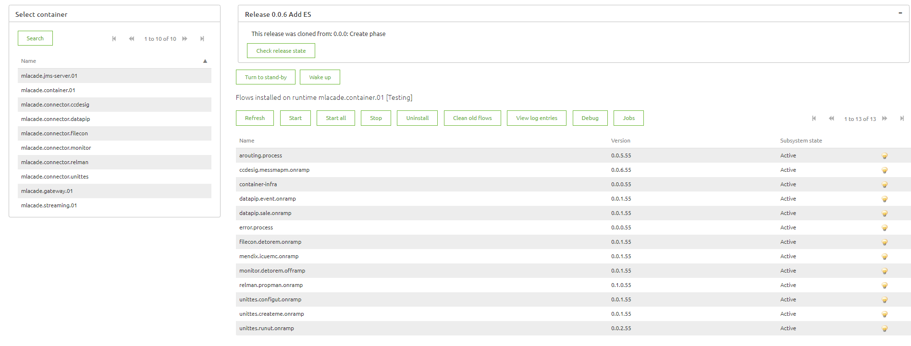

# Runtime Dashboard

In this microlearning you will learn the way you can see and validate which flows are active or running on a specific runtime in eMagiz. 

Should you have any questions, please contact academy@emagiz.com.

- Last update: February 10th 2021
- Required reading time: 5 minutes

## 1. Prerequisites
- Basic knowledge of the eMagiz platform
- Understanding Releases and be able to run a Deployment plan effectively

## 2. Key concepts
eMagiz uses the concept of flows and runtimes. A flow can run inside a runtime, and that runtime acts as a container to make that flow operate properly. Flows can be stopped inside that container, started, installed and deinstalled. The runtime dashboard helps to understand the status of the flow inside the runtime, and where needed change the status of that flow.

eMagiz holds some terminology around these runtimes
1 - There is use of a JMS flow which is run as a single flow inside a runtime. For that specific runtime, there is 1 flow called the JMS and therefore usually referred as the JMS runtime or just JMS
2 - In the Create phase you have seen the onramps and offramps, as well as the routing and error flows. These are running inside the container runtime, often referred as the container. In the Cloud formation, the JMS and Container are located on a single Cloud machine
3 - There are also exit and entry flows that run inside runtimes, and these runtimes are referred as the connector runtimes or just connector. These connector can run on Cloud Connector machine or Local Connector machines.

## 3. Exploring the Runtime dashboard

1. Navigation - use the selection on the left hand panel to select the runtime you wish to inspect
2. Options
	- Start - start the flow selected. The light bulb will turn yellow if the flow is started correctly
	- Stop - stop the flow selected. The status of the flow will become Resolved.
	- Refresh - refresh the status of all flows on the selected runtime 
	- Other options are discussed in next step microlearnings
3. Versions
	- Using the dashboard you can see what version of a flow is running in terms of major, minor or patch. The patterrn is <major>.<minor>.<patch>. 
	- The last two digits always denote the build number that is used for that flow.
4. Do's and don'ts
	- Don't stop the container.infra flow. This means that the connectivity to the runtime is gone, and you control over the runtime itself. Especially in Cloud deployments this is not recommended
	- Stopping the error.process flow means that error messages are no longer send to the eMagiz platform. 
	

## 4. Assignment
Once you have installed the runtimes as described in the previous microlearnings, inspect the runtime dashboard. Stop, start flows.

## 5. Key takeaways

- The runtime dashboard helps to understand what flows are running and what the associated status is
- You need edit rights to perform actions in the Runtime dashboard

## 6. Suggested Additional Readings

If you are interested in this topic and want more information on it please read the helptext provided by eMagiz when executing these actions.

## 7. Silent demonstration video

This video demonstrates how you could have handled the assignment and gives you some context on what you have just learned.

<iframe width="1280" height="720" src="../../vid/microlearning/crashcourse-platform-deploy-runtime-dashboard.mp4" frameborder="0" allow="accelerometer; autoplay; clipboard-write; encrypted-media; gyroscope; picture-in-picture" allowfullscreen></iframe>