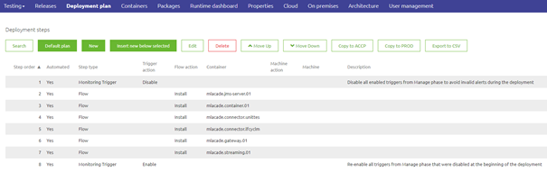

    

        <main class="micro-learning">
        <ul class="doc-nav">
            <li class="doc-nav__item"><a href="../../docs/microlearning/crashcourse-platform-index" class="doc-nav__link">Home</a></li>
            <li class="doc-nav__item"><a href="#intro" class="doc-nav__link">Intro</a></li>
            <li class="doc-nav__item"><a href="#theory" class="doc-nav__link">Theory</a></li>
            <li class="doc-nav__item"><a href="#practice" class="doc-nav__link">Practice</a></li>
            <li class="doc-nav__item"><a href="#solution" class="doc-nav__link">Solution</a></li>
        </ul>

##### Intro

# Setting up a deployment plan

This microlearning will focus on the various options to create and edit properties, i.e., property management.

Should you have any questions, please get in touch with academy@emagiz.com.

- Last update: March 17th, 2022
- Required reading time: 6 minutes

## 1. Prerequisites
- Basic knowledge of the eMagiz platform
- Understand eMagiz releases in basics
- Have an environment where you can add releases, and that is operational to try out the deployment plan

## 2. Key concepts
This microlearning is about the Deployment plan. The deployment plan is a series of steps that need to be executed on a TAP environment to make the release defined as active. Active in the sense that all changes made to the release compared to the running environment before executing the deployment plan are applied effectively.

The Deployment plan is defined in the Deployment Plan section under Deploy. Each Test, Acceptance, and Production environment has its strategy, and the method may vary across an environment. Therefore, the Deployment plan is executed on the release itself, using the options that a Release has.

##### Theory

## 3. Defining the Deployment plan

Below is a screenshot of an elementary Deployment plan. In the next section, we'll look at the options available for configuration. These are referred to as steps and can be added with the button New, seen below.

### 3.1 Enable or disable triggers

One of the steps is to disable all triggers defined in the Manage phase. Running a deployment plan means specific flows are stopped, new ones deployed, and the entire runtime might be stopped and started. Depending on the alerting approach, specific alerts will be triggered during execution, regarded as false-positive alerts. Making this step the first one of any deployment plan would prevent this from happening.
At the same time, you can enable these triggers as the last step in any deployment plan.

### 3.2 Flow actions
For every runtime or connector, the actions on the flows can be defined. Hereunder are the options available for this step. Note that only changed, deleted, or new flows will be handled in any option.
- Install (updated) flows from that container
- Stop all flows from that container
- Start all flows from that container
- Remove all old flows from that container

### 3.2 Machine actions (Gen 3 only)
For every machine, you can define various actions. Below you will find each option available. Note that eMagiz will automatically include the Deploy Machine step in the deployment plan when you run (partly) Gen3.
- Deploy Machine
- Start Machine
- Stop Machine
- Restart Machine
 

### 3.3 Restart runtime
In specific cases, an entire runtime can be just restarted. This helps to clean up the metaspace section of the memory during more extensive deployment, allowing more flows to be deployed effectively. After a restart, more capability exists for that.

### 3.4 Manual steps
All the above options are automated steps. In case a specific action needs to be taken before any next automated step needs to be taken, a manual effort can be added. The description helps describe it, and the deployment steps will halt at this part. It is, however, often used for pre-deployment and post-deployment reminders.

### 3.5 Keep the deployment plan up to date
The following ways will help to keep the plan up to date:

- Use the Default plan option to handle 90% of all cases so that every new runtime is automatically added
- Copy the plan to the following environment to align all plans in the same way.
- Ensure to have a Prepare deployment step in your work definition (sprint) and improve the deployment at each iteration

##### Practice

## 4. Assignment

Go to your environment, and try to add a deployment plan for your environment. Experiments with all options, and ensure to run the deployment plan at least once. Be so familiar with the plan that you will use this approach to refresh your environment at all times. 

## 5. Key takeaways

- The deployment plan is part of the Release Management feature set of eMagiz
- Using the deployment plan, you are always sure that the release defined is the release that runs on any environment (notably the production environment)
- The deployment plan is a must-have to deploy all the changes in an active release on an environment
- Keeping the plan up to date is easy and takes away the manual effort to deploy flows on the different runtimes. 

##### Solution

## 6. Suggested Additional Readings

If you are interested in this topic and want more information, please read the help text provided by eMagiz when executing these actions.

## 7. Silent demonstration video

This video demonstrates how you could have handled the assignment and gives you some context on what you have just learned.

<iframe width="1280" height="720" src="../../vid/microlearning/crashcourse-platform-deploy-setup-deployment-plan-video.mp4" frameborder="0" allow="accelerometer; autoplay; clipboard-write; encrypted-media; gyroscope; picture-in-picture" allowfullscreen></iframe>

</main>

