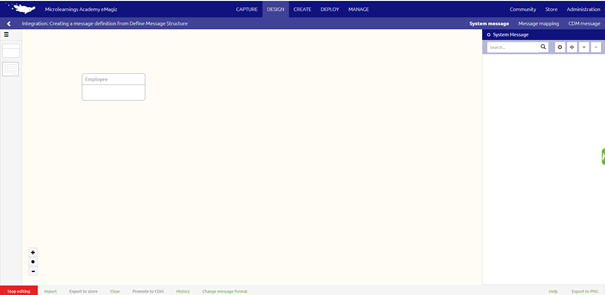
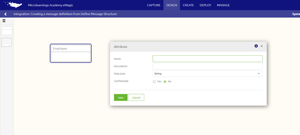
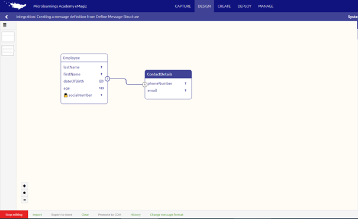
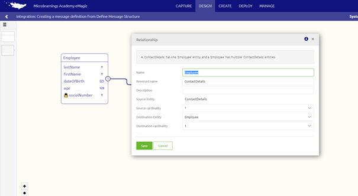
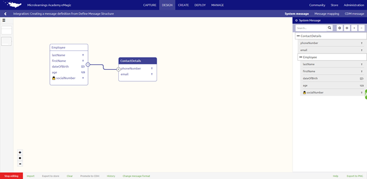
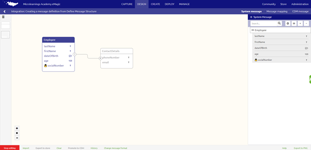

	

		<main class="micro-learning">
		<ul class="doc-nav">
			<li class="doc-nav__item"><a href="../../docs/microlearning/crashcourse-platform-index" class="doc-nav__link">Home</a></li>
			<li class="doc-nav__item"><a href="#intro" class="doc-nav__link">Intro</a></li>
			<li class="doc-nav__item"><a href="#theory" class="doc-nav__link">Theory</a></li>
			<li class="doc-nav__item"><a href="#practice" class="doc-nav__link">Practice</a></li>
			<li class="doc-nav__item"><a href="#solution" class="doc-nav__link">Solution</a></li>
		</ul>

##### Intro

# Creating a message definition

In this microlearning we will focus on how to create a message definition within the eMagiz tooling. Should you have any questions, please contact academy@emagiz.com.

- Last update: February 5th 2021
- Required reading time: 8 minutes

## 1. Prerequisites
- Basic knowledge of the eMagiz platform

## 2. Key concepts
This micro learning centers around the creation of message definition in the Design Phase within eMagiz. 
With a message definition we mean a collection of data elements and fields that are send or recieved by an application.
The structure of this message definition wil eventually create the data validation which validates the content of the message in the Deploy Phase.

In this microlearning we will explain the following items
- Create an entity
- Create an attribute
- Create a relationship between entities
- Creating a message definition

##### Theory

## 3. Creating a message definiton
To create a message definition you navigate to the Design phase of eMagiz. 
Within the Design phase of eMagiz you will right mouse click on the integration where you want to add the message definition. 

After you clicked several options are visible, depending on the integration type and transportmechanism.

For instance, if you click on a synchronous flow the option you will select is "Go to the request systemmessage". For asynchronous this will be "Go to systemmessage".

### 3.1 Create an entity
When you start with the design of a new integration after clicking on the option "Go to systemmessage" eMagiz will load a empty overview. 

If you have an existing file eMagiz will load the message definition that is now in place. 

In this overview you will have several options to complete your message defintion. Before you can use them, you have to click on "Start editing". 
This microlearning will focus on the option to manually add the systemmessage definition to the integration.

The first step is to add an entity for your message definition. Click on the entity icon on the right side and drag and drop it on the canvas. A pop-up will appear with the canvas. 
Name your entity and click on save. eMagiz will add the entity to the canvas.

 
If you made a mistake and want to start over again use rightmouseclick on your added entity and choose the option delete entity.

### 3.2 Create an attribute
When your entity is created you can add an attribute to the entity. With attribute we mean characteristics of a entity. 
For adding a attribute you are still in the edit modus of the systemmessage in design. 
By right click on the lower part of the added entity you will get the option "add attribute". 
Clicking on this option will resolve in a pop-up which gives you the opportunity to add an attribute.

In this popup you have the following options to add.
- Name: This name is the name you will see as the displayname, but also later on as validation name.
- Description: You can use this field to add some extra information about the name. For instance if the name is a abreviation or code, you can use the description to explain the field
- Data type: What datatype is the attribute
- Confidential: Is the attribute that you use confidential or not

To choose the datatype for your attribute eMagiz provides you with the following options:

- String: a sequence of characters
- Integer: a numeric type of attribute
- Decimal: a numeric type with a non round character. 
- Boolean: represents the values true and false
- DateTime: is used for values that contain both date and time
- Enumeration: a set of distinct values. Only those values are accepted for this attribute

When choosing the option confidential to a attribute and pressing save the attribute will be added to the entity in the canvas with a lock icon in front of it.

### 3.3 Create a relationship between entities

A single entity is normally not the case. In a message definition you mostly see a set of entities that are related to each other. 
When mannually adding all the entities and attributes for your message definition the next step is to define the relation between the entities.

To add a relation between two entities you always start from the element that is the child of the parent. The setting of a relationship will be done via drag and drop from child to parent.

The relation is automatically added with the structure more to one. If you want to change this double click on the relation.

The options in eMagiz relationships:
- one-to-one relationship: by changing in this case the source cardinality
- one-to-more relationship: one entity can have multiple child entities
- more-to-more relationship: by changing in this case the destination cardinality

When you are satisfied press Save. If you made a mistake and want to start over again completly press Cancel.

### 3.4 Creating a message definition
When you have added a relation to two entities the message definition is automatically created by eMagiz. The message definition is found on the right side of the canvas in a structured manner. 

If you are satisfied with this message definition you are finished. If it is not what you expect you can change this message definition.
To change the message definition you have to change the root of the message. This can be done by using the root icon.

After clicking on the root icon you can choose the entity that should be the root of your message defintion. 
Click on this entity and eMagiz will give a pop-up with a warning that you are changing the root entity of a message defintion. 
This warning gives you a headsup that all your progress of the message in the right side will be lost.

You have two options. If you agree this will be the root of your message definition press Change root. If you made a mistake and want to start over again completly press Cancel.
When change root is chosen the message definition will only exist of the selected entity with all the attributes.

The next step is to add the other entities to build up your structure of your message definition. Press the canvas icon to add new entities to your message definition.

After clicking on this icon when you go to the canvas the other entities can be selected.

When you are satified of your structure of your message definition you can make attributes optional. This can be done by using the toggle when you hover over the attribute in your message definition.

##### Practice

## 4. Assignment

Manually create a message definition for a flow within your (Academy) project. 
This assignment can be completed with the help of the (Academy) project that you have created/used in the previous assignment.

## 5. Key takeaways

To manually create a message definition you need the following:

- Create an entity
- Create an attribute
- Create a relationship between entities
- Creating a message definition

##### Solution

## 6. Suggested additional readings

If you are interested in this topic and want more information on it please read the helptext provided by eMagiz.

## 7. Silent demonstration video

<iframe width="1280" height="720" src="../../vid/microlearning/crashcourse-platform-design-creating-a-messagedefinition.mp4" frameborder="0" allow="accelerometer; autoplay; clipboard-write; encrypted-media; gyroscope; picture-in-picture" allowfullscreen></iframe>

</main>

