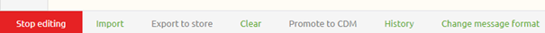
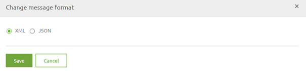

# Defining a message format
Earlier in this module we already learned what message definitions are. 
In this microlearning we focus on setting the message format correctly in design. Setting this correct in Design helps you while building your integration in Create.

In this microlearning we will learn which options you have for defining a message format in Design and how you can set it.

Should you have any questions, please contact academy@emagiz.com.

- Last update: February 4th 2021
- Required reading time: 1 minutes

## 1. Prerequisites
- Basic knowledge of the eMagiz platform

## 2. Key concepts
This micro learning centers around defining a message format.

With message format we mean: The form in which the message is send to or received from a external party the moment it can be validated by the system

In other words, whether the message that you need to send or the message that you receive is in JSON or XML.

## 3. Defining a message format

You can define your message format in two places in Design:
- On system level
- On integration level

### 3.1 Defining a message format on system level

When you go to Design and double click on a system you will see the following configuration. In this case we are interested in the default message format

By switching between XML and JSON you indicate that all messages that are being send and received in relation to this system are defined in XML or JSON.
This is an easy way of correctly definining the message format of all your integration related to a specific system at once.

### 3.2 Defining a message format on integration level

However it could be that one the integration related to the system deviates from the default setting. 
If so you can register this on integration level. To be more precise on system message level. 
When you go to your system message and enter Start editing mode there will be a option called Change message format

Selecting this option will result in the following pop-up. In this pop-up you can switch between both formats and save the result.

## 4. Assignment

Navigate to Design and open a system. Set the default message format of this system to JSON, press Save, open the system again and switch it back to XML. 
This assignment can be completed within the (Academy) project that you have created/used in the previous assignment.

## 5. Key takeaways

- By defining your message format you register to which format (XML or JSON) you will validate all messages related to a certain system
- Defining a message format can be done in two places (system level and integration level)

## 6. Suggested Additional Readings

If you are interested in this topic and want more information on it please read the help text provided by eMagiz.

## 7. Silent demonstration video

This video demonstrates a working solution and how you can validate whether you have successfully completed the assignment.

<iframe width="1280" height="720" src="../../vid/microlearning/microlearning-defining-a-message-format.mp4" frameborder="0" allow="accelerometer; autoplay; clipboard-write; encrypted-media; gyroscope; picture-in-picture" allowfullscreen></iframe>