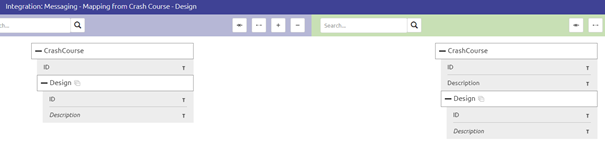
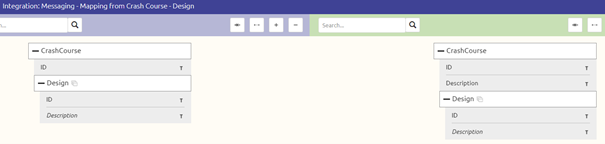
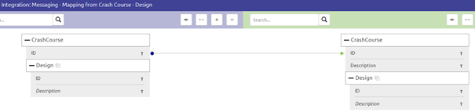

	

		<main class="micro-learning">
		<ul class="doc-nav">
			<li class="doc-nav__item"><a href="../../docs/microlearning/crashcourse-platform-index" class="doc-nav__link">Home</a></li>
			<li class="doc-nav__item"><a href="#intro" class="doc-nav__link">Intro</a></li>
			<li class="doc-nav__item"><a href="#theory" class="doc-nav__link">Theory</a></li>
			<li class="doc-nav__item"><a href="#practice" class="doc-nav__link">Practice</a></li>
			<li class="doc-nav__item"><a href="#solution" class="doc-nav__link">Solution</a></li>
		</ul>

##### Intro

# Drawing lines in message mapping
In this microlearning, we will educate you on the first step of realizing message mapping which is drawing lines

Should you have any questions, please contact academy@emagiz.com.

- Last update: February 3th 2021
- Required reading time: 4 minutes

## 1. Prerequisites
- Basic knowledge of the eMagiz platform

## 2. Key concepts
This microlearning centers around understanding how you can draw lines between elements of definitions and what it means when you draw such a line.

By drawing lines we mean: Connecting specific elements of a source definition to specific elements of a target definition

In other words, making sure that the data arrives in the place you want it to arrive.

##### Theory

## 3. Drawing lines in message mapping

### 3.1 Drawing lines

Let us return to where we stopped in the last microlearning by showing the message mapping overview

To change the message mapping you have to press Start Editing to enter the Start Editing Mode. 
After you enter this mode you will see a subtle change in the background color of the overview

Now it is time to draw lines. To help you eMagiz identifies which mandatory elements still need to be mapped. 
In this case, since we are at the beginning the mandatory element we start with is the root element.

You can draw lines from entity to entity (identifiable as the white rectangles) or from attribute to attribute (identifiable as the grey rectangles).
Note that when you do not draw a line to an entity but draw lines to the underlying attributes your output message will never have these attributes as part of the output.
A example of such a wrong mapping would be:

To draw the correct lines start at the top of your target definition (the definition on the right) and determine which element on the left should be the input for this element.
Continue this process until you are at the bottom of your target definition.

To draw a line you hover over the element in the source definition until you see a + icon, do a left mouse click, and hold your finger on the left mouse button. 
Then start dragging your mouse to the target element. 
The moment you see that the line that is being drawn turns green and you have linked the correct elements to one another you can lift your finger.

The result of connecting both root elements would be

Notice also that eMagiz now tells you that certain other mandatory elements within your target definition have not yet gotten a source input. 
So let's finish drawing lines for this example.

### 3.2 Removing lines
If you have made a mistake in your mapping you can access the context menu via a right-click on one of the lines and press Delete.

Be aware that when you already transferred your integration to Create and you have customized the message mapping in any way deleting a line here means also deleting all that work in Create. 
So think before you act.

##### Practice

## 4. Assignment

Navigate to Design and open the message mapping option of at least one integration within your project. 
Draw lines to make sure that all information in the target system is correctly filled that you can fill based on drawing a line.
This assignment can be completed within the (Academy) project that you have created/used in the previous assignment.

## 5. Key takeaways

- Drawing lines makes it possible to make sure that the data arrives in the place you want it to arrive.
- To correct mistakes you can remove a line again. This removal can have an impact so think before you act.

##### Solution

## 6. Suggested Additional Readings

If you are interested in this topic and want more information on it please read the help text provided by eMagiz.

## 7. Silent demonstration video

This video demonstrates a working solution and how you can validate whether you have successfully completed the assignment.

<iframe width="1280" height="720" src="../../vid/microlearning/crashcourse-platform-design-drawing-lines-in-message-mapping.mp4" frameborder="0" allow="accelerometer; autoplay; clipboard-write; encrypted-media; gyroscope; picture-in-picture" allowfullscreen></iframe>

</main>

