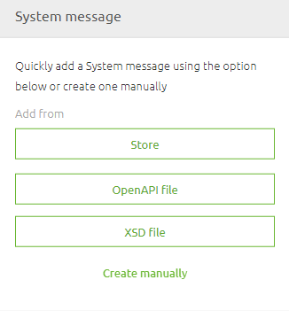

	

		<main class="micro-learning">
		<ul class="doc-nav">
			<li class="doc-nav__item"><a href="../../docs/microlearning/crashcourse-platform-index" class="doc-nav__link">Home</a></li>
			<li class="doc-nav__item"><a href="#intro" class="doc-nav__link">Intro</a></li>
			<li class="doc-nav__item"><a href="#theory" class="doc-nav__link">Theory</a></li>
			<li class="doc-nav__item"><a href="#practice" class="doc-nav__link">Practice</a></li>
			<li class="doc-nav__item"><a href="#solution" class="doc-nav__link">Solution</a></li>
		</ul>

##### Intro

# Importing a message definition
Earlier in this module we already learned what message definitions are and how you can manually create them. 
As you can imagine having to do everything by hand can be cumbersome. Therefore eMagiz provides you with the option to import a message definition.

In this microlearning we will learn how you can import these message defintions to help you build integration faster.

Should you have any questions, please contact academy@emagiz.com.

- Last update: February 4th 2021
- Required reading time: 5 minutes

## 1. Prerequisites
- Basic knowledge of the eMagiz platform

## 2. Key concepts
This micro learning centers around understanding how you can import definitions from various sources to aid your process.

With import we mean: Selecting a input definition which eMagiz will use to generate a visual representation based on that input

In other words, letting eMagiz drag the entities and attributes on the canvas and connect them to each other with all the correct datatypes and whether or not a element or attribute is optional.

##### Theory

## 3. Importing a message definition

Importing a message definition can be done in various places. 
Main place a import would be usefull is a place where you don't impact other integrations / message types with your import.

What I mean is  that centralized data models (i.e. CDM, API Gateway Data Model and Event Streaming Data model) are less ideal for a import 
as the import could alter parts of other message types or create a duplicate with a _1 after it for example. Both mean a manual correction afterwards.

On the other hand you have the system messages for each integration pattern. In those situation it is ideal to import the defintion as was provided to you by the external party.
The scope of the import in this microlearning is therefore importing a message definition on system message level.
When we zoom into the specifics of the API Gateway integration pattern we will also discuss the possibility to import the Open API specification that could accelerate your development.

Having said that let us delve into the specifics of this functionality. Once again you can navigate to Design and select the integration of your choose to access the context menu.

After you have selected this option you will be directed to the system message overview. If this is the first time you acess this overview it should look empty

On the bottom left, next to Start Editing you have a Import button. You can use this Import button when you are in Start Editing mode.
As the integration pattern differ slightly the import options available differ also a bit. Below we will discuss the various 

### 3.1 Import from Capture
Importing a definition from Capture is currently only possible for the messaging pattern. 
When you select this option you get a pop-up showing you all integration attachments from Capture with the type XSD.
Select the one you want and press Import to import the definition

### 3.2 Import from XSD
Importing a definition from XSD is possible for both the messaging as well as the API Gateway pattern. 
In both cases you can select this option and select the correct XSD (located on your laptop) and press Import

### 3.3 Import from CDM
Importing a definition from CDM is only possible within the messaging pattern. 
Imagine that you need to host a webservice (SOAP/REST) and you can determine the structure of how the message should look like or when you have control of the application that will receive the data. 
In those cases you can use this option to your advantage. 
Additional benefit of this option is that eMagiz will automatically do the message mapping (more on that later) for you as the definitions are equal to one another.

### 3.4 Import from OpenAPI File
Importing a definition from Capture is currently only possible with the API Gateway pattern. 
In case the external system (i.e. backend operation) has a OpenAPI specification defining the structure of the API (including definitions) you can use that to import the schema in eMagiz.

### 3.5 Import from Store
Importing a definition from Store is currently only possible for the messaging pattern. 
With this option you can re-use existing solutions within your own eMagiz project by selecting a message to import from the store.

### 3.6 Importing result
Regardless of the option that you choose the end result should be a visual representation of the definition that you wanted to import.

##### Practice

## 4. Assignment

Navigate to Design and open the system message option of atleast one integration within your project. 
Import from Capture and/or XSD for atleast one integration to see the effect of importing a definition
This assignment can be completed within the (Academy) project that you have created/used in the previous assignment.

## 5. Key takeaways

- Importing a definition can speed up the development of integration and improve quality at the same time
- Per integration pattern eMagiz offers a varying set of importing options
- The end result of your import should be a visual representation of your definition

##### Solution

## 6. Suggested Additional Readings

If you are interested in this topic and want more information on it please read the help text provided by eMagiz.

## 7. Silent demonstration video

This video demonstrates a working solution and how you can validate whether you have successfully completed the assignment.

<iframe width="1280" height="720" src="../../vid/microlearning/crashcourse-platform-design-import-message-definition.mp4" frameborder="0" allow="accelerometer; autoplay; clipboard-write; encrypted-media; gyroscope; picture-in-picture" allowfullscreen></iframe>

</main>

