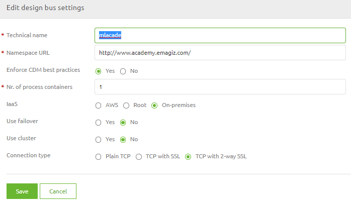
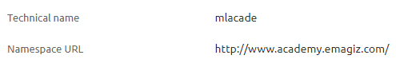
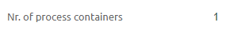
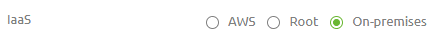
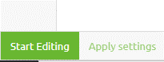

	

		<main class="micro-learning">
		<ul class="doc-nav">
			<li class="doc-nav__item"><a href="../../docs/microlearning/crashcourse-platform-index" class="doc-nav__link">Home</a></li>
			<li class="doc-nav__item"><a href="#intro" class="doc-nav__link">Intro</a></li>
			<li class="doc-nav__item"><a href="#theory" class="doc-nav__link">Theory</a></li>
			<li class="doc-nav__item"><a href="#practice" class="doc-nav__link">Practice</a></li>
			<li class="doc-nav__item"><a href="#solution" class="doc-nav__link">Solution</a></li>
		</ul>

##### Intro

# Project Settings

In this microlearning we will educate you on which project settings you need to define in Design to ensure that you can transfer your solution to Create.

Should you have any questions, please contact academy@emagiz.com.

- Last update: February 3th 2021
- Required reading time: 7 minutes

## 1. Prerequisites
- Basic knowledge of the eMagiz platform

## 2. Key concepts
This micro learning centers around the Project Settings in Design

With Project settings we mean: A set of configuration items that defines how the setup of the project will look like.

The Project settings define:
- Technical name
- Namespace URL
- Enforce CDM best practices
- Nr. of process containers
- IaaS where is your eMagiz project deployed)
- Use failover
- Use cluster
- Connection type

##### Theory

## 3. Project Settings

In this microlearning we will discuss how to configure the project settings to represent the correct structure of how your project will be running.

eMagiz will fill in several settings for you and those you don't need to change. These settings are:

- Enforce CDM best practices
- Use cluster
- Connection type

The other settings can be divided into two segments. The first segment defines settings that you need to set once and never have to change anymore.
Under this segment we define the following settings:
- Technical name
- Namespace url

The second segment defines settings that might change over time as your integration landscape is growing which leads to different choices:
- Nr. of process containers
- IaaS (where is your eMagiz project deployed)
- Use failover

Editing either one of these settings can be done via the Edit Settings button:

 

### 3.1 Generic Project Settings

The generic project settings that need to be defined once are the technical name and the namespace url. 
The advice is to shorten your display name within seven characters to represent the technical name and let the namespace url reflect what your eMagiz project is about (i.e name of a business, organizational unit, etc.).

An example of such a implementation would be:

 

### 3.2 Specific Project Settings

The specific project settings could change over time as your integration landscape is growing leading to other decisions being made.
Let us take a look at each of these settings one by one to see what they are about and how they can change over time.

#### 3.2.1 Nr. of process containers
The number of process containers defines how many runtimes will be used to run your core flows (i.e. onramp, offramp, routing, error). 
The default setting is 1 process container. 

 

However the moment your integration landscape grows beyond a certain number of flows you should think about dividing the load between multiple process containers.
The current limit we advise is a maximum of 60 flows per process container.

#### 3.2.1 IaaS
We offer two choices when it comes to where you are deploying your integration (eMagiz Cloud in AWS or On-premise). The third option (Root) is deemed end of life

Best practice for test projects and academy related projects is to run them on-premise (meaning in this case your own laptop). 
Best practice for actual projects is to run them in the eMagiz Cloud (AWS)

#### 3.2.1 Use failover
The third setting that could change over time is the setting to use a failover or not.

Using failover will add high availability and redundancy of the JMS servers to the solution, but also requires more hardware to deploy on.
Note that in most cases using failover with only a single process container is not very useful, as this makes the process container a single point of failure.

This means that you have to decide whether your project should be always up and running (also in case of trouble on one of the JMS servers) or if it is okay that downtime can occur in those situation.
Furthermore it means that this setting also impacts the setting for the nr. of process containers. 

If you use failover and have less then 60 flows you should have 2 process containers. 
If you have between 60-120 flows and use failover you should have 4 process containers. As you can imagine the logic continues onwards if you continue to grow.

### 3.3 Applying Settings
The moment you are satisfied with your settings you need to apply the settings in order for the Design Architecture to reflect your choices.
The first time you set up these settings you can press the Apply Settings button in this overview as it will immediately apply the settings to Test, Acceptance and Production.

However the moment you are already running your eMagiz integration landscape on these environments on Test, Acceptance and Production 
we strongly advice that you apply the change in settings **per** environment.

You can apply these settings **per** environment via the Design Architecture overview by selecting the option Apply settings.

### 3.4 Transfer settings to Create
Furthermore the moment you change your project settings **after** you have transferred atleast one flow to Create you should also update the settings in Create to reflect the new reality.
You can do so by navigating to Create -> Settings -> Transfer Settings from Design.

If there are differences on one of the specified categories you should press the Transfer button to sync Design and Create.

Be aware that changing these settings can have a impact on a multitude of flows, therefore proceed with caution and be patient to see results

##### Practice

## 4. Assignment

Navigate to Design -> Settings and check if all settings are filled in. If not fill in the required settings (technical name and namespace url) 
and set IaaS to on-premise **(only if you use a Academy project and not a real project for this assignment)**
This assignment can be completed within the Academy project that you have created/used in the previous assignment.

## 5. Key takeaways

- Some project settings need to be defined once
	- Technical name
	- Namespace URL
- Other settings can change over time
	- Nr. of process containers
	- IaaS
	- Use failover
- Applying them should be done with caution and with reason

##### Solution

## 6. Suggested Additional Readings

If you are interested in this topic and want more information on it please read the help text provided by eMagiz.

## 7. Silent demonstration video

This video demonstrates a working solution and how you can validate whether you have successfully completed the assignment.

<iframe width="1280" height="720" src="../../vid/microlearning/crashcourse-platform-design-project-settings.mp4" frameborder="0" allow="accelerometer; autoplay; clipboard-write; encrypted-media; gyroscope; picture-in-picture" allowfullscreen></iframe>

</main>

