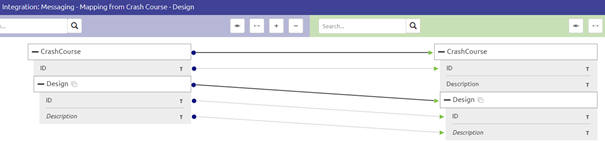
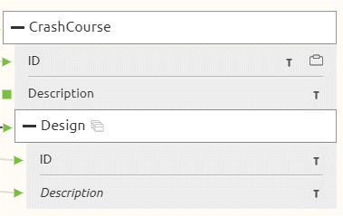

# Set as mapped in message mapping
In this microlearning we will educate you on the second step of realizing a message mapping which is set as mapped. 
This is a optional step and is only necessary in case atleast one mandatory attribute in your target definition cannot be filled based on anything within the target definition/

Should you have any questions, please contact academy@emagiz.com.

- Last update: February 3th 2021
- Required reading time: 2 minutes

## 1. Prerequisites
- Basic knowledge of the eMagiz platform

## 2. Key concepts
This micro learning centers around understanding how you can place a attribute on set as mapped while doing the message mapping.

With set as mapped we mean: Registering that a certain attribute will be filled with a static input

In other words, enriching the output based on a static input instead of something in the input definition

## 3. Set as mapped in message mapping

Let us return to where we stopped in the last microlearning by showing the message mapping overview with the lines we drew

As you see, the Description attribute on Crash Course level is not mapped yet but is mandatory. 
To register that we want to use a static input we have to press Start Editing to enter the Start Editing Mode.

After that we navigate to the attribute in question, right mouse click and set as mapped.

To indicate that a certain attribute has been registered as set as mapped eMagiz will show a cube icon in front of the attribute

As you can see, all mandatory elements have been mapped with the help of our message mapping. Therefore we can conclude that the message mapping is done.

**Note**: In the case that you have made a mistake and did not want to set this specific attribute to set as mapped you can right click on the attribute to access the context menu and select unset as mapped.

### 3.1 Adding notes
A nice addition to the functionality surrounding message mapping is that you can add notes to tell others if a certain mutation on the input field is necessary or what the static input should be.
You can add a note by right clicking on the attribute and selecting the option New/Edit Note

Selecting this option will lead you to the following pop-up. In this pop-up you can fill in some information that can help others that will create the transformation later on in Create.
A example of such an entry would be:

After you have saved the note a icon will appear on the attribute letting you and others know that some notation has been made on that attribute that is worth reading.

## 4. Assignment

Navigate to Design and open the message mapping option of atleast one integration within your project. 
Register atleast one of the output attributes as set as mapped and add a note to this attribute telling what the input of the attribute should be.
This assignment can be completed within the (Academy) project that you have created/used in the previous assignment.

## 5. Key takeaways

- With the set as mapped functionality you can register for (mandatory) attributes that the input is a static value
- Adding notes can help improve the quality of work and help you to explain to others why you have made certain choices

## 6. Suggested Additional Readings

If you are interested in this topic and want more information on it please read the help text provided by eMagiz.

## 7. Silent demonstration video

This video demonstrates a working solution and how you can validate whether you have successfully completed the assignment.

<iframe width="1280" height="720" src="../../vid/microlearning/microlearning-set-as-mapped-in-message-mapping.mp4" frameborder="0" allow="accelerometer; autoplay; clipboard-write; encrypted-media; gyroscope; picture-in-picture" allowfullscreen></iframe>