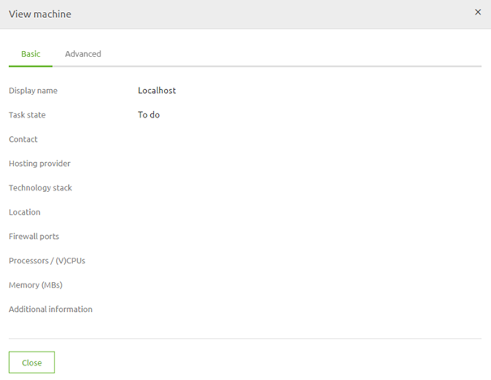
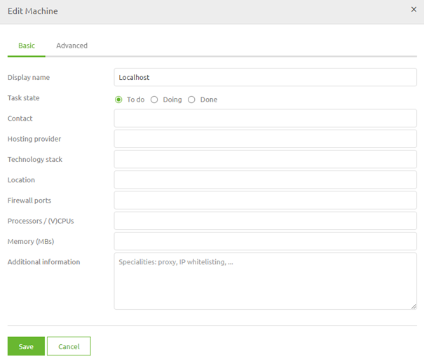
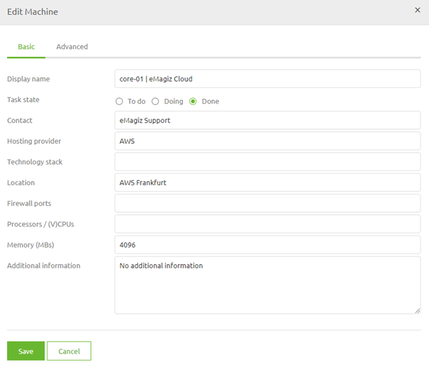
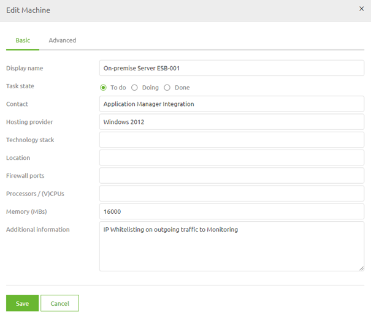

# Storing Metadata - Design Architecture

In the previous microlearning we learned a bit about the Design Architecture. 
In this microlearning we will build on that by learning how you can store metadata on machine level to get clarity on what is happening.

Should you have any questions, please contact academy@emagiz.com.

- Last update: February 2th 2021
- Required reading time: 2 minutes

## 1. Prerequisites
- Basic knowledge of the eMagiz platform

## 2. Key concepts
This micro learning centers around learning how to store metadata on machine level to give you and your colleagues insights into what is happening.

With metadata we mean: Information that tells us something about the characteristics of a machine (i.e. host, name, contact, IP-whitelisting)

Storing metadata can help you:
- See where machines are running specifically
- See who you should contact in case of troubles
- See if there are any custom settings, special consideration when updating anything on that machine

## 3. Storing Metadata - Design Architecture

Once again we find ourselves in Design -> Architecture. 
When you double click on a machine or view it via the context menu you get a pop-up detailing information that could help you.

As you can see it is still a pretty blank page at the moment. When you press Start Editing you can edit this information

Let us fill in some of the details to get a feeling of how the information can help you

As you can see from the examples given it is quite easy to register some information on machine level in a way that all can benefit

## 4. Assignment

The assignment is easy this time. Add relevant information on atleast one machine within your project that could clarify specific information on machine level.
This assignment can be completed with the help of a associated Mendix project linked to the (Academy) project that you have created/used in the previous assignment.

## 5. Key takeaways

Storing metadata can help you:
- See where machines are running specifically
- See who you should contact in case of troubles
- See if there are any custom settings, special consideration when updating anything on that machine

## 6. Suggested Additional Readings

If you are interested in this topic and want more information on it please read the help text provided by eMagiz.

## 7. Silent demonstration video

This video demonstrates a working solution and how you can validate whether the refresh has actually worked in AWS Redshift.

<iframe width="1280" height="720" src="../../vid/microlearning/microlearning-design-storing-metadata.mp4" frameborder="0" allow="accelerometer; autoplay; clipboard-write; encrypted-media; gyroscope; picture-in-picture" allowfullscreen></iframe>