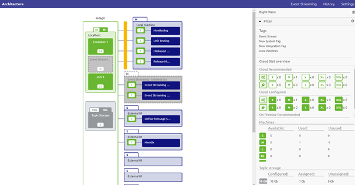
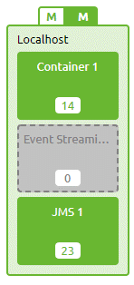
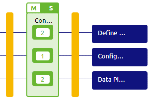
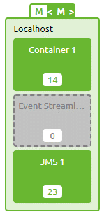
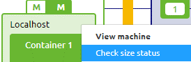

	

		<main class="micro-learning">
		<ul class="doc-nav">
			<li class="doc-nav__item"><a href="../../docs/microlearning/crashcourse-platform-index" class="doc-nav__link">Home</a></li>
			<li class="doc-nav__item"><a href="#intro" class="doc-nav__link">Intro</a></li>
			<li class="doc-nav__item"><a href="#theory" class="doc-nav__link">Theory</a></li>
			<li class="doc-nav__item"><a href="#practice" class="doc-nav__link">Practice</a></li>
			<li class="doc-nav__item"><a href="#solution" class="doc-nav__link">Solution</a></li>
		</ul>

##### Intro

# Understanding Design Architecture - Basic

In this microlearning, we will educate you on what Design Architecture is, what you can use it for and how it can help you.

Should you have any questions, please contact academy@emagiz.com.

- Last update: February 2th 2021
- Required reading time: 5 minutes

## 1. Prerequisites
- Basic knowledge of the eMagiz platform

## 2. Key concepts
This microlearning centers around understanding what the Design Architecture overview is and how it can help you

With Design Architecture we mean: The desired overview of where the instances are deployed, on which machines, and how many resources it takes to deploy these instances

The Design Architecture gives you insights into:
- Where do my instances run (cloud, on-premise)
- What is the machine size needed to run my instances
- Can I still develop more integration solutions within the current sizing parameters

##### Theory

## 3. Understanding Design Architecture

The Design Architecture overview is accessible under Design. In Design, you can click on Architecture to get to the overview. 
The following Design Architecture could look similar to what you would see the first time you open this page. A lot to improve as you can see.

 

As you can see in the overview of the architecture we have several machines within our integration landscape (i.e. localhost, local machine, External 01, etc.) and each machine has several systems running on it.

### 3.1 Core Machine
The machine called localhost in this example is a so-called core machine. This machine (or machines if you scale up) plays host to the core functionalities of eMagiz:
- JMS
- Process Container (holds all onramps, offramps, routers, and error for messaging processes)
- Event Streaming Container (holds all onramps and offramps for event stream processes)

Depending on your specific implementation you need some of them or all of them. If you do not need them eMagiz will grey them out indicating that the system in question can be ignored.

### 3.2 Connector Machine(s)
The machine called a local machine in this example is a so-called connector machine. 
These machines are connected to the internet as this is the place where you exchange data with other systems.

Within eMagiz we make a distinction between two types of connector machine(s):
- Connector machine(s) running in the eMagiz Cloud managed by eMagiz
- Connector machine(s) running on-premise in the data center of the client

Both are also represented differently within this picture. The on-premise systems are blue and behind one firewall. 

The connector machine(s) in the eMagiz Cloud is running in between firewalls and are green.

Cleaning the picture up and removing the unnecessary systems gives us a way nicer overview

### 3.3 Determining size
Apart from determining where an instance (runtime) should be running (cloud or on-premise) the Design Architecture 
also helps in determining the size a machine would need to have to support the processes running on it.

When you activate the Start Editing mode you will notice that you can alter the size of the green machines (those that are managed by eMagiz) 

To help you determine the size of the machine eMagiz has the option to check the size status

In the pop-up that follows we specify how the memory advice of eMagiz is calculated (the figure on the left above a machine). 
This can help you determine the correct sizing for your machine, now and in the future

There is much more to tell about the Design Architecture but more on that in later microlearnings.

##### Practice

## 4. Assignment

Navigate to Deploy -> Architecture and determine for your environment whether the advised size matches the size that is currently configured by the user.
This assignment can be completed with the help of an associated Mendix project linked to the (Academy) project that you have created/used in the previous assignment.

## 5. Key takeaways

- Design Architecture gives you context on which instances run where (on-premise or cloud)
- Design Architecture gives you the tools that you need to determine the correct sizing for your environment
- Machines are divided into so-called core and connector machines

##### Solution

## 6. Suggested Additional Readings

If you are interested in this topic and want more information on it please read the help text provided by eMagiz.

## 7. Silent demonstration video

This video demonstrates a working solution and how you can validate whether you have successfully completed the assignment.

<iframe width="1280" height="720" src="../../vid/microlearning/crashcourse-platform-design-understanding-design-architecture-basic.mp4" frameborder="0" allow="accelerometer; autoplay; clipboard-write; encrypted-media; gyroscope; picture-in-picture" allowfullscreen></iframe>

</main>

