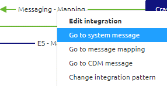
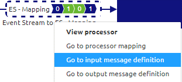
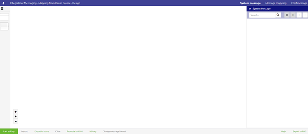

	

		<main class="micro-learning">
		<ul class="doc-nav">
			<li class="doc-nav__item"><a href="../../docs/microlearning/crashcourse-platform-index" class="doc-nav__link">Home</a></li>
			<li class="doc-nav__item"><a href="#intro" class="doc-nav__link">Intro</a></li>
			<li class="doc-nav__item"><a href="#theory" class="doc-nav__link">Theory</a></li>
			<li class="doc-nav__item"><a href="#practice" class="doc-nav__link">Practice</a></li>
			<li class="doc-nav__item"><a href="#solution" class="doc-nav__link">Solution</a></li>
		</ul>

##### Intro

# What is a message definition
In this microlearning, we will educate you on what we mean when we talk about message definitions.

Should you have any questions, please contact academy@emagiz.com.

- Last update: February 4th, 2021
- Required reading time: 3 minutes

## 1. Prerequisites
- Basic knowledge of the eMagiz platform

## 2. Key concepts
This microlearning centers around understanding the concept of the message definition.

With message definition we mean: A visual representation of how the elements are related to each other, whether they are mandatory and the data types they have that can be used in the message mapping

In other words, the message definition defines the structure of the data that will be sent or received.

##### Theory

## 3. What is a message definition

A message definition is a visual representation of how the elements are related to each other, whether they are mandatory and the data types they have that can be used in the message mapping.
In all integration patterns (Messaging, API Gateway, and Event Streaming) we have message definitions.

On one hand, we have message definitions that relate to a system. 
These definitions tell us something about how the system will send or wants to receive messages (data). 
On the other hand, we have message definitions that relate to eMagiz. 
These are generic and consistent across systems (i.e. CDM messages, Gateway messages, Topic messages).

 

In this phase, you can open the context menu on the integration level (remember, that is a line between eMagiz and an external system). 
The context menu will look slightly different based on the integration pattern. These differ as the use cases for each pattern differ slightly.

Selecting one of the above options will lead you to an overview similar to the one that is shown below.

In this overview, you can import a definition or create one yourself.

### 3.1 eMagiz datamodels

Above the focus was on the system messages (i.e. the definitions as defined by the external system). Within each of the patterns eMagiz supports (Messaging, API Management, and Event Streaming) we support an eMagiz data model. In these data models you can define how the messages should look like when they pass through the system of eMagiz. When creating a message transformation you always have atleast one eMagiz part that is based on an eMagiz data model. This is needed as you need to transform from the external system to the eMagiz data model for example.

In messaging terms we call this eMagiz data model a CDM for example. Based on the pattern you are implementing the naming can change slightly but the conceptual idea is the same. For more information on the various data models we support for the patterns please check out the suggested additional readings section below.

##### Practice

## 4. Assignment

Navigate to Design and open the message definition option of at least one integration within your project.
This assignment can be completed within the (Academy) project that you have created/used in the previous assignment.

## 5. Key takeaways

- A message definition is a visual representation of how the elements are related to each other, whether they are mandatory and the data types they have that can be used in the message mapping
- Some message definitions are specific to a system. Others are generic across systems

##### Solution

## 6. Suggested Additional Readings

If you are interested in this topic and want more information on it please read the help text provided by eMagiz. Furthermore check out these links if you want a more in-depth knowledge of the eMagiz data models:

- [API Gateway model](crashcourse-api-gateway-api-data-model.md)
- [Understanding the eMagiz CDM](crashcourse-messaging-what-is-cdm.md)
- [Event Streaming data model](intermediate-configuring-event-streaming-data-model.md)

## 7. Silent demonstration video

This video demonstrates a working solution and how you can validate whether you have successfully completed the assignment.

<iframe width="1280" height="720" src="../../vid/microlearning/crashcourse-platform-design-what-is-a-message-definition.mp4" frameborder="0" allow="accelerometer; autoplay; clipboard-write; encrypted-media; gyroscope; picture-in-picture" allowfullscreen></iframe>

</main>

