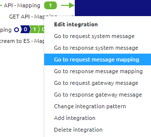

# What is a message mapping

In this microlearning we will educate you what we mean when we talk about message mapping

Should you have any questions, please contact academy@emagiz.com.

- Last update: February 3th 2021
- Required reading time: 2 minutes

## 1. Prerequisites
- Basic knowledge of the eMagiz platform

## 2. Key concepts
This micro learning centers around understanding the concept of message mapping

With message mapping we mean: Drawing lines, making notes and defining static inputs between two message definitions to identify how data elements will be transformed from the source to the target definition

In other words, the art of a good message mapping lies within your ability to correctly translate between two definitions. eMagiz will help you to make that art a reality.

## 3. What is a message mapping

A message mapping is a visual representation of how data is translated from the source definition to the target definition. 
In all integration patterns (Messaging, API Gateway and Event Streaming) you can translate data elements between definitions.

You can access a message mapping when you navigate to the Design phase of eMagiz. 

 

In this phase you can open the context menu on integration level (remember, that is a line between eMagiz and a external system). 
The context menu will look slightly different per integration pattern. These differ as the use cases for each pattern differ slightly.

Selecting one of the above options will lead you to a overview similar to the one I show below

In this overview you can actualize the message mapping between the system (identifiable by the blue bar above the definition) and eMagiz (identifiable by the green bar above the definition).
In the next microlearning we will continue to actualize the message mapping so we can transform the data between the external system and eMagiz.

## 4. Assignment

Navigate to Design and open the message mapping option of atleast one integration within your project.
This assignment can be completed within the (Academy) project that you have created/used in the previous assignment.

## 5. Key takeaways

With message mapping we mean: Drawing lines, making notes and defining static inputs between two message definitions to identify how data elements will be transformed from the source to the target definition
In other words, the art of a good message mapping lies within your ability to correctly translate between two definitions. eMagiz will help you to make that art a reality.

## 6. Suggested Additional Readings

If you are interested in this topic and want more information on it please read the help text provided by eMagiz.

## 7. Silent demonstration video

This video demonstrates a working solution and how you can validate whether you have successfully completed the assignment.

<iframe width="1280" height="720" src="../../vid/microlearning/microlearning-what-is-a-message-mapping.mp4" frameborder="0" allow="accelerometer; autoplay; clipboard-write; encrypted-media; gyroscope; picture-in-picture" allowfullscreen></iframe>