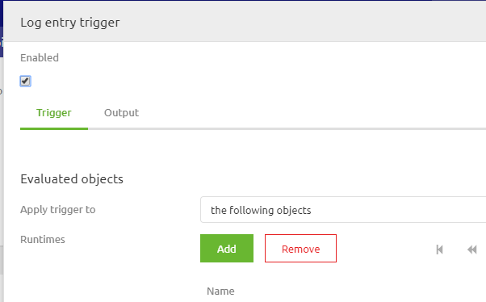
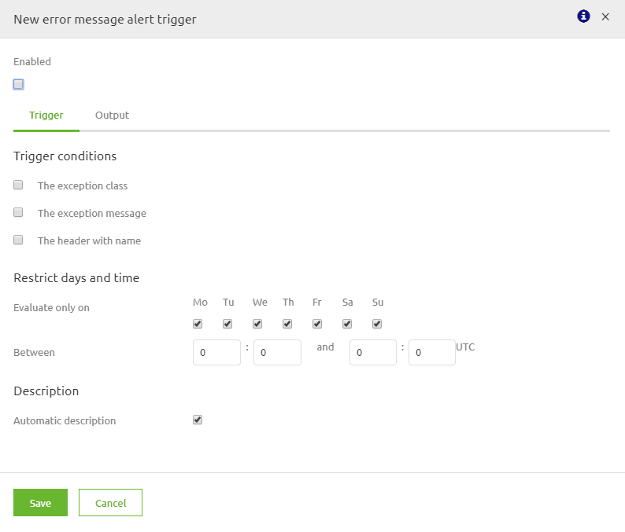
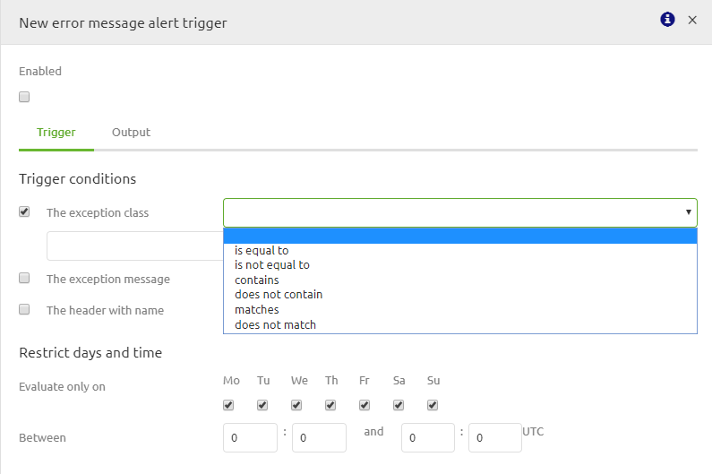
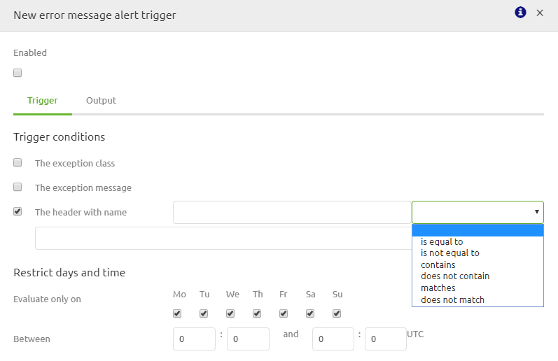
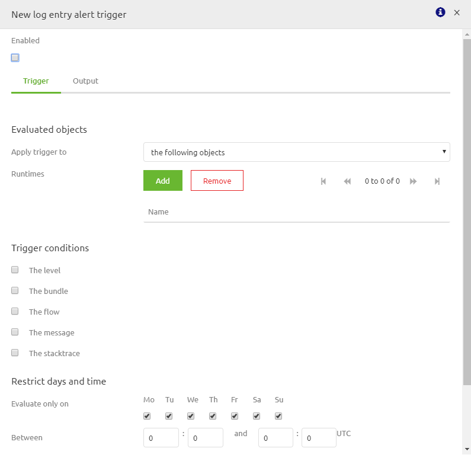
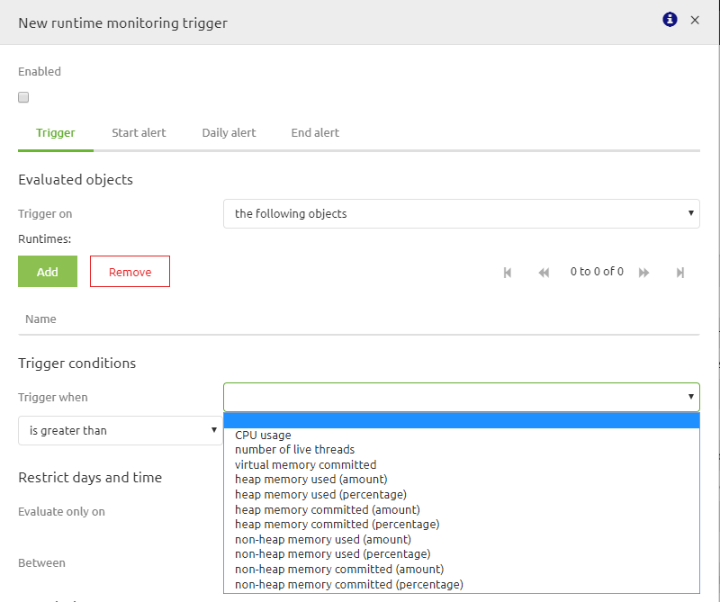

	

		<main class="micro-learning">
		<ul class="doc-nav">
			<li class="doc-nav__item"><a href="../../docs/microlearning/crashcourse-platform-index" class="doc-nav__link">Home</a></li>
			<li class="doc-nav__item"><a href="#intro" class="doc-nav__link">Intro</a></li>
			<li class="doc-nav__item"><a href="#theory" class="doc-nav__link">Theory</a></li>
			<li class="doc-nav__item"><a href="#practice" class="doc-nav__link">Practice</a></li>
			<li class="doc-nav__item"><a href="#solution" class="doc-nav__link">Solution</a></li>
		</ul>

##### Intro

## Alerting in eMagiz
Assessing the health of your systems is critical in a stable and robust integration solution. 
Getting alerts when something deviates is a crucial part of guaranteeing the stable and robust integration solution.

In this microlearning we will educate you on Alerting within the Manage phase of eMagiz.

- Last update: February 9th 2021
- Required reading time: 11 minutes

## 1. Prerequisites
- Basic knowledge of the eMagiz platform

## 2. Key concepts
This microlearning centers around setting up the alerting in eMagiz.
With alerting we mean: Configure thresholds that raise an alert when the threshold is passed

There are four areas on which you can configure alerting:
- Error Messages
- Log Entries
- Measurement Data
- Missing Data

Setting up the alerting in these four areas has common steps and specific steps

##### Theory

## 3. Alerting in eMagiz
Assessing the health of your systems is critical in a stable and robust integration solution. 
Getting alerts when something deviates is a crucial part of guaranteeing the stable and robust integration solution.

First we take a look at the general process of creating, updating and deleting a alerting in a general manner. 
Afterwards we explain per area how you can configure the alerting correctly for that specific area.

To access the Alerting overview you navigate to Manage -> Alerting.

### 3.1 Best practices
-	Use the standard as described here to correctly set up the alerting
-	Always stay in contact with the business, preferable as early as possible on which triggers they deem relevant
-	eMagiz already provides you, from the start point, with a set of relevant triggers
-	Always send alerts to generic mailboxes or multiple persons. This to prevent problems when someone is unable to check their email. 
-	Use the include option. This means that you select all flows or runtimes for which a certain trigger is relevant. This prevents unnecessary triggers the moment you add an integration to Create. See figure below for an example

-	Always link a tag with a trigger. Tags can be re-used. Triggers need to be as specific as possible
-	Always use a generic description for your trigger so it is clear to all what the function of the trigger is
-	When naming the tags please consider this naming convention
-	All standard tags are prefixed with Standard. This with the exception of the Error messages and Cloud alert tag. Those are used by eMagiz for separate purposes
-	All business tags are prefixed with Business
-	Use the deployment plan to tell you which alerts you might need to update based on your Production deployment

### 3.2 Create or Update alerting

1.	Navigate to Manage -> Alerting -> Triggers
2.	Check if there is already an trigger that determines a threshold for your use case
	- If yes, double click on the alert in question and add the runtime, flow, statistic etc. to the alert and press save. No need to continue any further.
	- If no, continue with step 3
3.	Navigate to Tags
4.	Check if there is already a tag for your use case. See best practice on tag names for more information.
	- If yes, then continue with step 5
	- If no, create a new tag conform the best practice and continue with step 5
5.	Navigate back to Triggers
6.	Press the New button and determine the type of trigger
	- If you want to raise alerts on **error messages** which you received from all queues that are running on your environment select the option Error Messages
	- If you want to raise alerts on any type of **logging** that is generated on your environment select the option Log Entries
	- If you want to raise alerts on all **statistics (runtime and queue)** that is generated on your environment select the option Measurement Data
	- If you want to raise alerts on all **statistics (runtime and queue)** that is **not** generated on your environment select the option Missing Data

7.	Link the tag to the trigger you have just created and enable the trigger

### 3.3 Trigger Error Messages
1.	After you have selected the option Error messages as trigger type you will see the following pop up.

2.	For triggers on error message you have three options as you can see from the above pop up:
	- The exception class. If you want to use this trigger condition continue with step 3
	- The exception message. If you want to use this trigger condition continue with step 6
	- The header with name. If you want to use this trigger condition continue with step 9
3.	Select the checkbox before the exception class. The screen will change to the following

4.	Select if you want the exception class to be equal to, not equal to, contains, does not contain, matches or does not match. The advice would be to make the alerting as specific as possible so choose: equal to, contains or matches
5.	Select the correct exception class for which the trigger needs to raise an alert. Examples are:
	- org.springframework.integration.MessageRejectedException
	- org.springframework.messaging.MessageHandlingException
	- org.springframework.web.client.HttpClientErrorException
	- com.emagiz.components.error.ErrorToXmlTransformer.RestErrorResponseBody
6.	Select the checkbox before the exception message. The screen will change to the following

7.	Select if you want the exception message to be equal to, not equal to, contains, does not contain, matches or does not match. The advice would be to make the alerting as specific as possible so choose: equal to, contains or matches
8.	Select the correct exception message for which the trigger needs to raise an alert. Examples are:
	- 400 Bad Request
	- Message was rejected due to XML Validation errors
	- failed to receive JMS response within timeout of
9.	Select the checkbox before the header with name. The screen will change to the following

10.	Select if you want the name of the header to be equal to, not equal to, contains, does not contain, matches or does not match. The advice would be to make the alerting as specific as possible so choose: equal to, contains or matches
11.	Select the correct name of the header for which the trigger needs to raise an alert. Examples are:
	- xxx_sourceSystem
	- xxx_targetSystems
	- xxx_messageTypes
12.	Select the correct value of the header for which the trigger needs to raise an alert. Examples are:
	- Project
	- Order
	- WMS
	- TMS
	
### 3.4 Trigger Log entries
1.	After you have selected the option Log entries as trigger type you will see the following pop up

2.	Select to which runtimes you will apply the trigger. For this also select the most specific option (advice is the following objects). Options are:
	- The following objects
	- All objects
	- All objects, except for
3.	Select on which trigger condition you want the alert to be raised. Options are:
	- The level. If you want to use this continue with step 4
	- The bundle. Don’t use this option. It has no practical use
	- The flow. Don’t use this option. The trigger would we too specific but yet at the same time to generic.
	- The message. If you want to use this continue with step 5
	- The stack trace. If you want to use this continue with step
4.	Log entries can be send in three forms i.e. Info, Warning or Error. The Error option is the most relevant one to select as other forms are only relevant in combination with other triggers conditions
5.	Select if you want the message to be equal to, not equal to, contains, does not contain, matches or does not match. The advice would be to make the alerting as specific as possible so choose: equal to, contains or matches
6.	Select the correct exception message for which the trigger needs to raise an alert. Examples are:
	- org.springframework.transaction.CannotCreateTransactionException
	- Application exception overridden by rollback exception
7.	Select if you want the stack trace to be equal to, not equal to, contains, does not contain, matches or does not match. The advice would be to make the alerting as specific as possible but due to the nature of stack traces we advise to use the contains function on a specific section relevant to that flow.
8.	Select the correct part of the stack trace for which the trigger needs to raise an alert. Examples are:
	- org.springframework.messaging.MessageHandlingException: error occurred in message handler
	- AMQ224095: Error updating Consumer Count
	
### 3.5 Trigger measurement data
1.	Select which evaluated object type you want to start your trigger with. Two options are predominantly used:
	- Runtime. If you want to select this option continue with step 2
	- JMS queue. If you want to select JMS queue continue with step 5

2.	You will be prompted with the following pop up. First step is to select the Runtimes for which the trigger will be executed. Once again the advise is to use the following objects option

3.	Next step would be to select the Trigger condition on which you want the trigger to raise an error. For each option you have furthermore the option to select is greater than or is less than. 
4.	Use the runtime statistics of the runtime(s) for which you want to configure the trigger to determine the correct thresholds.
5.	You will be prompted with the following pop up. First step is to select the JMS queues for which the trigger will be executed. Once again the advise is to use the following objects option

6.	Next step would be to select the Trigger condition on which you want the trigger to raise an error. For each option you have furthermore the option to select is greater than or is less than. 
7.	Mainly the two following options are used in all busses (and are supplied standard by eMagiz):
	- One for queued messages
	- One for number of consumers
8.	Use the queue statistics of the jms queue(s) for which you want to configure the trigger to determine the correct thresholds (in combination with common sense)

### 3.6 Trigger missing data
1.	Select which evaluated object type you want to start your trigger with. Two options are predominantly used:
	- Runtime. If you want to select this option continue with step 2
	- JMS queue. If you want to select JMS queue continue with step 6

2.	You will be prompted with the following pop up. First step is to select the Runtimes for which the trigger will be executed. Once again the advice is to use the following objects option

3.	The two following options are used in all busses (and are supplied standard by eMagiz):
	- One for data measurements
	- One for log entries
4.	If you feel you need to change and/or add/adapt triggers of this kind please take a look at those eMagiz generated for you. Those are generated based on the best practice
5.	You will be prompted with the following pop up. First step is to select the Runtimes for which the trigger will be executed. Once again the advice is to use the following objects option

6.	For trigger conditions you have the following options:
	- Data measurements. Loss of data measurements is already covered on runtime level, with the queued messages and number of consumers trigger. Therefore this is not needed unless you have a specific scenario.
	- Messages. In some cases it can be handy if you receive an alert when messages are missing over a certain period of time. For example when you have an integration that is always running, each day, between 19:00 and 20:00 and needs to deliver data. If not someone needs to know. Continue with step 8 in which we elaborate on this example further.
7.	Select messages for Trigger when the following option: messages
8.	Select for are missing over the last the following option: 15 minutes
9.	Check continuously on yes
10.	Evaluate only on: Select all days (default option)
Between: 19:00 and 20:00. Be aware eMagiz talks UTC time so take that into account when selecting the correct values.

##### Practice

## 4. Assignment

The assignment is simple this time. Simply navigate to the trigger (Manage -> Alerting -> Triggers) overview in eMagiz and analyze the default triggers eMagiz generates by default and spot the improvements.
This assignment can be completed with the help of a associated Mendix project linked to the (Academy) project that you have created/used in the previous assignment.

## 5. Key takeaways

There are four areas on which you can configure alerting:
- Error Messages
- Log Entries
- Measurement Data
- Missing Data

Setting up the alerting in these four areas has common steps and specific steps

##### Solution

## 6. Suggested Additional Readings

If you are interested in this topic and want more information on it please read the help text provided by eMagiz.

## 7. Silent demonstration video

This video demonstrates how you could have handled the assignment and gives you some context on what you have just learned. Disclaimer, you only see the eMagiz part but if you follow the above steps you are good to go!

<iframe width="1280" height="720" src="../../vid/microlearning/crashcourse-platform-manage-alerting-in-emagiz.mp4" frameborder="0" allow="accelerometer; autoplay; clipboard-write; encrypted-media; gyroscope; picture-in-picture" allowfullscreen></iframe>	

</main>

