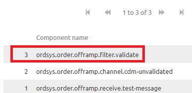
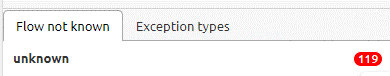

	

		<main class="micro-learning">
		<ul class="doc-nav">
			<li class="doc-nav__item"><a href="../../docs/microlearning/crashcourse-platform-index" class="doc-nav__link">Home</a></li>
			<li class="doc-nav__item"><a href="#intro" class="doc-nav__link">Intro</a></li>
			<li class="doc-nav__item"><a href="#theory" class="doc-nav__link">Theory</a></li>
			<li class="doc-nav__item"><a href="#practice" class="doc-nav__link">Practice</a></li>
			<li class="doc-nav__item"><a href="#solution" class="doc-nav__link">Solution</a></li>
		</ul>

##### Intro

# Determining origin of error message

In this microlearning we will focus on how you can quickly and easily determining the origin of a error message. In other words determine which component broke within your flow.

Should you have any questions, please contact academy@emagiz.com.

- Last update: February 9th 2021
- Required reading time: 6 minutes

## 1. Prerequisites
- Basic knowledge of the eMagiz platform
- Understanding of Monitoring concept
- One or more error messages raised in the last two weeks within the context of your (Academy) project

## 2. Key concepts
This micro learning centers around determining the origin of error messages.
With origin, in this context, we mean: Identifying the component within your flow solution that raises an error indicating that something went wrong.

Determining in which component a error message is raised can be done with the help of the dashboard provided in Manage. Here you see all flows that have raised atleast one error.
This can quickly narrow down in which of the flows that make up a integration the error was raised.

Knowing the flow is half the battle. If you know the flow you should zoom in on this flow to see which specific component is the origin of your error message.
You can do this by looking at the detail page related to that flow. On this page you can see the component (right hand list view) that raised the error. This is always the component you see at the top of the list.

When you know the component you have determined the origin of your error message.

##### Theory

## 3. Determining origin of error message

You can determine the origin of a error message with a two step approach:
1. Analyze the flow of data through your integraton landscape with the help of the Manage Dashboard
2. Zoom in on the flow that holds the component that raised the error to identify the specific component

### 3.1 Analyze the flow of data

As specified before the first step in determining the origin of a error message is to look at the flow of data. In messaging this means from entry via onramp, routing, offramp to exit. 
In API Gateway terms this would mean from entry to exit. In Event Streaming terms this would mean on event processor level.

This flow of data (for messaging) can be analyzed with the help of the Dashboard that is available in Manage.

On this dashboard you see all flows on which atleast one error has been raised. In the case where no errors have been raised in the last two weeks you will see your complete landscape, 
but since you are looking for a error message that does not seem to be the likely case in this scenario. 
Based on this information and your knowledge of how the data you are testing or checking flows through your integration landscape you should be able to pinpoint in which flow something went wrong.

### 3.2 Zoom in on the flow that raised the error

After you have determined the specific flow that has raised the error you can double click on the flow to see the details of the error messages that have been raised on this flow.

This detail page is divided into three sections

#### 3.2.1 The Error that has been raised

The first section, located on the left hand side of your screen shows the list of all errors that have been raised on this flow and specifies the actual error that was triggered by a certain component in your flow.
This section, in combination with the second section (the one in the middle) is instrumental in determining the cause of the error message. They however are of less interest when looking for the origin of the error message.

#### 3.2.2 The header and payload of the message, the moment the message caused an error.

The second section, located in the middle of your screen shows the header and payload information of the specific message you have selected in the left hand panel and the exception that was raised.
This section, in combination with the first section (the one on the left hand) is instrumental in determining the cause of the error message. They however are of less interest when looking for the origin of the error message.

#### 3.2.3 The components

The third section, location on the right hand side of your screen shows the list of components the message has passed before coming to a halt at the last component. The component that raised the error.
This section is instrumental in determining the origin of the error message as it tells us exactly which components have been successfully navigated and which component raised the error.
By having that information we know the origin of the error message. This section however holds less interest when looking for the cause of the error message.

As illustrated in the picture below the component highlighted with red is the component that raised the error.

### 3.3 Flow not known errors

Not all errors that are raised by eMagiz can be linked to a specific flow. Examples of such an error are:
- outOfMemory error
- StackOverFlow error

These errors are not shown in the dashboard itself, but are instead shown on the right hand panel under your filtering option under the segment "Flow not known". 
So if you cannot find any error within your integration yet the message has not reached it end goal please take a look at that section to see whether you can link one of those error messages to your integration.

##### Practice

## 4. Assignment

Determine the origin of atleast five error messages that have been raised within your (Academy) project in the last two weeks. If your project has no errors be creative in messing up stuff to create error for which you can then determine the origin.

## 5. Key takeaways

- Starting point is determing the full context of where a message could have gone wrong (the complete integration)
- With the help of the Manage dashboard you can quickly zoom in on which flow within said context is the culprit
- In some cases the error cannot be linked to a specific flow, leading to a "Flow not known" error
- After having identified the flow where a message has stranded or having determined that the error must be in the "Flow not known" section you can zoom in on this flow to see on which component your message has stranded

##### Solution

## 6. Suggested Additional Readings

If you are interested in this topic and want more information on it please read the helptext provided by eMagiz when executing these actions.

## 7. Silent demonstration video

This video demonstrates how you could have handled the assignment and gives you some context on what you have just learned.

<iframe width="1280" height="720" src="../../vid/microlearning/crashcourse-platform-manage-determining-origin-of-error-messages.mp4" frameborder="0" allow="accelerometer; autoplay; clipboard-write; encrypted-media; gyroscope; picture-in-picture" allowfullscreen></iframe>

</main>

