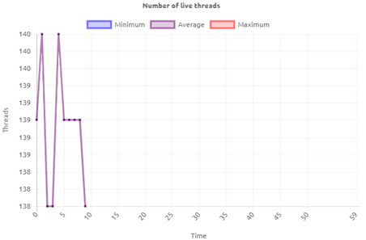
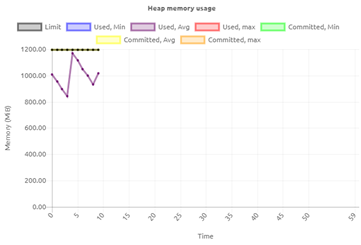

	

		<main class="micro-learning">
		<ul class="doc-nav">
			<li class="doc-nav__item"><a href="../../docs/microlearning/crashcourse-platform-index" class="doc-nav__link">Home</a></li>
			<li class="doc-nav__item"><a href="#intro" class="doc-nav__link">Intro</a></li>
			<li class="doc-nav__item"><a href="#theory" class="doc-nav__link">Theory</a></li>
			<li class="doc-nav__item"><a href="#practice" class="doc-nav__link">Practice</a></li>
			<li class="doc-nav__item"><a href="#solution" class="doc-nav__link">Solution</a></li>
		</ul>

##### Intro

## Interpreting Runtime Statistics
Assessing the health of your systems is critical in a stable and robust integration solution. 
One of the aspects of assessing the health of your systems is looking at the runtime statistics.

In this microlearning we will educate you on the Runtime Statistics overview within the Manage phase of eMagiz.

- Last update: February 9th 2021
- Required reading time: 8 minutes

## 1. Prerequisites
- Basic knowledge of the eMagiz platform

## 2. Key concepts
This microlearning centers around interpreting runtime statistics.
With interpreting we mean: Analyzing the patterns based on the information presented to you
With runtime statistics we mean: Various information elements on system (runtime) level 

There are six graphs that tell part of the story:
- Total JVM CPU Usage
- Number of live threads
- Total JVM Memory Usage
- Data measurements
- Heap memory usage
- Non-heap memory usage

The added value lies in combining the information from each of them into a coherent interpretation

##### Theory

## 3. Interpreting Runtime Statistics
Assessing the health of your systems is critical in a stable and robust integration solution. 
One of the aspects of assessing the health of your systems is looking at the runtime statistics.

To explain to you how you can correctly interpret the Runtime Statistics we have divided the following into three sections.
The focus of the first section will be to explain each of the six graphs separately in order to create a common understanding of what each of these graphs tell us.
In the second section we will highlight the relationship between these six graphs to create more context on how to interpret the graphs in unison.
The third section will focus on troubleshooting. In this section we have focused on some common cases we see happening and tried to explain which steps are needed and which reasoning is required to better analyze problems and prevent them in the future

To access the Runtime Statistics overview you navigate to Manage -> Monitoring -> Runtime Statistics and select the runtime (system) you want to analyze.

### 3.1 The Six Graphs

#### 3.1.1 Total JVM CPU usage

The top left hand graph shows the CPU usage of the JVM (Java Virtual Machine) aka the runtime you have selected from the dropdown menu. The CPU usage (%) indicates how much of the available CPU is used to run the (Java) processes. In broad terms for eMagiz the main things that take up CPU are:
1.	Running flows (starting / stopping flows)
2.	Processing messages
3.	Garbage collection
4.	Threads
  

#### 3.1.2 Number of live threads

The top right hand graph shows the number of live threads that are currently running on your JVM (runtime). Each thread represents a task that is executed on that JVM. This could be the consumption of a message, the registration of a queue, etc. An ever growing number of live threads indicates that there might be something wrong.

#### 3.1.3 Total JVM Memory Usage

The second graph on the left hand side shows the total JVM Memory Usage of the JVM (runtime) you have selected from the dropdown menu. This graph shows the total memory the JVM uses. This is a combination of heap (memory where objects that are created by the application are stored) and native memory. The native memory is subsequently divided into several categories:
1.	metaspace (used to store information about the classes that have been loaded), 
2.	threads (memory used by threads in the JVM), 
3.	code cache (memory used by the JIT to store its output), 
4.	garbage collection (stores data used by the GC), 
5.	symbol (stores symbols such as field names, method signatures, and interned strings)
6.	internal (stores other internal data that does not fit into any of the other areas)
As a user you can influence these heap and native memory settings under Deploy -> Architecture to create the best balance. eMagiz supports this by advising you on the desired setting per JVM (runtime).

#### 3.1.4 Data measurements

The second graph on the right hand side shows the data measurements of the particular JVM (runtime) that you have selected from the dropdown menu. Each minute various data points (measurements) with regards to the runtime are send to the portal. This graph indicates that the measurements indeed have been successfully send and processed by the portal. 
The moment you start seeing gaps in your graphs you will also see comparable gaps in this graph indicating that data measurements are not coming through. The fact that data measurements are not shown here could indicate problems on the JVM.

#### 3.1.5 Heap memory usage

The bottom left hand graph shows the heap memory usage of your JVM (runtime). The heap memory consists of memory where objects that are created by the application are stored. In other words when you process messages you use some of the heap memory to execute the various tasks in threads. This process takes up heap memory.
To make sure that unused objects are removed Java uses the Garbage Collection. It is the task of garbage collection (GC) in the Java virtual machine (JVM) to automatically determine what memory is no longer being used by a Java application and to recycle this memory for other uses.
The moment you see a nice drop every now and then (zigzag shape) this means the garbage collection has removed all unused memory to free it up for the processing of subsequent messages.

#### 3.1.6 Non-heap memory usage

The bottom right hand graph shows the non-heap memory usage of your JVM (runtime). With the introduction of Java 8 the way Java handles memory has changed. This change also included that non-heap has been changed to the term native memory.
In this graph you can see if the native memory is within range. Contrary to heap memory, non-heap memory is less likely to vary under load. Once an application has loaded all of the classes that it will use and the JIT is fully warmed up, things will settle into a steady state.

### 3.2 Relation between graphs

In this section we will highlight how the graphs shown in this page are connected to each other. This way you get a better picture of how the various parts of the JVM act in unison.

1.	CPU usage and heap memory. 
	-	An increase in both heap memory as well as CPU is a strong indication that a lot of traffic (in MBs) is being processed. This could be the result of a lot of messages being processed or one or a few large ones.
	-	A decrease in heap memory, from a high point, combined with a slight increase in CPU is a strong indication that garbage collection has kicked in.
	-	An explosive increase in both heap memory as well as CPU is a strong indication that the runtime might be having memory problems.
	-	A decrease in both heap memory as well as CPU is a indication that not a lot of messages are being processed
2.	CPU usage and number of threads.
	-	An increase in CPU usage and the number of threads means that more tasks are needed to handle the data that is being processed
	-	A decrease in CPU usage and the number of threads means that less tasks are handled
	-	A decrease in CPU and an increase in the number of threads is an indication that although more tasks are needed this has no impact on CPU usage
3.	Heap memory and number of threads
	-	An increase in heap memory and the number of threads indicates that more tasks are taken up more memory
	-	An decrease in heap memory and the number of threads indicates that less tasks take up less memory

### 3.3 Troubleshooting
	
With the help of these graphs you can do analysis on your runtimes. Below we have written out several scenarios that occur **often**.

1.	Alert that a high CPU percentage has been detected on a specific runtime.
	- First thing to do in such a scenario would be to navigate to the runtime in question and see whether the CPU keeps on increasing or whether there was a temporary spike in CPU usage.
	- Based on this observation you need to look at the other graphs, especially the one surrounding the heap memory to see whether the increase in CPU can be linked to an increase in heap memory. If both keep on increasing this could indicate a memory problem. The advice would be to analyze whether the current heap memory settings are still valid
	- If you see a decrease in heap memory slightly after the spike in CPU this is an indication that the runtime was temporarily busy with garbage collection (a standard process within Java) to free up memory. No further action is warranted	
	- If you see no or minimal effect on the heap memory but your CPU is spiking this could be due to someone installing a substantial number of flows on this runtime. Check again after all flows have been installed and started to see whether everything runs stable again. If so, no further action is necessary. 

If you still see strange behavior you should check under the log entries and/or with other related runtimes to see if you can see a casual relation between the both of them.

2.	Alert that the amount of heap memory used is above a threshold.
	- First thing to do in such a scenario would be to navigate to the runtime in question and see whether the heap memory keeps on increasing towards the limit or not.	
	- The moment it keeps on climbing there will probably be an out of memory error. You can confirm this by looking at the log entries of the runtime. 
	- Out of memories also have the effect that statistics won’t be coming through anymore. This means that another way of verifying whether an out of memory might have occurred is to see whether the statistics disappeared (be aware the statistics are shown once per minute so be patient). 
		- All three observations together give you the conclusion that an out of memory has occurred.
	- The moment the heap memory peaks and then drops (zigzag pattern) is a strong indicator that garbage collection has kicked in to free up memory for future use.

**	Not all scenarios that could happen have been specified above. The scenarios written here are to show a certain way of thinking that is needed to trouble shoot.

##### Practice

## 4. Assignment

The assignment is simple this time. Simply navigate to the runtime statistics overview in eMagiz and analyze the graphs of atleast one runtime.
This assignment can be completed with the help of a associated Mendix project linked to the (Academy) project that you have created/used in the previous assignment.

## 5. Key takeaways

There are six graphs that tell part of the story:
- Total JVM CPU Usage
- Number of live threads
- Total JVM Memory Usage
- Data measurements
- Heap memory usage
- Non-heap memory usage

The added value lies in combining the information from each of them into a coherent interpretation

##### Solution

## 6. Suggested Additional Readings

If you are interested in this topic and want more information on it please read the help text provided by eMagiz and read more on the following links:

https://spring.io/blog/2019/03/11/memory-footprint-of-the-jvm
https://www.eginnovations.com/blog/java-threads/#:~:text=A%20thread%2C%20in%20the%20context,invoked%20with%20the%20main%20thread.
https://www.eginnovations.com/blog/what-is-garbage-collection-java/

## 7. Silent demonstration video

This video demonstrates how you could have handled the assignment and gives you some context on what you have just learned. Disclaimer, you only see the eMagiz part but if you follow the above steps you are good to go!

<iframe width="1280" height="720" src="../../vid/microlearning/crashcourse-platform-manage-interpreting-runtime-statistics.mp4" frameborder="0" allow="accelerometer; autoplay; clipboard-write; encrypted-media; gyroscope; picture-in-picture" allowfullscreen></iframe>	

</main>

