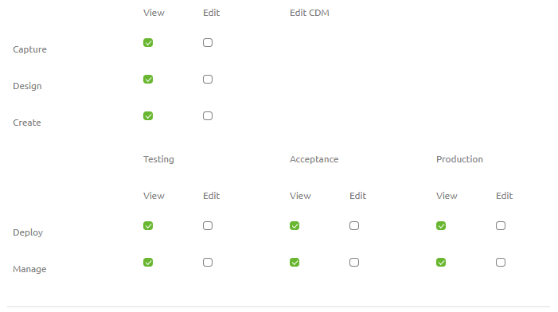

## Portal Security - Basic
Securing your solution and your data is a shared responsibiliy between eMagiz and you. 

In this microlearning we will educate you on the basics of the security of the eMagiz Portal.

- Last update: February 9th 2021
- Required reading time: 5 minutes

## 1. Prerequisites
- Basic knowledge of the eMagiz platform

## 2. Key concepts
This microlearning centers around eMagiz portal security.
With portal security we mean: Ensuring that your model is not accessible for those who have no right to access your project.

The portal security consists of multiple parts:
- User access to Portal
- User access to Integration Projects
- User authorizations to Integration Projects
- Partner user access to Client environments
- Password Policy & Validity

For each aspect it is good to know how the security is set up by eMagiz.

## 3. Portal Security - Basic
Securing the portal is done in various ways. 
In this microlearning the focus will be on user access to the portal, to projects and how to determine that a user has exactly the rights he/she needs to execute their job.
We will discuss each of these aspects below one by one.

### 3.1 User access to https://my.emagiz.com
User can be added with their email address by the eMagiz Partner Manager, upon which the user gets an email to sign-in. 
A temporary password is created and emailed as well, which has to be changed at the first login to the iPaaS Portal. Users are connected to organizations in eMagiz.
In the adminstration section of the user, a MFA token can be used to enble the Multifactor Authentication on a user level. 
Typical authenticators on a smartphone can be used such as Google Authenticator. 
An MFA reponse is required for bus owners to manage the permissions on a project level and for any Edit activity in Production environments. See next sections for more details on these functions.

### 3.2 Users access to Integration Projects
Users can be added to Integration projects, which hold all the configurations required to run the different integrations for the TAP environments. 
Integration projects are connected to organizations in eMagiz to ensure the integration project remains within limits of the license agreements. 
Users can be added to integration projects of the organization where the user belongs to. Users can't be added to integration projects of other clients. 

### 3.3 User authorizations to Integration projects.
Every integration project has a bus owner who can distribute rights across functionalities and environments. 
In the picture below, one can see the various options available across the Integration Life Cycle (ILM) Phases Capture through Manage. 
The bus owner manages the user permissions and needs to have the MFA authentication level activated before making any changes. 
- In case an Edit permission is granted on a ILM phase, all the sub-options can be configured
- View rights mean that all options can be viewed only
- In case the user has no Edit or View rights to a certain ILM phase, the phase will not be displayed at all in the eMagiz iPaaS Portal
- Bus owners are assigned to integration projects by eMagiz Administrators
- An audit trail is kept of the changes made in the project permission structure

### 3.4 Partner user access to Client environments
Partner organizations are supported in eMagiz. 
Bus owners can select user from their own organization or from the connected partner organization. 
The connection between client and partners organization is managed by eMagiz administrators

### 3.5 Password policy & Validity 
Below the relevant items for the password policy in eMagiz Portal

- There is no expiry policy on the password - eMagiz has a Forget Password functionality. 
- Password must be 8 - 20 characters long, cannot contain white spaces, and must contain at least one digit, one upper case and one lower case letter."

## 4. Assignment

The assignment is simple this time. Simply navigate to the permissions (Project Dashboard -> Permissions) overview in eMagiz and analyze who has access to the project and what they can do within your project.
This assignment can be completed with the help of a associated Mendix project linked to the (Academy) project that you have created/used in the previous assignment.

## 5. Key takeaways

The portal security consists of multiple parts:
- User access to Portal
- User access to Integration Projects
- User authorizations to Integration Projects
- Partner user access to Client environments
- Password Policy & Validity

For each aspect it is good to know how the security is set up by eMagiz.

## 6. Suggested Additional Readings

If you are interested in this topic and want more information on it please read the help text provided by eMagiz.

## 7. Silent demonstration video

This video demonstrates how you could have handled the assignment and gives you some context on what you have just learned. Disclaimer, you only see the eMagiz part but if you follow the above steps you are good to go!

<iframe width="1280" height="720" src="../../vid/microlearning/microlearning-portal-security-basic.mp4" frameborder="0" allow="accelerometer; autoplay; clipboard-write; encrypted-media; gyroscope; picture-in-picture" allowfullscreen></iframe>	
